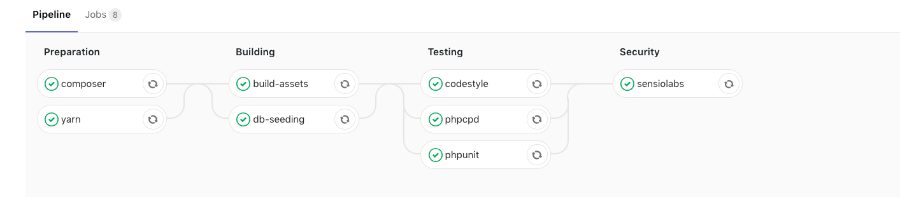

> 本文转载自 [ondear](https://ohdear.app/blog/our-gitlab-ci-pipeline-for-laravel-applications)

我们已经相当公开了我们为哦亲爱的测试数量！暴走已经[展示](https://twitter.com/freekmurze/status/963119438504611842) [位](https://twitter.com/freekmurze/status/927996380932689920)和[个](https://twitter.com/freekmurze/status/969680415618252800)在他的Twitter，以显示这一努力的程度。

拥有一个庞大的测试套件很不错，但将它集成到您的开发工作流程中会更好。

这就是我们发布针对Laravel应用程序优化的Gitlab CI管道的原因。它包含您期望的所有元素：构建（`composer`，`yarn`＆`webpack`），数据库种子，PHPUnit和复制/粘贴（混乱）检测器以及对第三方依赖项的一些基本安全审核。

如果要查看其中的操作，请跳至[“如何使用”](https://ohdear.app/blog/our-gitlab-ci-pipeline-for-laravel-applications#how-to-use-our-gitlab-ci)部分。

## 我们的Laravel CI管道

这是我们当前设置的样子。



我们将在这篇博文中详细解释*为什么*我们已经做出了一些我们做出的决定以及如何建立这样的系统。

## 设置Gitlab CI

我们使用免费版的[Gitlab](https://gitlab.com/)来托管我们的Git存储库并启动运行我们所有测试的作业。但是，由于我们运行免费版本（作为初创公司，我们对运营成本持谨慎态度），我们仅限于在Gitlab上运行哪种CI。

因此，我们已经安装并运行了我们自己的[Gitlab Runner](https://docs.gitlab.com/runner/)，它使用Docker容器来运行我们的测试。Gitlab.com服务器实质上指示*我们的*服务器运行整个管道，我们将状态报告给Gitlab进行报告。

[使用Docker](https://docs.gitlab.com/runner/install/docker.html)设置本地[Gitlab Runner](https://docs.gitlab.com/runner/install/docker.html)非常简单，他们的文档可以很好地处理这个问题。我们为了加快速度而改变的一些小事情与工作的并发性有关。

```bash
$ cat /etc/gitlab-runner/config-main.toml
concurrent = 2
check_interval = 0

[[runners]]
  name = "ohdear/ohdear"
  url = "https://gitlab.com"
  token = "(this is secret, don't share this)"
  executor = "docker"
  [runners.docker]
    tls_verify = false
    image = "php:7.2"
    privileged = false
    disable_cache = false
    volumes = ["/cache"]
    shm_size = 0
  [runners.cache]
```

默认情况下，我们在PHP 7.2上运行测试，同时允许2个作业。

## CPU负载和Docker容器

我们在自己的系统上运行测试套件。测试开始时，Docker启动了几个容器。其中一个是MySQL容器，数据库播种将在其中发生。

```bash
$ docker ps
COMMAND                  CREATED             NAMES
"docker-php-entryp..."   2 minutes ago       runner-...-build-4
"docker-entrypoint..."   2 minutes ago       runner-...-mysql-0
```

当多个测试并行运行时，CPU负载趋于高峰。


请记住，多个容器将同时运行，可能会使您的服务器达到100％的CPU使用率。出于这个原因，我们决定在我们的一台测试机器上运行它们，即使生产服务器拥有大量可用的CPU和内存。

但是，为了使我们能够处理峰值使用，我们需要保持这些资源的免费和可用性。

## 定义阶段

我们创建了4个不同的阶段，我们的测试运行。这些将逐步发生，作业并发为2.在任何阶段，最多同时运行2个作业。

```bash
$ cat /etc/gitlab-runner/config-main.toml
concurrent = 2
...
```

如果您的测试需要同时执行更多作业，则可以增加该`concurrent`设置。

前一阶段必须在下一阶段开始之前成功。这是我们的[.gitlab-ci.yml](https://github.com/ohdearapp/gitlab-ci-pipeline-for-laravel/blob/master/.gitlab-ci.yml)的缩写版本。

```yaml
stages:
  - preparation
  - building
  - testing
  - security

composer:
  stage: preparation

yarn:
  stage: preparation

build-assets:
  stage: building

db-seeding:
  stage: building

phpunit:
  stage: testing

codestyle:
  stage: testing

phpcpd:
  stage: testing

sensiolabs:
  stage: security
```

如果你有一个包含3个作业的`testing`阶段（比如我们的阶段），请记住第3个作业可能需要更长的时间来完成并发*只有* 2个作业。前2个将并行运行，第3个将不得不等待一个空闲的工作*位置*。

## 资产建设测试前？

我们做的与大多数步骤不同的步骤之一是*在*运行单元测试*之前*构建资产。

原因是因为这样的测试：

```php
public static function boot()
{
  /* ... */

  $startServerCommand = '
      php -S localhost:9000/ -t \
      ./tests/Server/public > /dev/null 2>&1 & echo $!
  ';

  $pid = exec($startServerCommand);
```

在我们的单元测试期间，我们生成了一个Web服务器来测试我们的几个关键功能;

- 正常运行时间和停机检测
- 我们抓取该测试服务器以检测混合内容和损坏的链接
- 我们测试了几个自定义HTTP标头功能

这个测试网络服务器产生[了我们的公共网站](https://ohdear.app/)，而后者依赖于编译的JavaScript和CSS（[Laravel Mix](https://laravel.com/docs/5.7/mix)）。这是编译的`webpack`，这就是我们在单元测试之前运行资产构建阶段的原因。

没有它，我们的测试将失败，因为我们无法呈现我们的主页。

抓取我们自己的网站 - 以及各种自定义端点来模拟停机时间或缓慢响应 - 还有一个额外的好处，即我们在部署之前验证（大部分）我们的网站是否正常运行。

## 设置依赖关系
我们的一些阶段取决于前一阶段的输出以便工作。一个很好的例子是我们的`testing`舞台。当我们运行时`phpunit`，它将获取oru主页，而主页又依赖于在前一阶段生成的CSS和JavaScript。

Gitlab CI允许您设置每个阶段的依赖项。

```bash
phpunit:
  [...]
  dependencies:
    - build-assets
    - composer
    - db-seeding
```

设置依赖关系可确保`artifacts`从该特定作业下载到此特定作业，实质上是将一个作业的输出复制到另一个作业。

在这个例子中，在我们运行单元测试之前，我们需要：

- 我们编译的资产（以及`public/mix-manifest.json`Laravel所需的资产）
- 的`vendor`目录`composer install`
- 包含我们种子数据的功能正常的数据库

一旦完成，它就可以运行这项工作。

## 缓存与工件

Gitlab CI严重依赖于我们最初错误配置的两个概念：缓存和工件。

正如文字所暗示的，*缓存*是数据的本地*缓存*。它仅在服务器上本地可用，并不保证存在。

用我们自己的话说，工件是你想要存储在工作中的东西，以传递给下一个工件。*最初*，工件是你想要在工作中*生存的*东西。与生成的日志或错误文件一样，PHP单元覆盖率等。

但是这个功能可以比仅导出测试结果更广泛地使用：您可以使用它将一个作业的输出传递给下一个作业。

我们首先考虑使用*缓存*来实现此目的，因为它们可以在本地存储并且可以更快地使用。但是，缓存不能保证在那里，大约30％的管道会随机失败，因为它缺少一个作曲家`vendor`目录，编译资产，......即使这些工作完成得很好。

```yaml
composer:
  stage: preparation
  script:
    - composer install --prefer-dist --no-ansi --no-interaction --no-progress --no-scripts
  artifacts:
    paths:
      - vendor/
      - .env
    expire_in: 1 days
    when: always
  cache:
    paths:
      - vendor/
```

在上面的例子中，我们定义了两个关键部分：

- `artifacts`：我们想要上传回Gitlab以便我们的下一个工作可以使用
- `cache`：我们想在本地存储什么来加速下一次这项工作

因此，我们最终将Artifacts用于我们想要继承的下一个作业和本地缓存，以便尽可能加快作曲家安装速度。

这感觉就像YAML文件中的代码重复一样，但这是必要的步骤。

## 你的.env.example中的一些问题
我们为MySQL数据库生成了一个单独的Docker容器。它使用一组预定义的环境变量来创建具有密码和数据库的用户。

它定义在我们的[.gitlab-ci.yml](https://github.com/ohdearapp/gitlab-ci-pipeline-for-laravel/blob/master/.gitlab-ci.yml)的最顶层。

```yaml
variables:
  MYSQL_ROOT_PASSWORD: root
  MYSQL_USER: ohdear_ci
  MYSQL_PASSWORD: ohdear_secret
  MYSQL_DATABASE: ohdear_ci
  DB_HOST: mysql
```

我们的Laravel应用程序也需要了解这些凭据才能连接到此数据库。我们通过在`.env.example`文件中设置这些凭据来解决这个问题。

```yaml
DB_CONNECTION=mysql
DB_HOST=mysql
DB_PORT=3306
DB_DATABASE=ohdear_ci
DB_USERNAME=ohdear_ci
DB_PASSWORD=ohdear_secret
```

在我们的`composer`工作中，我们还准备使用Laravel配置。

```yaml
composer:
  [...]
  script:
    - composer install [...]
    - cp .env.example .env
    - php artisan key:generate
```

通过处理`.env.example`文件，我们为测试环境提供了MySQL凭据。

## 缺少部署步骤

这里缺少一个明显的步骤 - 也许 - 最重要的一步：部署应用程序。

我们还没有在Gitlab CI中实现这一点。我们的部署当然是自动化的，但是现在它与我们的CI管道的状态无关。即使测试失败，我们*也可以进行*部署。

我们仍然是一个小团队，我们决定部署，但受控制。由于许多Laravel用户会使用[Envoyer](https://envoyer.io/)进行部署，因此可以进行进一步的自动化以进行集成。

我们将在稍后的博文中强调我们的部署策略（以及不与Gitlab CI结合的原因），有很多细微差别值得强调。

## 抓住我们的Gitlab CI管道

你会在我们的Github上找到配置：[ohdearapp / gitlab-ci-pipeline-for-laravel](https://github.com/ohdearapp/gitlab-ci-pipeline-for-laravel)。

如果您发现问题或有改进，请随时贡献！

[Loris Leiva关于Laravel管道的博客文章充分](http://lorisleiva.com/laravel-deployment-using-gitlab-pipelines/)启发了这条管道的基础，并根据我们的需求和愿望进行了调整。

## 如何使用我们的Gitlab CI？

缩写版本是;

1. 获取Gitlab帐户并将代码提交到Gitlab存储库
2. 将[.gitlab-ci.yml](https://github.com/ohdearapp/gitlab-ci-pipeline-for-laravel/blob/master/.gitlab-ci.yml)复制/粘贴到您的项目中
3. 推送到您的存储库

现在观看Gitlab检测到您的配置并尝试运行您的工作。此时，您可能想要考虑订阅Gitlab CI或运行自己的Gitlab运行程序来执行测试。

如果您发现任何改进，得到或有一般性评论，我们很乐意在下面的评论中听到您的想法！