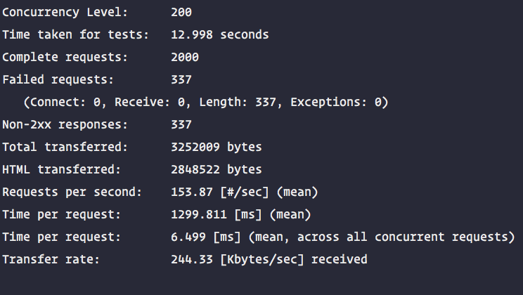
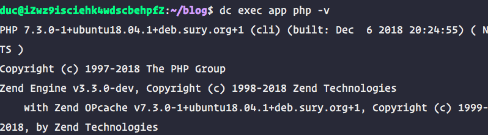
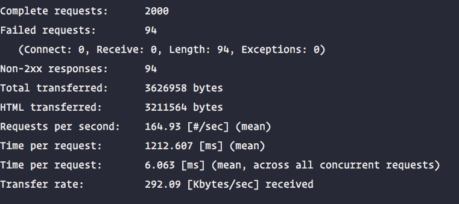
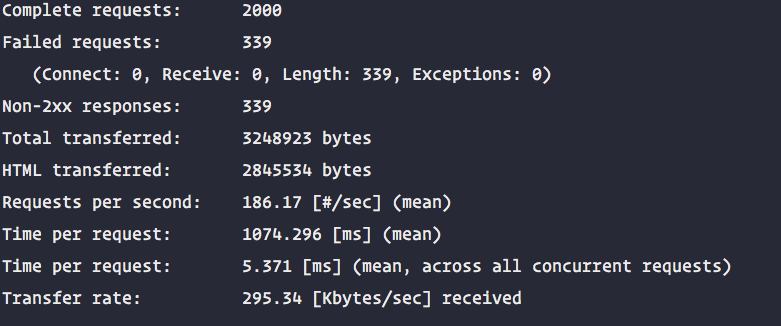

> 性能测试
>
> 博客跑在 1 核 2G 的阿里云服务器上

## 先测试 7.2

服务器php版本👇


用mac做ab测试

```shell
$ ab -n 2000 -c 200 ../articles/24/
```




```shell
$ ab -n 2000 -c 100 ../articles/24/
```


## 现在我们切换到 7.3




```shell
$ ab -n 2000 -c 200 ../articles/24/
```





```shell
$ ab -n 2000 -c 100 ../articles/24/
```


## 结果对比(100压力下均没有失败请求)

| Fail | qps(200) | qps(100) | 7.2    |
| ---- | -------- | -------- | ------ |
| 455  | 181.38   | 149.11   | 第一次 |
| 47   | 163.93   | 154.69   | 第二次 |
| 337  | 153.87   | 149.29   | 第三次 |
| 280  | 166.39   | 151.03   | 平均   |

| Fail   | qps(200) | qps(100) | 7.3    |
| ------ | -------- | -------- | ------ |
| 339    | 186.17   | 168.70   | 第一次 |
| 94     | 164.93   | 160.52   | 第二次 |
| 309    | 174.16   | 182.29   | 第三次 |
| 247.33 | 175.08   | 170.5    | 平均   |

## 总结

从测试结果看，7.3  比 7.2 快 5%~12% 😁

也可以看 https://www.phoronix.com/scan.php?page=news_item&px=PHP-7.3-Alpha-1-Benchmarks