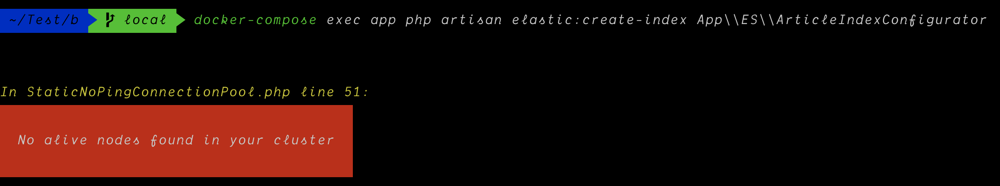

> 源码地址 https://github.com/DuC-cnZj/blog  ，给个 star 吧老铁们 😂


## 功能
1.  游客评论、github 评论
2.  支持 `markdown` 语法
3. 支持 `emoji` 表情，留言区输入符号 `:` 自动补全表情 🍭
4. 文章编辑支持图片拖拽上传
5. 文章主题支持语法高亮
6. 支持 `ElasticSearch` 搜索 🔍
7. 支持搜索结果高亮显示
8. 评论实时同步
9. 新文章广播通知
10. 文章置顶和隐藏
11. 用户数据分析
12. 不断更新中...


## 💡 安装

```shell
git clone --depth 1 -b local https://github.com/DuC-cnZj/server_docker_configuration.git blog
```

## 🚀 启动
```shell
cd blog
docker-compose up -d
```

## 🎃 安装须知
由于启动需要时间所以如果登陆后台出现请检查网络状态，则说明系统还在准备中，从启动到可以使用，大概需要 1min。


## 🧐 填充测试数据

> 文章测试数据一次填充60条数据，可以多次填充。

填充测试数据，务必在启动至少一分钟后再使用该命令，因为在启动时，es 搜索引擎还没准备好，如果使用该命令时出现错误，证明系统还没启动完成。

建立es索引
```shell
docker-compose exec app php artisan elastic:create-index App\\ES\\ArticleIndexConfigurator
```

es 没启动完成会出现以下提示，请安心等待


填充数据
```shell
docker-compose exec app php artisan db:seed --class=ArticleTableSeeder --force
```

## 👀 预览

http://localhost:8000/ 前台

http://localhost:8080/ 后台 账号 123456789 密码 secret

## 🤠 操作

停止运行

```shell
docker-compose down
```

> 删除之前请先停止运行。

删除 docker镜像以及相关数据文件：
```shell
docker rmi registry.cn-hangzhou.aliyuncs.com/duc-cnzj/blog_frontend:local
docker rmi registry.cn-hangzhou.aliyuncs.com/duc-cnzj/blog_backgroung:local
docker rmi registry.cn-hangzhou.aliyuncs.com/duc-cnzj/blog_app

docker volume rm blog_dbdata blog_esdata blog_redisdata
```

## 最后附上测试


