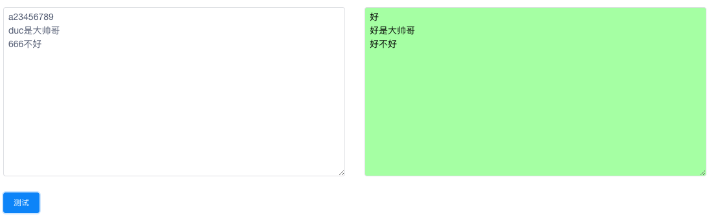

> 起因，吹逼群中有位小伙伴提到，他有一堆txt格式的文章想要放到我的博客上，但是懒与把txt格式转化成md格式，所以就没放。嗯，平时记的笔记可都是财富啊，应该分享出来，所以我就开发了这个新功能。

## 先预览下

> 这是该功能的后台页面

1. 测试按钮，言简意赅，添加规则后，既可以对自己规则的正确与否进行测试
2. 测试下面是添加规则和规则列表，相信正常人一眼就能看懂了😅


## 实际测试

> 我添加了一条将 a 转化为 1 的规则


> 随便添加一些a和1，来进行测试，很成功👏


### 多条测试是否可行呢？？？

来测试一下吧

> 首先添加测试规则

- 第一条把 a 替换为 1
- 第二条把 duc 替换为 888
- 第三条把 数字开头的 替换为中文 “好”


可以看到我加了下面这些测试数据 👇

如果结果正确那么应该输出

```
123456789
888是大帅哥
好不好
```


来，我们来看结果



> ❗️注意这里 duc 以及第一行数字 并没有正确转化，原因是由于下面的规则将数字转化为了好，所以，在使用规则时一定要注意顺序，最后添加的规则最后才执行，当然你也可以适当的选择关闭一些规则

至于后台的实现，请看这里 [规则功能实现](https://github.com/DuC-cnZj/blog/commit/65d366ea5074f529b9cf4fc564095eb7e7e0a96f)

## 🍺🍭🍖☄️🌈👏

## 有点赞打赏吗？？？这些功能好像还没做😂

