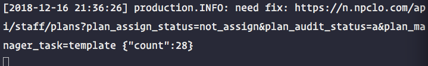

> api resource 资源类 指的是 php artisan make:resource User 生成的 后缀为 Resource 的类

## 起因

在优化项目查询语句发现其中有一条请求查询语句多达28条



检查代码时一直在寻找项目代码的sql语句是否存在 N+1，然而进过多次测试发现并不是由于sql语句问题，继续往下找

```php
return PlanResource::collection($plans);
```

进入到 `PlanResource` 类中发现有这样一句

```php
# PlanResource
public function toArray($request)
{
    $permissionName = auth()->user()->getRoleFields();
    ...
}
```

继续

```php
# JsonResource
public static function collection($resource)
{
    return new AnonymousResourceCollection($resource, get_called_class());
}

# CollectsResources 

$this->collection = $collects && ! $resource->first() instanceof $collects
    ? $resource->mapInto($collects)  // 走到这里
    : $resource->toBase();

# Collection
public function mapInto($class)
{
    return $this->map(function ($value, $key) use ($class) {
        return new $class($value, $key); // PlanResource
    });
}
```

可以看到最终它通过map方法来循环格式化数据，所以一旦你在 资源类 中发请求，那么有多少个循环发多少次！！！


## 解决

> 最终我通过 php artisan make:resource Users --collection 生成一个资源集合

在该集合中发请求传入PlanResource，解决了这个问题

```php
# PlansCollection
public function __construct($resource)
{
    parent::__construct($resource);

    $this->permissionName = auth()->user()->getRoleFields();
}

public function toArray($request)
{
    return [
        'data' => $this->collection->map(function ($r) {
            return new PlanResource($r, $this->permissionName);
        })
    ];
}
```

