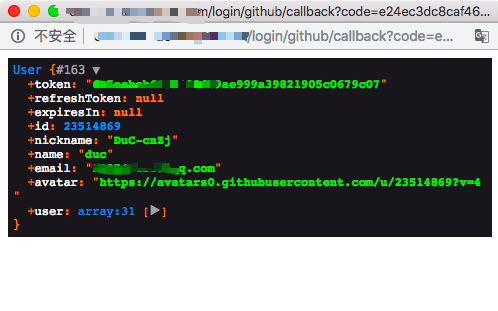
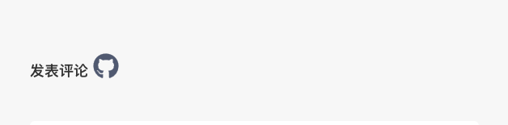

## 第三方登陆的种类分析

1. 前后端不分离的情况，后端根据第三方回调返回的用户信息可以直接登陆用户，这种比较简单，后端拿到用户可以直接使用session记住并且登陆用户，跳转到相应页面。
2. 前后端分离，但是不跨域
3. 前后端分离，并且是跨域的，即前端域名和后端api域名不同


## 以 `github` 为例子：

首先去添加一个 Oauth App：


配置相关回调地址，这里的回调地址必须必须能通过外网访问。或者你可以用内网穿透。


配置完后把你的 `ID` 和 `secret` 加入到你的后端逻辑中去，


之后用户通过前端授权按钮登陆，首次登陆需要授权。


授权完成后 github 会调用你的回调地址返回用户信息：



获取到用户信息后逻辑就开始区分了

1. 前后端不分离的话可以直接在回调方法中登陆用户跳转
2. 前后端分离的话比较麻烦，请继续看

分离环境下，后端会先把 github 回调的用户信息存到数据库中，然后再做相应处理。

因为 github 调用的是你后端 api 的地址，比如调用地址的域名为 `api.server.com` ，然而你web端的地址是 `web.server.com` ，这时候如何去登陆用户呢？

## 难题：

因为前后端分离中的后端几乎都是返回 json 格式的信息，几乎不存在直接跳前端页面的做法，并且前后端分离都是用token获取用户信息。前端只有拿到相应的token才能获取到github用户的资料。所以这里的问题变成了如何通过后端把用户的 token 给到前端页面。


## 解决方案：

> 本质上来讲这个问题属于跨域问题，只有同源的数据才能相互访问。

1995年，同源政策由 Netscape 公司引入浏览器。目前，所有浏览器都实行这个政策。

最初，它的含义是指，A 网页设置的 Cookie，B 网页不能打开，除非这两个网页“同源”。所谓“同源”指的是”三个相同“。

> - 协议相同
> - 域名相同
> - 端口相同


举例来说，`http://www.example.com/dir/page.html`这个网址，协议是`http://`，域名是`www.example.com`，端口是`80`（默认端口可以省略），它的同源情况如下。

- `http://www.example.com/dir2/other.html`：同源
- `http://example.com/dir/other.html`：不同源（域名不同）
- `http://v2.www.example.com/dir/other.html`：不同源（域名不同）
- `http://www.example.com:81/dir/other.html`：不同源（端口不同）
- `https://www.example.com/dir/page.html`：不同源（协议不同）

那么如何解决跨域问题的，这里我采用了，跨文档通信 API（Cross-document messaging）。`window.postMessage()` 。（HTML5 为了解决跨域窗口通信这个问题，引入的一个全新的API）。


## 下面开始实践

### 前端页面：


点击 `github` logo，跳转到后端的 `api.server.com/oauth/login`，为了好看，你可以采用弹出小窗的形式，类似于下面这样


`弹出窗口->github 授权登陆->后端接收到用户的json信息`。

### 后端：

后端得到github回调用户信息后，去生成一串 `token`，怎么实现的话，问你自己咯😀，生成token之后，后端必须跳转一个页面（但不是跳转到前端页面，这样不可行，直接把token放在url地址上也不安全），正确的方法是跳一个类似于下面这样的页面（注意这个行为是后端做的）。`domain`是你前端的**域名** `web.server.com`。

```html
<!doctype html>
<html lang="en">
<head>
    <meta charset="UTF-8">
    <meta name="viewport"
          content="width=device-width, user-scalable=no, initial-scale=1.0, maximum-scale=1.0, minimum-scale=1.0">
    <meta http-equiv="X-UA-Compatible" content="ie=edge">
    <title>oauth github</title>
</head>
<body>
登陆中...
<script>
    window.onload = function () {
        window.opener.postMessage("bearer {{ $token }}", "{{ $domain }}");
        window.close();
    }
</script>
</body>
</html>

```


用户几乎是不会感觉到这个行为的，非常快！

这个页面的意义在于和前端通信，把token传给前端，

前端点击跳出小窗口的代码：

```js
href () {
        # 弹出 500 * 500 的窗口
      window.open(this.githubUrl, 'newwindow', 'height=500, width=500, top=0, left=0, toolbar=no, menubar=no, scrollbars=no, resizable=no,location=n o, status=no')

      # 通过监听，父页面可以拿到子页面传递的token，父(前端页面)，子(小窗)
      window.addEventListener('message', function (e) {
        this.me(e.data).then(() => {
          console.log('用户信息获取成功')
          this.setToken(e.data)
        }).catch(() => {
          this.setToken('')
        })
      }, false)
},
```

如果不知道上面代码的实现原理或者有疑问请看这里 https://wangdoc.com/javascript/bom/same-origin.html#windowpostmessage，

嗯，拿到token了之后怎么做上面代码也写了，聪明的你应该看懂了😁

## 这种方式的安全性
MDN 上对其这样介绍

> window.postMessage() 方法可以安全地实现跨源通信。通常，对于两个不同页面的脚本，只有当执行它们的页面位于具有相同的协议（通常为https），端口号（443为https的默认值），以及主机  (两个页面的模数 Document.domain设置为相同的值) 时，这两个脚本才能相互通信。window.postMessage() 方法提供了一种受控机制来规避此限制，只要正确的使用，这种方法就很安全。


## 演示一下


你可以来 [我的博客](http://39.108.139.38/articles/100) 体验一下 