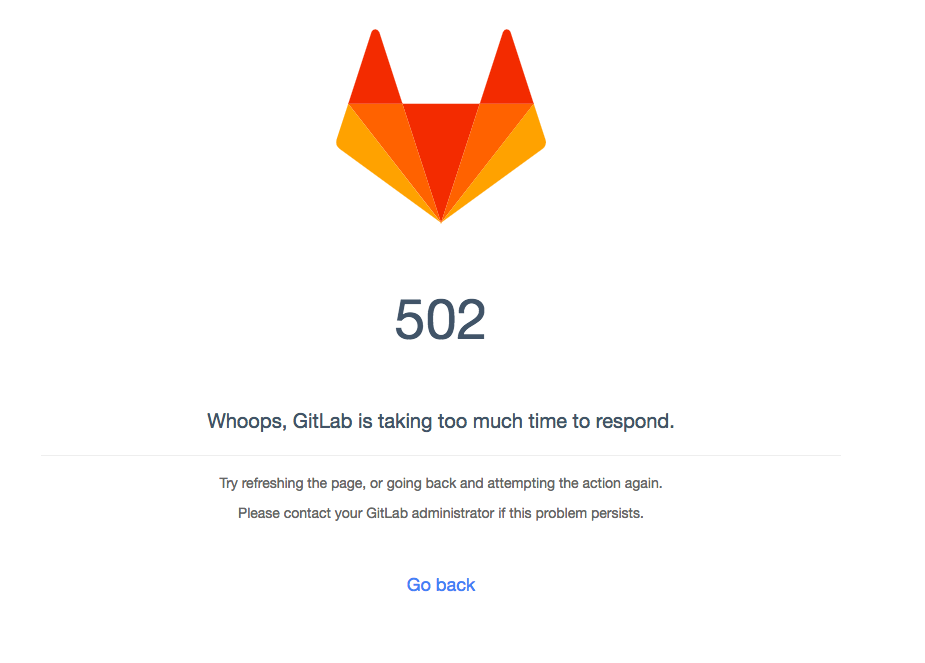
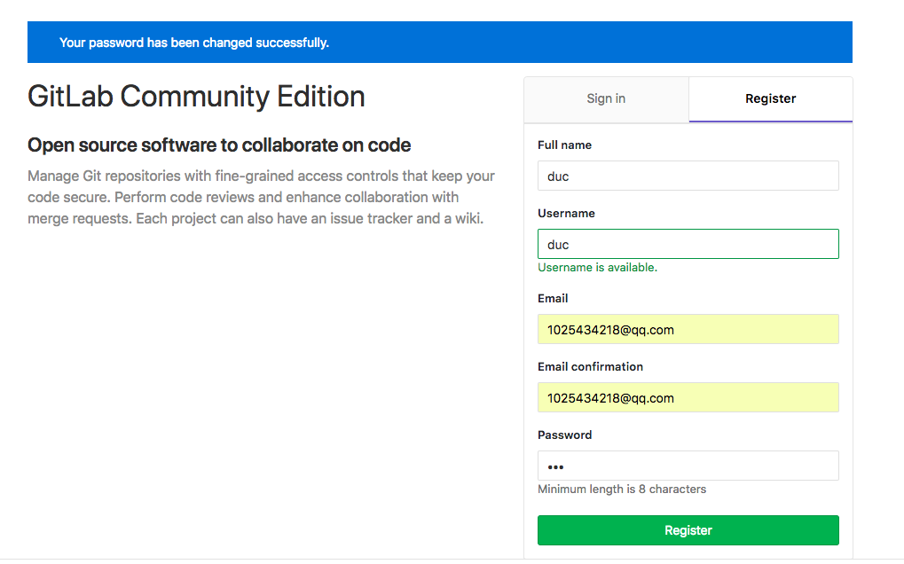
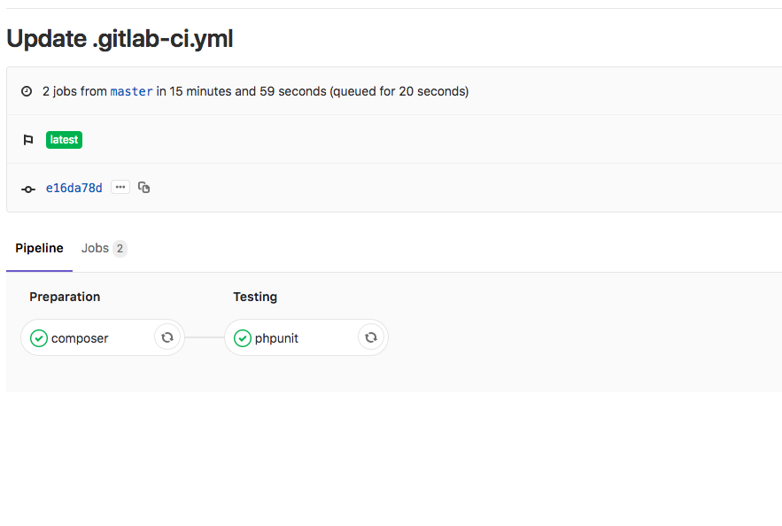

## 先搭建gitlab

> 本文使用docker安装gitlab https://docs.gitlab.com/omnibus/docker/

运行该命令可在本地安装gitlab

> 注意 gitlab.example.com 需要在 /ets/hosts 里面配置

```shell
# first step
mkdir gitlab && cd gitlab

# second
docker run --detach \
    --hostname gitlab.example.com \
    --publish 443:443 --publish 80:80 --publish 22:22 \
    --name gitlab \
    --restart always \
    --volume $(pwd)/config:/etc/gitlab \
    --volume $(pwd)/logs:/var/log/gitlab \
    --volume $(pwd)/data:/var/opt/gitlab \
    gitlab/gitlab-ce:latest    
```

上面的命令完成后，你会在 `gitlab` 目录下看到 `config` `logs` `data` 三个目录，分别存着配置日志和数据文件

### tips

> 由于服务启动比较慢，所以如果出现 502 请耐心等几分钟





等待片刻后，输入密码


注册一个账号


蛋疼的服务器 不玩了cao


### docker-compose.yaml 参考

```yaml
version: "3"
services:
  gitlab-runnner:
    image: gitlab/gitlab-runner
    networks:
      - gitlabnet
    volumes:
      - ./runner-config:/etc/gitlab-runner
      - /var/run/docker.sock:/var/run/docker.sock
  gitlab:
    image: gitlab/gitlab-ce:latest
    hostname: 'gitlab.example.com'
    networks:
      - gitlabnet
    volumes:
      - ./config:/etc/gitlab
      - ./logs:/var/log/gitlab
      - ./data:/var/opt/gitlab
    ports:
      - 80:80
      - 443:443
      - "22:22"
networks:
  gitlabnet:
    driver: bridge

```

## 使用docker搭建runner

#### 方法一

直接写在 `docker-compose.yaml` 里面 这里你必须 `docker-in-docker`  ，使用这条命令

```shell
docker run -v /var/run/docker.sock:/var/run/docker.sock ...
```

否则在你的docker容器中无法使用docker。

不过DinD这种方式好像不太好，具体google。


#### 方法二

开一台虚拟机，然后当做一台新的服务器来安装docker以及gitlab-runner


### 添加 runner

方法一

执行，注册，url 和 token 在项目 setting-> CI/CD  里面有，每个项目都不一样

```shell
gitlab-runner register 
```

方法二

直接修改配置文件  config.toml

```yaml
# runner-config/config.toml
concurrent = 1
check_interval = 0

[session_server]
  session_timeout = 1800

[[runners]]
  name = "a"
  url = "http://gitlab.example.com/"
  token = "fFEGL5JzN9vPKTiyx4s7"
  executor = "docker"
  [runners.docker]
    tls_verify = false
    image = "php:7.1"
    privileged = false
    disable_entrypoint_overwrite = false
    dns = ["192.168.99.100"]  # 重点！！！，不然你的ci用的docker将无法拉取代码，会connection refused
    oom_kill_disable = false
    disable_cache = false
    volumes = ["/cache"]
    shm_size = 0
  [runners.cache]
    [runners.cache.s3]
    [runners.cache.gcs]

[[runners]]
  name = "b"
  url = "http://gitlab.example.com/"
  token = "3Seirt-EwZ6RybwaL1wf"
  executor = "docker"
  [runners.docker]
    tls_verify = false
    dns = ["192.168.99.100"]
    image = "php:7.2"
    privileged = false
    disable_entrypoint_overwrite = false
    oom_kill_disable = false
    disable_cache = false
    volumes = ["/cache"]
    shm_size = 0
  [runners.cache]
    [runners.cache.s3]
    [runners.cache.gcs]

[[runners]]
  name = "ci"
  url = "http://gitlab.example.com/"
  token = "aMMMxCvrYNA-E4KfS1Ru"
  executor = "docker"
  [runners.docker]
    tls_verify = false
    image = "php:7.1"
    dns = ["192.168.99.100"]
    privileged = false
    disable_entrypoint_overwrite = false
    oom_kill_disable = false
    disable_cache = false
    volumes = ["/cache"]
    shm_size = 0
  [runners.cache]
    [runners.cache.s3]
    [runners.cache.gcs]

[[runners]]
  name = "ci"
  url = "http://gitlab.example.com/"
  token = "n8oB_P2cXeUPwjpLw3n2"
  executor = "docker"
  [runners.docker]
    tls_verify = false
    dns = ["192.168.99.100"]
    image = "php:7.2"
    privileged = false
    disable_entrypoint_overwrite = false
    oom_kill_disable = false
    disable_cache = false
    volumes = ["/cache"]
    shm_size = 0
  [runners.cache]
    [runners.cache.s3]
    [runners.cache.gcs]

```

## 解决本地搭建docker ci runner DNS 服务问题

> 此举主要是为了解决本地搭建的gitlab
>
> -ci runner 中的docker 容器无法解析到本地的 gitlab.example.com 

1. 新开一台linux（我选用docker-machine），安装docker
2. `docker run -d -p 53:53/tcp -p 53:53/udp  --cap-add=NET_ADMIN --name dns-server andyshinn/dnsmasp`
3. `docker exec -it dns-server /bin/sh`
4. vi /etc/resolv.dnsmasq `nameserver 114.114.114.114 nameserver 8.8.8.8`
5. vi /etc/dnsmasqhosts 加入 `192.168.200.190 gitlab.example.com`
6. 修改 dnsmasq,  vim /etc/dnsmasq.conf  `resolv-file=/etc/resolv.dnsmasq addn-hosts=/etc/dnsmasqhosts`
7. 回到宿主机重启dns服务 `docker restart dns-server`
8. 这时候dokcer host 就是一台dns服务器了加入他的地址是 192.168.99.100


> ❗️❗️❗️❗️❗️
>
> 注意这里如果你安照上面那样做了，你做到的只是gitlab-runner 能 ping 通 gitlab.example.com 但是，你gitlab-runner 中的docker容器里面还是没办法ping通的
>
> 所以你要在 config.toml 中加入 dns 配置项 `dns = ["192.168.99.100"]`  磕了我两天，wocao

## 测试

在gitlab ci 上修改 /etc/resolv.conf

```
nameserver 192.168.99.100
```

就可以直接ping通gitlab.example.com 了


## .gitlab-ci.yml

### 一级变量

| 关键字        | 是否必须 | 描述                                                         |
| ------------- | -------- | ------------------------------------------------------------ |
| image         | 否       | 用于docker镜像，查看[docker](https://docs.gitlab.com/ce/ci/docker/README.html)文档 |
| services      | 否       | 用于docker服务，查看[docker](https://docs.gitlab.com/ce/ci/docker/README.html)文档 |
| stages        | 否       | 定义构建阶段                                                 |
| types         | 否       | `stages` 的别名(已废除)                                      |
| before_script | 否       | 定义在每个job之前运行的命令                                  |
| after_script  | 否       | 定义在每个job之后运行的命令                                  |
| variables     | 否       | 定义构建变量                                                 |
| cache         | 否       | 定义一组文件列表，可在后续运行中使用                         |

### Jobs 中的变量

| Keyword       | Required | Description                                                  |
| ------------- | -------- | ------------------------------------------------------------ |
| script        | yes      | Runner执行的命令或脚本                                       |
| image         | no       | 所使用的docker镜像，查阅[使用docker镜像](https://docs.gitlab.com/ce/ci/docker/using_docker_images.html#define-image-and-services-from-gitlab-ciyml) |
| services      | no       | 所使用的docker服务，查阅[使用docker镜像](https://docs.gitlab.com/ce/ci/docker/using_docker_images.html#define-image-and-services-from-gitlab-ciyml) |
| stage         | no       | 定义job stage（默认：`test`）                                |
| type          | no       | `stage`的别名（已弃用）                                      |
| variables     | no       | 定义job级别的变量                                            |
| only          | no       | 定义一列git分支，并为其创建job                               |
| except        | no       | 定义一列git分支，不创建job                                   |
| tags          | no       | 定义一列tags，用来指定选择哪个Runner（同时Runner也要设置tags） |
| allow_failure | no       | 允许job失败。失败的job不影响commit状态                       |
| when          | no       | 定义何时开始job。可以是`on_success`，`on_failure`，`always`或者`manual` |
| dependencies  | no       | 定义job依赖关系，这样他们就可以互相传递artifacts             |
| cache         | no       | 定义应在后续运行之间缓存的文件列表                           |
| before_script | no       | 重写一组在作业前执行的命令                                   |
| after_script  | no       | 重写一组在作业后执行的命令                                   |
| environment   | no       | 定义此作业完成部署的环境名称                                 |
| coverage      | no       | 定义给定作业的代码覆盖率设置                                 |


## 在 laravel 中 cicd

> 完整版请参考 https://github.com/ohdearapp/gitlab-ci-pipeline-for-laravel

简单案例参考

```yaml
stages:
  - preparation
  - testing
  - deploy

variables:
  REDIS_PORT: 6379

composer:
  stage: preparation
  image: edbizarro/gitlab-ci-pipeline-php:7.2
  tags:
    - duc72
  script:
    - php -v
    - composer install --prefer-dist --no-ansi --no-interaction --no-progress --no-scripts
  artifacts:
    paths:
      - vendor/
      - .env
    expire_in: 1 days
    when: always
  cache:
    paths:
      - vendor/

phpunit:
  stage: testing
  image: edbizarro/gitlab-ci-pipeline-php:7.2
  tags:
    - duc72
  services:
    - redis:latest
  dependencies:
    - composer
  script:
    - php -v
    - ./vendor/phpunit/phpunit/phpunit --version
    - php -d short_open_tag=off ./vendor/phpunit/phpunit/phpunit -v --colors=never --stderr
  artifacts:
    paths:
      - ./storage/logs # for debugging
    expire_in: 1 days
    when: on_failure

deploy:
  stage: deploy
  script:
    - docker build -t duc/app .
    - docker rm duc/app -f
    - docker run -d -p 8080:80 duc/app
   tags:
    - on_shell

```


## 测试中遇到的问题

如果你的测试中使用了 redis 那么可能会出现

问题原因 https://github.com/laravel/framework/issues/7904

> 在我的情况下，问题是OS环境变量REDIS_PORT被设置为
>
> `REDIS_PORT=tcp://172.17.0.4:6379 `
> 并覆盖Laravel .env文件中设置的REDIS_PORT。
>
> 也许Artisan获得OS环境变量。我解决了它将OS环境变量REDIS_PORT设置为
>
> ```yaml
> REDIS_PORT=6379
> ```
>
> 我使用docker和docker-compose，所以我只修改了我的docker-compose.yml，添加了这两行：
>
> ```yaml
>    environment:
>       REDIS_PORT: 6379
> ```

```
Connection refused [tcp://redis:tcp://172.17.0.3:6379]
```

解决：在 .gitlab-ci.yaml 中加入环境变量

```yaml
variables:
  REDIS_PORT: 6379
```


## 最后

本文只是简单实现，更多配置，更多参数，请去研究官方文档！

> 在无数次删除容器，修改配置，提交代码测试中，通过了测试😭


这些只是简单的实现了ci/cd ，也为我之后学习 kubernetes 打下基础😄