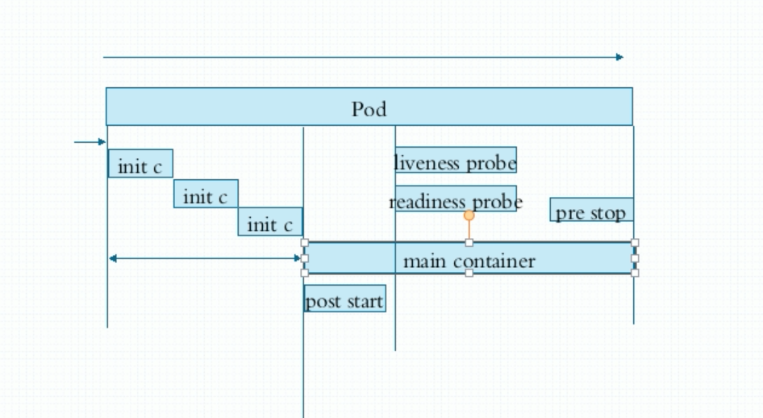

```
kubeadm init --pod-network-cidr=10.244.0.0/16 --service-cidr=10.96.0.0/12 --ignore-preflight-errors=all

kubeadm join 192.168.188.37:6443 --token axkkew.i12j238xb0gc6vv0 --discovery-token-ca-cert-hash sha256:3343c8d6f9dd8a2ecb7205ea42e7d6357d1dc5e762ed5338cd21c74d49d2dda0
加入失败记住要关闭防火墙，并且要把 ssh_key 加入相互的机器中


kubeadm join 192.168.188.37:6443 --token axkkew.i12j238xb0gc6vv0 --discovery-token-ca-cert-hash sha256:3343c8d6f9dd8a2ecb7205ea42e7d6357d1dc5e762ed5338cd21c74d49d2dda0 --ignore-preflight-errors=all --node-name=node1

KUBELET_EXTRA_ARGS="--fail-swap-on=false"

quay.io/coreos/flannel:v0.11.0-amd64
quay.io/coreos/flannel:v0.11.0-arm64
quay.io/coreos/flannel:v0.11.0-arm
quay.io/coreos/flannel:v0.11.0-ppc64le
quay.io/coreos/flannel:v0.11.0-s390x


k8s.gcr.io/kube-proxy:v1.12.6
k8s.gcr.io/kube-controller-manager:v1.12.6
k8s.gcr.io/kube-scheduler:v1.12.6
k8s.gcr.io/kube-apiserver:v1.12.6
k8s.gcr.io/coredns:1.2.6
k8s.gcr.io/etcd:3.2.24
k8s.gcr.io/pause:3.1

kubectl expose deploy nginx-deploy --port=80 --target-port=80 --protocol=TCP --name=nginx

service的CluserIp 类型是集群内部访问的
多被用于其他pod的访问


# 问题 "cni0" already has an IP address different from 10.244.4.1/24
#在master节点之外的节点进行操作
kubeadm reset
systemctl stop kubelet
systemctl stop docker
rm -rf /var/lib/cni/
rm -rf /var/lib/kubelet/*
rm -rf /etc/cni/
ifconfig cni0 down
ifconfig flannel.1 down
ifconfig docker0 down
ip link delete cni0
ip link delete flannel.1
##重启kubelet
systemctl restart kubelet
##重启docker
systemctl restart docker
```

Token 24 小时过期解决办法

https://blog.csdn.net/mailjoin/article/details/79686934


```
kubectl run myapp --image=ikubernetes/myapp:v1 --replicas=2

kubectl expose deploy myapp --name=myapp --port=80

# 扩展到三个
kubectl scale --replicas=3 deploy myapp

# 设置镜像版本
kubectl set image deploy myapp myapp=ikubernetes/myapp:v2

# 查看回滚状态
kubectl rollout status deploy myapp

# 执行回滚
kubectl rollout undo deploy myapp
```


- RESTFul
  - Get,post,delete,put
  - Kubectl run/get/edit
- 资源，对象
  - workload: pod,RS,deployment,statefulSet,DaemonSet,Job,Cronjob
  - 服务发现均衡：Service，Ingress...
  - 配置与存储：Volume，CSI
    - ConfigMap，Secret
    - DownwardAPI
  - 集群级资源
    - Namespace，Node，Role，ClusterRole（集群角色，RoleBinding（角色绑定），ClusterRoleBinding）
  - 元数据资源
    - HPA，PodTemplate（控制器创建pod的模板），LimitRange（限制cpu等资源使用量）


```yaml
apiVersion: v1 # 一般 group/version 如果group省略那么代表 core，核心组
kind: Pod # 指明哪一种资源初始化成资源对象时使用
metadata:
  creationTimestamp: "2019-03-18T14:29:17Z"
  generateName: myapp-9b4987d5-
  labels:
    pod-template-hash: 9b4987d5
    run: myapp
  name: myapp-9b4987d5-f88w6
  namespace: default
  ownerReferences:
  - apiVersion: apps/v1
    blockOwnerDeletion: true
    controller: true
    kind: ReplicaSet
    name: myapp-9b4987d5
    uid: 3146ede8-497d-11e9-9e2f-0800271ed0ce
  resourceVersion: "14706"
  selfLink: /api/v1/namespaces/default/pods/myapp-9b4987d5-f88w6 # 每个资源引用的path
  uid: 35e85b38-498a-11e9-9e2f-0800271ed0ce
spec: # 规格 规范
  containers:
  - image: ikubernetes/myapp:v1
    imagePullPolicy: IfNotPresent
    name: myapp
    resources: {}
    terminationMessagePath: /dev/termination-log
    terminationMessagePolicy: File
    volumeMounts:
    - mountPath: /var/run/secrets/kubernetes.io/serviceaccount
      name: default-token-sgq66
      readOnly: true
  dnsPolicy: ClusterFirst
  enableServiceLinks: true
  nodeName: node1
  priority: 0
  restartPolicy: Always
  schedulerName: default-scheduler
  securityContext: {}
  serviceAccount: default
  serviceAccountName: default
  terminationGracePeriodSeconds: 30
  tolerations:
  - effect: NoExecute
    key: node.kubernetes.io/not-ready
    operator: Exists
    tolerationSeconds: 300
  - effect: NoExecute
    key: node.kubernetes.io/unreachable
    operator: Exists
    tolerationSeconds: 300
  volumes:
  - name: default-token-sgq66
    secret:
      defaultMode: 420
      secretName: default-token-sgq66
status: # 当前状态，由 kubernetes 定义，用户不能随意指定
  conditions:
  - lastProbeTime: null
    lastTransitionTime: "2019-03-19T02:48:10Z"
    status: "True"
    type: Initialized
  - lastProbeTime: null
    lastTransitionTime: "2019-03-19T02:48:14Z"
    status: "True"
    type: Ready
  - lastProbeTime: null
    lastTransitionTime: "2019-03-19T02:48:14Z"
    status: "True"
    type: ContainersReady
  - lastProbeTime: null
    lastTransitionTime: "2019-03-18T14:29:17Z"
    status: "True"
    type: PodScheduled
  containerStatuses:
  - containerID: docker://eab122a14a37445b141b03d637e2c569dd5b31f8703aaa57b86ef7b140f81bb1
    image: ikubernetes/myapp:v1
    imageID: docker-pullable://ikubernetes/myapp@sha256:9c3dc30b5219788b2b8a4b065f548b922a34479577befb54b03330999d30d513
    lastState: {}
    name: myapp
    ready: true
    restartCount: 0
    state:
      running:
        startedAt: "2019-03-19T02:48:13Z"
  hostIP: 192.168.188.30
  phase: Running
  podIP: 10.244.4.13
  qosClass: BestEffort
  startTime: "2019-03-19T02:48:10Z"
```

`kubectl explain pods.spec`  查看 spec 有哪些字段可以定义


```yaml
apiVersion: v1
kind: Pod
metadata:
  name: pod-demo
  namespace: default
  labels:
    app: myapp
    tier: frontend
spec:
  containers:
  - name: myapp
    image: ikubernetes/myapp:v1
  - name: busybox
    image: busybox:latest
    command:
      - "/bin/sh"
      - "-c"
      - "echo $(date) >> /usr/share/nginx/html/index.html;sleep 5;"
```

`kubectl get po -w`  -w 监控

`kubectl exec -it pod-demo -- sh` 在容器中运行


资源清单格式

- 一级字段 apiVersion(group/version)，kind，metadata(name,namespace,labels.annotations,…),spec
- Pod资源
  - spec.containers <[]object>
  - name <string>
  - image <string>
  - imagePullPolicy <string> latest 标签，那么就会always

> k8s中的command和args，修改镜像中的默认应用
>
> https://k8smeetup.github.io/docs/tasks/inject-data-application/define-command-argument-container/

标签：

key=value

Key: 字母、数字、_、-、.

Value: 可以为空，只能数字字母开头结尾，中间可以使用


标签选择器：

1. 等值关系 =,==,!=  `kubectl get po -l release=aabc --show-labels`

2. 集合关系 -> 逻辑与

   1. KEY in/notin (VALUE1,VALUE2…) `kubectl get po -l "release in (abc,bbc)" --show-labels`
   2. !KEY
   3. KEY

   许多资源支持内嵌字段

   matchLabels:直接给定键值

   matchExpressions:给予给定的表达式来使用标签选择器，{key:"KEY",operator:"OPERATOR",values:[VAL1,VAL2,...]}常用的操作符有：In NotIn 值必须非空列表

   Exists NotExists： values字段的值必须为空列表


节点也可以打标签

```bash
nodeSelector <map[string]string>

kubectl label nodes node1 disk=ssd

kubectl get nodes —show-labels

可以在yaml添加和 container 同级的 nodeSelector
或者指定nodeName直接指定运行在某个节点上
spec:
  container:
    ...
  nodeSelector:
    disk: ssd
    
annotations:
  group/duc: sf
 与label 不同的地方在于，他不能用于挑选资源对象，仅用于为对象提供"元数据"
```


`kubectl get po -L app` 筛选出拥有app标签的po，并且标记出来

`kubectl get po -l app` 只拿出有app标签的po

`kubectl get po -l release,app --show-labels` 获取有release和app两个标签的po

`kubectl label pods pod-demo release=duc`


## Pod 生命周期

状态：pending 调度尚未完成，Running，Failed，SuccessEd，Unknown

创建 Pod：apiServer->etcd->node(kubelet)

### 生命周期中的重要行为

- 初始化容器
- 容器探测
  -  liveness
  -  readiness


### 探针

> 整个周期里面会不断对容器进行探测，一旦发生故障，就采取策略

liveness probe 存活性探测是确定容器是否处于运行状态

readiness probe 就绪性探测是探测容器中的主进程是否就绪能对外提供服务

无论是哪种钩子都可以有三种探测行为

- 执行自定义命令
- 向指定的tcp套接字发请求
- 向指定的http服务发请求，指定url请求

### 重启策略 restartPolicy

- always
- OnFailure
- Never
- Default to Always （默认是 always）

如果反复重启的话会影响运行，所以重启之后会有等待，30s，60s,…300s

如果需要终止容器，先发送 `Terminating` 信号，等待30s，如果未停止，则强制kill


### 探针类型

- ExecAction
- TCPSocketAction
- HTTPGetAction

### livenessProbe

#### Exec 探针

```yaml
apiVersion: v1
kind: Pod
metadata:
  name: liveness-exec-pod
  namespace: default
spec:
  containers:
  - name: liveness-exec-container
    image: busybox:latest
    imagePullPolicy: IfNotPresent
    command: ["/bin/sh", "-c", "touch /tmp/healthy;sleep 30;rm -rf /tmp/healthy;sleep 3600"]
    livenessProbe:
      exec:
        command: ["test", "-c", "/tmp/healthy"]
      initialDelaySeconds: 1 # 初始化后延迟一秒开始探测
      periodSeconds: 3 # 每隔3秒探测一次
```

#### httpGet

```yaml
apiVersion: v1
kind: Pod
metadata:
  name: liveness-httpget-pod
  namespace: default
spec:
  containers:
  - name: liveness-httpget-container
    image: ikubernetes/myapp:v1
    imagePullPolicy: IfNotPresent
    ports:
    - name: http
      containerPort: 80
    livenessProbe:
      httpGet:
        port: http
        path: /index.html
      initialDelaySeconds: 1 # 初始化后延迟一秒开始探测
      periodSeconds: 3 # 每隔3秒探测一次
```


### readinessProbe

> livenessProbe 在删除 index.html 后会删除pod并且重启，readinessProbe 不会

```yaml
apiVersion: v1
kind: Pod
metadata:
  name: readiness-httpget-pod
  namespace: default
spec:
  containers:
  - name: readiness-httpget-container
    image: ikubernetes/myapp:v1
    imagePullPolicy: IfNotPresent
    ports:
    - name: http
      containerPort: 80
    readinessProbe:
      httpGet:
        port: http
        path: /index.html
      initialDelaySeconds: 1 # 初始化后延迟一秒开始探测
      periodSeconds: 3 # 每隔3秒探测一次
```


> busybox是一个集成了一百多个最常用linux命令和工具的软件,他甚至还集成了一个http服务器和一个telnet服务器,而所有这一切功能却只有区区1M左右的大小.我们平时用的那些linux命令就好比是分立式的电子元件,而busybox就好比是一个集成电路,把常用的工具和命令集成压缩在一个可执行文件里,功能基本不变,而大小却小很多倍,在嵌入式linux应用中,busybox有非常广的应用,另外,大多数linux发行版的安装程序中都有busybox的身影,安装linux的时候案ctrl+alt+F2就能得到一个控制台,而这个控制台中的所有命令都是指向busybox的链接.
> Busybox的小身材大作用的特性,给制作一张软盘的linux带来了及大方便.

## lifecycle

```yaml
# sh 命令有错误
# postStart 用的情况很少，比如在启动前，去拉去git仓库的代码

apiVersion: v1
kind: Pod
metadata:
  name: poststart-pod
  namespace: default
spec:
  containers:
  - name: busybox-httpd
    image: busybox:latest
    imagePullPolicy: IfNotPresent
    lifecycle:
      postStart:
        exec:
          command: ["/bin/sh","-c","echo 'duc' >> /tmp/index.html"]
    command: ["/bin/httpd"]
    args: ["-f", "-h /tmp"]
```

## Pod控制器

- ReplicationController
- ReplicaSet：
- Deployment
- DaemonSet：确保集群每个节点只运行一个特定的pod副本
- Job：只做一次，只要完成就退出，比如备份
- CronJob：周期性的任务，和job相似，但是job只是运行一次
- StatefulSet


Helm: 类似yum的工具


```yaml
apiVersion: apps/v1
kind: ReplicaSet
metadata:
  name: myapp
  namespace: default
spec:
  replicas: 2
  selector:
    matchLabels:
      app: myapp
      release: duc
      env: local
  template:
    metadata:
      name: myapp-pod
      labels:
        app: myapp
        release: duc
        env: local
    spec:
      containers:
      - name: myapp-container
        image: ikubernetes/myapp:v1
        ports:
        - name: http
          containerPort: 80
```

> 使用 kubectl edit rs myapp 修改容器镜像的时候，需要删除原来的容器才会生效
>
> 此时就需要 deployment 来管理了

## deployment

> 提供滚动更新
>
> 先加(1/n)个，再删(1/n)个

deployment 控制 rs 控制 pods


```yaml
apiVersion: apps/v1
kind: Deployment
metadata:
  name: myapp-deploy
  namespace: default
spec:
  replicas: 2
  selector:
    matchLabels:
      app: myapp
      release: v1
  template:
    metadata:
      labels:
        app: myapp
        release: v1
    spec:
      containers:
      - name: myapp
        image: ikubernetes/myapp:v1
        ports:
        - name: http
          containerPort: 80
```

`kubectl apply -f deploy-demo.yaml`  apply 既可以创建也可以更新，当你修改文件后再次apply就会执行更新，而create不行

`Kubectl get rs/deploy` 都能看到信息，因为deploy管理rs

打补丁 `kubectl patch deploy myapp-deploy -p '{"spec":{"replicas":3}}'`

打补丁不会改文件，如果只是临时测试建议打补丁而不要去该文件

停止或者重新开始更新`kubectl rollout pause/resume deploy myapp-deploy`

```shell
[root@master demo]# kc rollout history deploy myapp-deploy
deployment.extensions/myapp-deploy
REVISION  CHANGE-CAUSE
1         <none>
2         <none>
3         <none> # 当前版本
```

`kubectl rollout undo deploy myapp-deploy --to-revision=1`


## DaemonSet

> 使用 — 可以定义多个资源

```yaml
apiVersion: apps/v1
kind: Deployment
metadata:
  name: redis
  namespace: default
spec:
  replicas: 1
  selector:
    matchLabels:
      app: redis
      role: logstor
  template:
    metadata:
      labels:
        app: redis
        role: logstor
    spec:
      containers:
      - name: redis
        image: redis:4.0-alpine
        ports:
        - name: redis
          containerPort: 6379
---
apiVersion: apps/v1
kind: DaemonSet
metadata:
  name: filebeat-ds
  namespace: default
spec:
  selector:
    matchLabels:
      app: filebeat
      release: statble
  template:
    metadata:
      labels:
        app: filebeat
        release: statble
    spec:
      containers:
      - name: filebeat
        image: ikubernetes/filebeat:5.6.5-alpine
        env:
        - name: REDIS_HOST
          value: redis.default.svc.cluster.local
        - name: REDIS_LOG_LEVEL
          value: info
```

## configmap

> 明文

```bash
kc explain cm
kc create cm --help
```

 

```bash
# Create a new configmap named my-config based on folder bar
  kubectl create configmap my-config --from-file=path/to/bar

  # Create a new configmap named my-config with specified keys instead of file basenames on disk
  kubectl create configmap my-config --from-file=key1=/path/to/bar/file1.txt --from-file=key2=/path/to/bar/file2.txt

  # Create a new configmap named my-config with key1=config1 and key2=config2
  kubectl create configmap my-config --from-literal=key1=config1 --from-literal=key2=config2

  # Create a new configmap named my-config from the key=value pairs in the file
  kubectl create configmap my-config --from-file=path/to/bar

  # Create a new configmap named my-config from an env file
  kubectl create configmap my-config --from-env-file=path/to/bar.env
```


```yaml
apiVersion: v1
kind: Pod
metadata:
  name: pod-cm
  namespace: default
  labels:
  	app: myapp
  	tier: frontend
  annotations:
  	created_by: 'duc'
spec:
  containers:
  - name: app
  	image: ikubernetes/myapp:v1
  	ports:
  	- name: http
  	  containerPort: 80
  	env:
  	- name: NGINX_PORT
  	  valueFrom:
  	    configMapKeyRef: # kc explain po.spec.containers.env.valueFrom.configMapKey Ref 其中 optional 选项代表是否必须定义
  	      name: nginx-config 
  	      key: nginx_port
    - name: NGINX_HOST
  	  valueFrom:
  	    configMapKeyRef: 
  	      name: nginx-config 
  	      key: nginx_host  
```

>   注意通过环境变量注入时，编辑(kc edit cm my-config)配置文件，容器中的环境值不会发生改变

下面是通过`volume`挂载的`configMap`，编辑配置对应的`pod`中的配置也会变

```yaml
apiVersion: v1
kind: Pod
metadata:
  name: myapp-volume
  labels:
    app: pod-cm-volume
spec:
  containers:
  - name: pod-cm-volume
    image: ikubernetes/myapp:v1
    ports:
    - name: http
      containerPort: 80
    volumeMounts:
    - name: cm
      mountPath: /data
  volumes:
  - name: cm
    configMap:
      name: my-config
```

> 注意虽然使用volume挂载configMap会自动更新变量，但如果更新nginx配置文件，是不会更新的，你必须手动或者脚本重启nginx

挂载部分变量，使用`items`属性


## secret

> base64 简单加密
>
> echo '密文' | base64  -d 既可解密
>
> kc create secret —help

定义的 `secret` 在 `spec.env` 中使用 

分三种类型 

- docker-registry 创建一个给 Docker registry 使用的 secret

- generic  从本地 file, directory 或者 literal value 创建一个 secret
-  tls  创建一个 TLS secret

```yaml
apiVersion: v1
kind: Pod
metadata:
  name: pod-cm-secret
  namespace: default
  labels:
  	app: myapp
  	tier: frontend
  annotations:
  	created_by: 'duc'
spec:
  containers:
  - name: app
  	image: ikubernetes/myapp:v1
  	ports:
  	- name: http
  	  containerPort: 80
  	env:
  	- name: MYSQL_ROOT_PASSWORD
  	  valueFrom:
  	    secretKeyRef:
  	      name: secret-mysql-pwd
  	      key: password
```

`kc create secret generic secret-mysql --from-literal=pwd=1234`
	
StatefulSet:

1. 文档并且唯一的网络标识符
2. 文档并且持久的存储
3. 有序、平滑部署和扩展
4. 有序、平滑的删除和终止
5. 有序的滚动更新

三个组件 headless service、StatefulSet、volumeClaimTemplate 

  

## 认证、ServiceAccount

> 先认证，再授权，然后是准入控制
>
> 准入控制代表你是否有权操作当前资源牵连到的其他资源
>
> k8s 有两类认证账号一种是 UserAccount，对应的是现实中的人，另一种是 ServiceAccount 对应 pod 访问 apiServer 的账号

客户端->apiServer

使用 kc proxy 

访问集群apis

API

Request path

```
http://172.20.0.70:6443/apis/v1/namespaces/default/deployments/myapp-deploy/
```

Http verb

​	get list create upadte patch watch proxy redirect delete deletecollection

Resource:

Subresource:

Namespace:

Api group:


```
kc get po myapp -o yaml 输出比较杂

Kc get po myapp —export -o yaml 输出简单
```


```
系统会为sa生成secret的token，用于让api server 认证授权登录k8s
kc create sa admin

kc get secret 
```

```yaml
apiVersion: v1
kind: Pod
metadata:
  name: app-sa
spec:
  containers:
  - name: app
  	image: ikubvernetes/myapp:v1
  	ports:
  	- name: http
  	  containerPort: 8080
  serviceAccountName: admin
```


```bash
kc config view # 查看集群和用户信息
kc config set-credentials duc --client-certificate=./duc.crt --client-key=./duc.key --embed-certs=true # 添加用户账号
kc config set-context duc@kubernetes --cluster=kubernetes --user=duc # 为账号设置管理的集群
```


## RBAC

```
kc create role pods-reader --verb=get,list,watch --resource=pods --dry-run -o yaml

kc create rolebinding duc-reader-pods --role=pods-reader --user=duc 
```

```yaml
apiVersion: rbac.authorization.k8s.io/v1
kind: Role
metadata:
  name: pods-reader
  namespace: default
rules:
- apiGroups:
  - ""
  resources:
  - pods
  verbs:
  - get
  - list
  - watch
  
-----------  

apiVersion: rbac.authorization.k8s.io/v1
kind: RoleBinding
metadata:
  namespace: default
  name: duc-reader-pods
roleRef:
  apiGroup: rbac.authorization.k8s.io
  kind: Role
  name: pods-reader
subjects:
- apiGroup: rbac.authorization.k8s.io
  kind: User
  name: duc
```

```bash
 kc get clusterrole -o yaml
```


Kubernetes: 认证、授权

API Server:

​	subject —> action —> object

认证： token tls user/password

​	账号: UserAccount, ServiceAccount

搜全： RBAC

​	role, rolebinding

​	clusterrole, clusterrolebinding

​	rolebinding, clusterrolebinding

​		subject:

​			user

​			group

​			serviceaccount

​	role, clusterrole

​		object:

​			resource group	

​			resource

​			non-resource url

​		action: get list watch pathc delete deletecollection, ...

```
cd /etc/kubernetes/pki/
(umask 077;openssl genrsa -out dashboard.key 2048)
openssl req -new -key dashboard.key -out dashboard.csr -subj "/O=duc/CN=dashboard"
openssl x509 -req -in dashboard,csr -CA ca.crt -CAcreateserial -out dashboard.crt -days 365

```


## Dashboard

```
kc apply -f kubernetes-dashboard.yaml
kc patch svc kubernetes-dashboard -p '{"spec":{"type":"NodePort"}}' -n kube-system
```

Token:

1. 创建ServiceAccount，根据其管理目标，使用rolebinding或者clusterrolebinding绑定合理的role和clusterrole
2. 获取到此ServiceAccount的secret，查看secret的详细信息，其中就有token

kubeconfig：把ServiceAccount的token封装为kubeconfig文件

- 创建ServiceaAccount，根据其管理目标，使用rolebinding或者clusterrolebinding帮助合理的role和clusterrole
- kc get secret | awl '/^ServiceAccount/{print $1}'
- KUBE_TOKEN=${kc get secret SERVICEACCOUNT_SECRET_NAME -o jsonpath={.data.token} | base64 -d}
- 生成kubeconfig文件
  - kc config set-cluster
  - kc config set-credentials NAME —token=$KUBE_TOKEN —kubeconfig=/PATH/TO/CONFIG
  - kc config set-context
  - kc config use-context

k8s 集群管理方式：

- 命令式：create、run、expose、delete...
- 命令式配置文件：create  -f /filepath, delete -f, replace -f 
- 声明式，apply -f ,patch 推荐

k8s网络通信：

- 容器间通信：同一个pod的多个容器通信，lo
- pod通信：pod IP <—> Pod IP
- pod与service通信：PodIP <—> ClusterIP

CNI:

- flannel
- callco
- canel
- kube-router
- ...

解决方案：

- 虚拟网络，性能不太好
- 多路复用：MacVLAN，性能第二
- 硬件交换：SR_IOV，性能最好

Flannel:

- 支持多种后端
  - VxLAN
    - vxlan
    - directrouting
  - Host-gw: Host Gateway
  - UDP
- 配置参数
  - network: 使用CIDR格式的网络地址，用于Pod配置网络的功能
    - 10.244.0.0/16
      - Master: 10.244.0.0/24
      - Node1: 10.244.1.0/24
      - ...
      - Node255: 10.244.255.0/24
    - 10.0.0.0/8
      - 10.0.0.0/24
      - ...
      - 10.255.255.0/24
  - Subnetlen: 把network切分子网各节点使用时，使用多长的掩码进行切分，默认24位； 
  - subnetMin: 10.244.10.0/24
  - subnetMax: 10.244.100.0/24
  - Backend: vxlan, host-gw, udp 

## NetworkPolicy

网络策略

名称空间

1. 拒绝所有出站入站
2. 放行所有出站目标本名称空间的 所有pod


```yaml
# netpol.yaml
apiVersion: networking.k8s.io/v1
kind: NetworkPolicy
metadata:
  name: deny-all-ingress
spec:
  podSelector: {}
  policyTypes:
  - Ingress
```

```
kc apply -f netpol.yaml -n dev
kc get netpol -n dev 
```


## 调度器

预选策略

CheckNodeCondition:

GeneralPredicates:

- Hostname: 检查pod对象是否定义了pod.spec.hostname
- PodFitHostPorts: pods.spec.containers.ports.hostPort
- MatchNodeSelector: pods.spec.nodeSelector
- PodFitsResources: 检查pod资源是否能被节点满足

NoDiskConflict: 检查pod以来的存储卷是否满足需求；

PodToleratesNodeTaints: 检查pod的spec.tolerations，可容忍的污点是否完全包含节点上的污点；

PodToleratesNodeExecuteTaints:

CheckNodeLabelPresence:

CheckServiceAffinity:


MaxEBSVolumeCount

MaxFCEPDVolumeCount

MaxAzureDiskVolumeCount


CheckVolumeBinding

NoVolumeZoneConflict


CheckNodeMemoryPressure

CheckNodePIDPressure

CheckNdoeDiskPressure


MatchInterPodAffinity


优先函数

LeastRequested:

资源占用量

(Cpu((capacity-sum(requested))*10/capacity)+memory((capacity-sum(requested))*10/capacity))


BalanceResourceAllocation:

CPU 和内存资源被占有率相近的胜出

CodePreferAvoidPods:

节点注解信息“scheduler.alpha.kubernetes.io/perferAvoidPods”

TaintToleration: 将Pod对象的spec.tolerations(tolerations可容忍的污点是否完全白喊节点上的污点)列表项目与节点的taints列表进行匹配度检查，匹配的越多，得分越低


SelectorSpreading: 

InterPodAffinity

NodeAffinity

MostRequested:

NodeLabel

ImageLocality: 根据满足当前pod对象的 需求的已有镜像的体积大小之和

节点选择器: nodeSelector, nodeName

节点亲和调度：nodeAffinity


### 污点是节点的属性

`node.spec.taints.effect` ：taint的effect定义对Pod排斥的效果：

- NoSchedule：仅影响调度过程，对现存的Pod对象不产生影响
- NoExecute: 既影响调度过程，也影响现在的Pod对象，不容忍的Pod对象将被驱逐
- PreferNoSchedule: 

​	

```sh
# node 也有 spec
kc explain no
kc taint node node1 node-type=dev:NoExecute
kc taint node node1 node-type=dev:NoExecute --overwrite
```

检查node的容忍度和pod的污点能否匹配, 只有 `node-type=dev:NoExecute`的节点才能运行以下的deploy

```yaml
apiVersion: apps/v1
kind: Deployment
metadata:
  name: myapp-deploy
  namespace: default
spec:
  replicas: 2
  selector:
    matchLabels:
      app: myapp
      release: v1
  template:
    metadata:
      labels:
        app: myapp
        release: v1
    spec:
      containers:
      - name: myapp
        image: ikubernetes/myapp:v1
        ports:
        - name: http
          containerPort: 80
      tolerations:
      - key: "node-type"
        operator: "Equal"
        value: "dev"
        effect: "NoExecute"
        tolerationSecond: 3600
        

----

apiVersion: apps/v1
kind: Deployment
metadata:
  name: myapp-deploy
  namespace: default
spec:
  replicas: 2
  selector:
    matchLabels:
      app: myapp
      release: v1
  template:
    metadata:
      labels:
        app: myapp
        release: v1
    spec:
      containers:
      - name: myapp
        image: ikubernetes/myapp:v1
        ports:
        - name: http
          containerPort: 80
      tolerations:
      - key: "node-type"
        operator: "Exists"
        value: ""
        effect: "NoExecute"
# Exists is equivalent to wildcard for value, so that a pod can tolerate all taints of a particular category.
# Exists 是通配符，即存在 node-type 不管 value


# 如果 effect 为空字符串，那么所有有node-type的污点都能容忍
```

