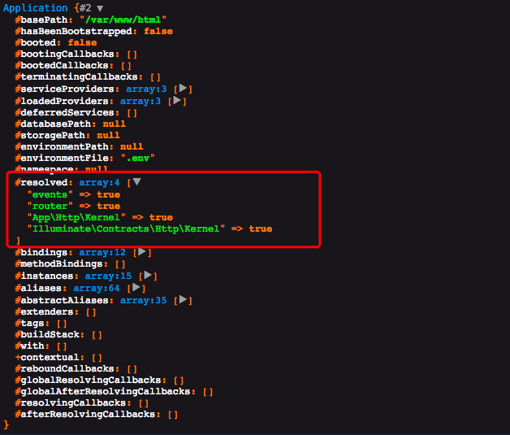
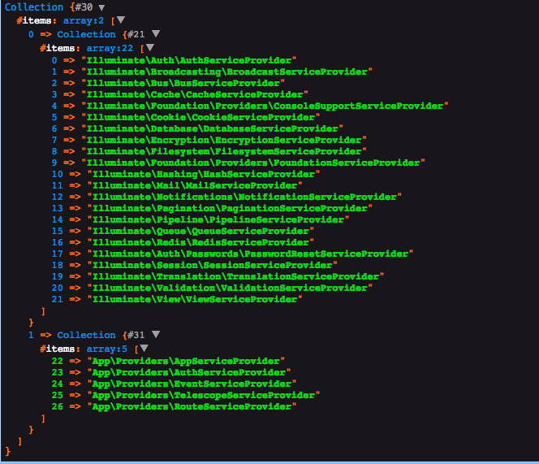

我们知道启动之前除了app和PackageManifest（生成缓存文件）以外第一个实例化的对象便是 `App\Http\Kernel::class` ，而内核类需要两个参数，app 实例和路由实例

```php
# class Kernel

public function __construct(Application $app, Router $router)
{
    $this->app = $app;
    $this->router = $router;

    $router->middlewarePriority = $this->middlewarePriority;

    foreach ($this->middlewareGroups as $key => $middleware) {
        $router->middlewareGroup($key, $middleware);
    }

    foreach ($this->routeMiddleware as $key => $middleware) {
        $router->aliasMiddleware($key, $middleware);
    }
}
```

即内核实例化之前你必须有一个 router 实例，而在 Application 的构造函数中已经 `registerBaseServiceProviders` 了路由

```php
public function __construct($basePath = null)
{
    if ($basePath) {
        $this->setBasePath($basePath);
    }

    $this->registerBaseBindings();

    $this->registerBaseServiceProviders();

    $this->registerCoreContainerAliases();
}
```

```php
protected function registerBaseServiceProviders()
{
    $this->register(new EventServiceProvider($this));

    $this->register(new LogServiceProvider($this));

    $this->register(new RoutingServiceProvider($this));
}
```

```php
# RoutingServiceProvider
public function register()
{
    $this->registerRouter();
    $this->registerUrlGenerator();
    $this->registerRedirector();
    $this->registerPsrRequest();
    $this->registerPsrResponse();
    $this->registerResponseFactory();
    $this->registerControllerDispatcher();
}
```

```php
# 可以看到实例化路由，需要传入两个参数， event 和 app，即实例化路由前，你需要有一个 event 实例
# 注意这里的 $app 是一个对象，那么对象为什么能用数组的形式调用呢？原来是 Application 实现了 \ArrayAccess 接口 (该接口以提供以数组形式访问对象。)
# 所以当 $app['events'] 时候，它执行了offsetGet($key) 方法，获取到 event 实例
#
# public function offsetGet($key)
# {
#     return $this->make($key);
# }

protected function registerRouter()
{
    # dd($this->app);
    # 此时可以看到下面（输出 1）的输出，router 还没被实例化，event 也没有
    $this->app->singleton('router', function ($app) {
        return new Router($app['events'], $app);
    });
}
```

```php
# 输出 1
# 未实例化router之前
  #resolved: []
  #bindings: array:12 [▼
    "events" => array:2 [▶]
    "log" => array:2 [▶]
    "router" => array:2 [▶]
    "url" => array:2 [▶]
    "redirect" => array:2 [▶]
    "Psr\Http\Message\ServerRequestInterface" => array:2 [▶]
    "Psr\Http\Message\ResponseInterface" => array:2 [▶]
    "Illuminate\Contracts\Routing\ResponseFactory" => array:2 [▶]
    "Illuminate\Routing\Contracts\ControllerDispatcher" => array:2 [▶]
    "Illuminate\Contracts\Http\Kernel" => array:2 [▶]
    "Illuminate\Contracts\Console\Kernel" => array:2 [▶]
    "Illuminate\Contracts\Debug\ExceptionHandler" => array:2 [▶]
  ]
  #methodBindings: []
  #instances: array:12 [▼
    "path" => "/var/www/html/app"
    "path.base" => "/var/www/html"
    "path.lang" => "/var/www/html/resources/lang"
    "path.config" => "/var/www/html/config"
    "path.public" => "/var/www/html/public"
    "path.storage" => "/var/www/html/storage"
    "path.database" => "/var/www/html/database"
    "path.resources" => "/var/www/html/resources"
    "path.bootstrap" => "/var/www/html/bootstrap"
    "app" => Application {#2}
    "Illuminate\Container\Container" => Application {#2}
    "Illuminate\Foundation\PackageManifest" => PackageManifest {#4 ▶}
  ]
```

实例化router，这里首先需要 $app['events']，上面已经降到了对象数组调用，其实是用了 make 方法，而make则是实例化event对象，如下

```php
# 这部分代码做了两件事，
# 第一件 实例化 Dispatcher
# 第二件设置队列解析器实现，并返回 Dispatcher 实例
public function register()
{
    $this->app->singleton('events', function ($app) {
        return (new Dispatcher($app))->setQueueResolver(function () use ($app) {
	        return $app->make(QueueFactoryContract::class);
        });
    });
}
```

返回 event 实例后，才真正的实例化 Router 对象，

```php
# Router.php
# 实例化时需要一个 events，container 就是 $app, 然后又 设置了 routes 属性为 RouteCollection 实例
public function __construct(Dispatcher $events, Container $container = null)
{
    $this->events = $events;
    $this->routes = new RouteCollection;
    $this->container = $container ?: new Container;
}
```

实例化完router和events后回到最初的kernel，

```php
# class Kernel

public function __construct(Application $app, Router $router)
{
    $this->app = $app;
    $this->router = $router;

    # 把系统的 $middlewarePriority 加入到router中，注意这个属性的中间件是有顺序的！，它会按照顺序调用
    $router->middlewarePriority = $this->middlewarePriority;

    # middlewareGroups 把中间件组添加进去，即 web 中间件和 api 中间件
    foreach ($this->middlewareGroups as $key => $middleware) {
        $router->middlewareGroup($key, $middleware);
    }

    # $routeMiddleware 中间件别名注册
    # 中间件组中有这样一段的代码，throttle，bindings 都是别名
    # 'api' => [
    #   'throttle:60,1',
    #   'bindings',
    # ],
    foreach ($this->routeMiddleware as $key => $middleware) {
        $router->aliasMiddleware($key, $middleware);
    }
}

```

 走到这里，我打印了路由实例


然后至此，即到生成kernel实例这里，可以看到整个app只实例化了

1. events
2. router
3. App\Http\Kernel **?**  生成 kernel 实例好理解，但是为什么有两个？
4. Illuminate\Contracts\Http\Kernel **?** 

```php
Illuminate\Contracts\Http\Kernel
$kernel = $app->make(Illuminate\Contracts\Http\Kernel::class);
dd($app);
```


 生成 kernel 实例好理解，但是为什么有两个？

先看这里

```php
# 在 new Application 之后，make kernel 之前，系统先绑定了三个单例，其中就有 Kernel
$app = new Illuminate\Foundation\Application(
    dirname(__DIR__)
);
$app->singleton(
    Illuminate\Contracts\Http\Kernel::class,
    App\Http\Kernel::class
);

$app->singleton(
    Illuminate\Contracts\Console\Kernel::class,
    App\Console\Kernel::class
);

$app->singleton(
    Illuminate\Contracts\Debug\ExceptionHandler::class,
    App\Exceptions\Handler::class
);
```

来看 make 方法

```php
# app 的 make 方法实际上调用了 reslove 方法
public function make($abstract, array $parameters = [])
{
	return $this->resolve($abstract, $parameters);
}

# 在 index.php 中用户传入的其实是一个接口，即 interface Kernel，接口当然不能实例化咯，所以，在去拿实例之前，系统会先去解析接口对应的实例对象类，可看到它会走到 $concrete = $this->getConcrete($abstract); 这里 而 getConcrete('Illuminate\Contracts\Http\Kernel') 方法会先去找bingings 中对应的 concrete，也就是生成 kernel 的闭包，因为之前绑定过单例所以找到了！它返回了一个生成 App\Http\Kernel::class 类的闭包，然后继续看 $this->isBuildable($concrete, $abstract)，因为是闭包所以会走到 $object = $this->build($concrete); 里面 嗯，里面的逻辑就是new App\Http\Kernel，但是为什么下面这个resloved中 kernel类比抽象类先解析完成呢？我明明 make 的是lluminate\Contracts\Http\Kernel这个接口类啊，奥秘在$object = $this->build($concrete);这个build里面，因为build传入了闭包，所以进去之后它会执行闭包，而闭包的生成是这样的当传入的$abstract和$concrete不一样是，它又会make，显然App\Http\Kernel和 Illuminate\Contracts\Http\Kernel不一样，所以它会make('App\Http\Kernel')，这时候他就会走到build方法中并且传入的不再是闭包，而是 App\Http\Kernel，然后用反射类去生成实例，再使得$this->resolved[$abstract] = true;所以App\Http\Kernel先变成true，当去拿Illuminate\Contracts\Http\Kernel实际走的是getClosure中的make方法，而此时已经有了 kernel 实例，所以直接返回，并设置$this->resolved[$abstract] = true;

# 解析Illuminate\Contracts\Http\Kernel的时候走了两次 make 方法第一次是Illuminate\Contracts\Http\Kernel本身，第二次是 App\Http\kernel
resolved: array:4 [▼
    "events" => true
    "router" => true
    "App\Http\Kernel" => true
    "Illuminate\Contracts\Http\Kernel" => true
  ]
    
# 闭包生成
protected function getClosure($abstract, $concrete)
{
    return function ($container, $parameters = []) use ($abstract, $concrete) {
        if ($abstract == $concrete) {
            return $container->build($concrete);
        }

        return $container->make($concrete, $parameters);
    };
}

protected function resolve($abstract, $parameters = [])
{
    $abstract = $this->getAlias($abstract);

    $needsContextualBuild = ! empty($parameters) || ! is_null(
	    $this->getContextualConcrete($abstract)
    );


    if (isset($this->instances[$abstract]) && ! $needsContextualBuild) {
	    return $this->instances[$abstract];
    }

    $this->with[] = $parameters;

    $concrete = $this->getConcrete($abstract);

    if ($this->isBuildable($concrete, $abstract)) {
	    $object = $this->build($concrete);
    } else {
    	$object = $this->make($concrete);
    }

    foreach ($this->getExtenders($abstract) as $extender) {
	    $object = $extender($object, $this);
    }

    if ($this->isShared($abstract) && ! $needsContextualBuild) {
	    $this->instances[$abstract] = $object;
    }

    $this->fireResolvingCallbacks($abstract, $object);

    $this->resolved[$abstract] = true;
    array_pop($this->with);

    return $object;
}

```

内核生成之后，便开始调用hanle方法了

```php
$response = $kernel->handle(
    $request = Illuminate\Http\Request::capture()
);
```

$request = Illuminate\Http\Request::capture()

```php
public static function capture()
{
    static::enableHttpMethodParameterOverride();

    return static::createFromBase(SymfonyRequest::createFromGlobals());
}

# 返回了一个request实例，并且主管实例带着客户端传过来的数据
public static function createFromBase(SymfonyRequest $request)
{
    if ($request instanceof static) {
        return $request;
    }

    $content = $request->content;

    $request = (new static)->duplicate(
        $request->query->all(), $request->request->all(), $request->attributes->all(),
        $request->cookies->all(), $request->files->all(), $request->server->all()
    );

    $request->content = $content;

    $request->request = $request->getInputSource();

    return $request;
}
```

hanle

```php
public function handle($request)
{
    try {
        # 这一句，用来开启 _method 参数，也就是你可以模拟请求，比如你的 post 请求中带有_method=put，那么laravel会把你的请求当成put请求，注意 源码有这样的注释 The HTTP method can only be overridden when the real HTTP method is POST.它只能重写你的post请求为"PUT" or "DELETE" 
        $request->enableHttpMethodParameterOverride();

        $response = $this->sendRequestThroughRouter($request);
    } catch (Exception $e) {
        $this->reportException($e);

        $response = $this->renderException($request, $e);
    } catch (Throwable $e) {
        $this->reportException($e = new FatalThrowableError($e));

        $response = $this->renderException($request, $e);
    }

    $this->app['events']->dispatch(
        new Events\RequestHandled($request, $response)
    );

    return $response;
}
```

然后sendRequestThroughRouter

```php
protected function sendRequestThroughRouter($request)
{
    # 可以看到这里他绑定了request实例
    # 为什么这样做？
    # 首先请求过来的request都是不一样的，如果不在这里绑定那么app回去new一个Request类，你拿不到客户端的任何参数
    $this->app->instance('request', $request);

    # 清除了下 Facade 中的 $resolvedInstance，防止先前注册过 \Request 与对应实例， unset(static::$resolvedInstance[$name]);
    Facade::clearResolvedInstance('request');
		
    # 启动
    # 1. 加载系统环境变量
    # 2. 加载配置文件 config
    # 3. 设置异常处理handler
    # 4. 注册门面，这之后才能用门面
    # 5. 加载 app.php 中的 providers
    # 6. 修改 booted = true，并且逐个调用 provider 中的 boot 方法
    $this->bootstrap();

    return (new Pipeline($this->app))
        ->send($request)
        ->through($this->app->shouldSkipMiddleware() ? [] : $this->middleware)
        ->then($this->dispatchToRouter());
}
```

### 第四步解析

```php
# RegisterFacades 上面的第四个步骤
# 最后还是调用了 spl_autoload_register 和 class_alias
# 比如调用 \App 它会调用 Facade 下面的 load 方法，load 把类名解析成 Illuminate\Support\Facades\Request，然后调用 __callStatic
public function bootstrap(Application $app)
{
    Facade::clearResolvedInstances();

    # 传入 app 实例，使得到时候拿实例的时候去app上拿
    Facade::setFacadeApplication($app);

    AliasLoader::getInstance(array_merge(
        $app->make('config')->get('app.aliases', []),
        $app->make(PackageManifest::class)->aliases()
    ))->register();
}

public function register()
{
    if (! $this->registered) {
        $this->prependToLoaderStack();

        $this->registered = true;
    }
}

protected function prependToLoaderStack()
{
    spl_autoload_register([$this, 'load'], true, true);
}

public function load($alias)
{
    if (static::$facadeNamespace && strpos($alias, static::$facadeNamespace) === 0) {
        $this->loadFacade($alias);

        return true;
    }

    if (isset($this->aliases[$alias])) {
        return class_alias($this->aliases[$alias], $alias);
    }
}

public static function __callStatic($method, $args)
{
    $instance = static::getFacadeRoot();

    if (! $instance) {
        throw new RuntimeException('A facade root has not been set.');
    }

    return $instance->$method(...$args);
}

public static function getFacadeRoot()
{
    return static::resolveFacadeInstance(static::getFacadeAccessor());
}

protected static function resolveFacadeInstance($name)
{
    if (is_object($name)) {
        return $name;
    }

    if (isset(static::$resolvedInstance[$name])) {
        return static::$resolvedInstance[$name];
    }
	
    # 关键，如果你之前没用过，它会返回app对应实例并且，赋值给 Facade的$resolvedInstance属性注册一下，注册树模式，Facade 的app 实例是启动的时候传的，请看RegisterFacades.php
    return static::$resolvedInstance[$name] = static::$app[$name];
}
```

下面是我模拟Facade的例子


```php
<?php

require '../vendor/autoload.php';

$app = new Duc\App;
$app->load();

echo \Request::get();

```


```php
<?php

namespace Duc;

class App
{
    public function load()
    {
        class_alias('Duc\Alias\Request', '\Request');
    }
}


```


```php
<?php

namespace Duc\Alias;

class Request
{
    public static function  get()
    {
        return 'call alias Request';
    }
}

```

最后输出 `call alias Request`

### 第五步解析

```php
public function registerConfiguredProviders()
{
    # partition 方法根据回调把集合分成2部分
    $providers = Collection::make($this->config['app.providers'])
        ->partition(function ($provider) {
            return Str::startsWith($provider, 'Illuminate\\');
        });

    # $this->make(PackageManifest::class)->providers() 这一步，实现了包自动加载，把composer.json 中对应的自动加载包加入到了 $providers 中，并且在这一步，系统为 providers 做了缓存，你可以在 bootstrap/cache 中看到 packages.php 缓存文件
    $providers->splice(1, 0, [$this->make(PackageManifest::class)->providers()]);

    # 这里就开始逐个加载 provider 了，该延迟的延迟该解析的解析
    (new ProviderRepository($this, new Filesystem, $this->getCachedServicesPath()))
    ->load($providers->collapse()->toArray());
}
```


```php
public function load(array $providers)
{
    # 第一步先检查是否存在 sevices.php 
    $manifest = $this->loadManifest();

    # 不存在则编译文件写入缓存
    if ($this->shouldRecompile($manifest, $providers)) {
        $manifest = $this->compileManifest($providers);
    }

	# 注册相关事件监听
    foreach ($manifest['when'] as $provider => $events) {
        $this->registerLoadEvents($provider, $events);
    }

	# 预加载 provider，只要属性defer为false的都是预加载
    foreach ($manifest['eager'] as $provider) {
        $this->app->register($provider);
    }

    # 把延迟加载的内容放入 $deferredServices 属性中
    $this->app->addDeferredServices($manifest['deferred']);
}
```

```php
protected function compileManifest($providers)
{
	# 初始化
    $manifest = $this->freshManifest($providers);

    foreach ($providers as $provider) {
        $instance = $this->createProvider($provider);
		
        # 实例化每个 provider 获取其中的属性
        if ($instance->isDeferred()) {
            foreach ($instance->provides() as $service) {
                $manifest['deferred'][$service] = $provider;
            }

            # when 属性指的是，注册 provider 所带的 events
            $manifest['when'][$provider] = $instance->when();
        }
        else {
            # 预加载，是提前注册，在binding中存入相关生成的闭包，并没有实例化对象的操作
            $manifest['eager'][] = $provider;
        }
    }

    # 创建 services.php 缓存文件
    return $this->writeManifest($manifest);
}
```


## 最后的最后

系统启动成功，然后开始调用 Pipeline

```php
return (new Pipeline($this->app))
    ->send($request)
    ->through($this->app->shouldSkipMiddleware() ? [] : $this->middleware)
    ->then($this->dispatchToRouter());
```


## 新增 （2019/12/1）

`$this->getContextualConcrete($abstract)`

场景：

```php
$this->app->when(Concrete::class)->needs('$name')->give('duc');
```

解析：

注册的时候会在容器的 `contextual` 属性中 注入 `name` 值为 `duc` ,


然后实例化的时候调用

```php
protected function getContextualConcrete($abstract)
{
  if (! is_null($binding = $this->findInContextualBindings($abstract))) {
    return $binding;
  }

  if (empty($this->abstractAliases[$abstract])) {
    return;
  }

  foreach ($this->abstractAliases[$abstract] as $alias) {
    if (! is_null($binding = $this->findInContextualBindings($alias))) {
      return $binding;
    }
  }
}


...

class Concrete {
    protected string $name;
    protected array $data;

    public function __construct ($name, $data) {
        $this->name = $name;
        $this->data = $data;
    }

    public function get () {
        return [$this->name, $this->data];
    }
}

// 然后去找到注入的属性
protected function findInContextualBindings($abstract)
{
  return $this->contextual[end($this->buildStack)][$abstract] ?? null;
}
```


