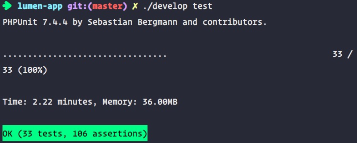

## 规范的命名


```c
// 无法读懂这个方法的含义 ？？？
// bad
public List<int []> getThem() {
    List<int[]> list1 = new ArrayList<int []>();
    for (int[] x : theList)
        if (x[0] == 4)
            list1.add(x)
    return list1;
}

// 用心去命名：比如这个方法是扫雷游戏中的一个环节，其中 List 是盘面，盘面上的每个单元格都用一个简单的数组表示，其中 0 下标是一种状态值，而 4 代表 “已标记”，经过重命名，将 List 改为 gameBoard。以下的代码是不是更好理解

// good
public List<int []> getFlaggedCells() {
    List<int[]> flaggedCells = new ArrayList<int []>();
    for (int[] cell : gameBoard)
        if (cell[STATUC_VALUE] == FLAGGED)
            flaggedCells.add(cell);
    return flaggedCells;
}

// very good
public List<Cell> getFlaggedCells() {
    List<Cell> flaggedCells = new ArrayList<Cell>();
    for (Cell cell : gameBoard)
        if (cell.isFlagged())
            flaggedCells.add(cell);
    return flaggedCells;
}
```

编写别人看的懂的代码

变量名称为 url 肯定比 r 好

## 类名

> 类名应该是名词或者短语，Customer，Account，WikiPage 等，而不是 Manager，Processor，Data。


## 别用双关语

如果在你的代码中add表示新增的话，该方法用来表示增加或连接两个现存值来获得新值，那么当你想要做另一件事，比如吧值加入collection中的时候，就不能用add，你应该用 insert 、append之类的来避免双关语。


## 函数

**函数就应该小！**

1. 一个方法不要超过5行

2. 只做一件事，单一职责，判断函数是不是只做了一件事，只要去看这个函数还能不能呢再拆分出一个函数来

3. 别害怕长的函数名称，它比短小难懂的要好很多

4. 函数参数越少越好，没有参数是最佳的

5. 最好不要传布尔值当做参数，因为这样你在赤裸裸的告诉别人这个函数不止做意见书

6. 如果有三个或者三个以上的参数，你就该考虑，是不是封装成类会比较好

      ```java
      Circle makeCircle(double x, double y, double radius);
      Circle makeCircle(Point center, double radius);
      ```

7. 函数名称应该是 动词(名词) 的形式 `writeField(name)`

8. 抛出异常比返回错误码('ok', 'true', 'false')要好

9. 抽离`try/catch`，因为处理异常本就是一件事，别的又是别的事情，P43.

10. 一些常量最好定义一个类去存储

```java
// bad
appendFooter(s); 

// good
// who do what.
Report.appendFooter(s);
```

## 注释

> 好的代码不需要注释，差的才要，因为注释是在弥补我们在用代码表达意图时的失败

- 注释掉的代码最好删除，不然会让读者误以为还有用
- 所有的无用的注释在代码控制工具出现之后都是废话
- 不要在注释中加 html 标签，令人恶心，且不易读
- 注释本身是来解释代码无法解释的内容，如果注释还要再来解释的话，实在是失败
- 不要为每一行代码做注释，实在是糟糕。我们上学时老师好像都让我们在每一行代码后写注释🤥


## 格式

> 在格式方面自认为做的很好，因为我一开始用的是 sublime 😳

- 垂直方向上代码质检加入适当的空行
- 如果某个函数调用了另一个，就应该把它们放到一起，并且具备上下联系的关系，方便阅读
- 缩进


## 对象和数据结构

- 链式结构应该避免。**我并不这样认为**


## 错误处理

- 抛出异常代替返回码
- 不要返回 null
- 不要把null当参数传入 （我不这样认为，毕竟 php 7 支持 ?string 这样的结构）


## 单元测试 TDD

> 单元测试我认为对于前后端来说都非常有必要

这是本博客某一阶段的测试图，时间长是因为在docker中做的测试，而我的电脑是最低配的mac



TDD 三原则

1. 在编写不能通过的测试前，不可编写生产代码
2. 只可以编写刚好无法通过的测试，不能编译也算不通过
3. 只可以编写刚好足已通过的当前失败测试的代码

有测试，你不用担心对代码的修改而带来的负面的隐藏在深处的影响

测试分为三个环节

- 制造测试数据
- 操作测试数据
- 验证是否得到期望的结果

测试应该遵守以下规则 P123

1. 快速
2. 独立
3. 可重复
4. 自足验证
5. 及时


## 下雪了❄️ 2018年12月08日13:26:43


## 类

- 公有常量定义在类最前面接着才是私有
- 类应该短小
- 系统应该由许多短小的类而不是少量巨大的类组成，每个小的类封装一个权责，只有一个修改的原因
- 内聚，类中的变量理论上应该被所有的类方法都用到，越多表示类越加内聚
- 不要因为类中的某些方法把某个变量变成类变量，这样不可取
- 类应该依赖于抽象而不是实体，对象接口变成的思想 DIP 依赖倒置原则


## 系统

DI

## 迭进

重构消除重复代码


## 其他

```java
if (shouldBeDeleted(timer)) {}
// 要好于
if (timer.hasExpired() && !timer.isRecurrent()) {}

// 避免使用否定语句
shouldCompact 
// 要好于
shouldNotCompact
```

- 一个方法中如果有执行的先后顺序必须体现出来，不能给人一种上下代码换个位置也能跑的想法（时序性）
- 不要继承常量，常量应该专门有一个常量类来导入
- 考虑方法名的时候要考虑仔细，比如 `buyBookByAlipay()` ,乍一看，通过Alipay买书，这个名字没问题，但是如果你仔细想想，用微信呢？刷卡呢？当你要继承或者是实现它的时候会不会感到名称不合适，所以你要提前考虑取名，比如这个就可以叫做 `buyBookByMoney()`😁