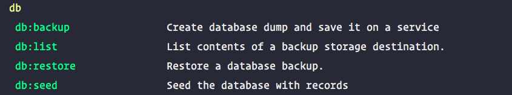
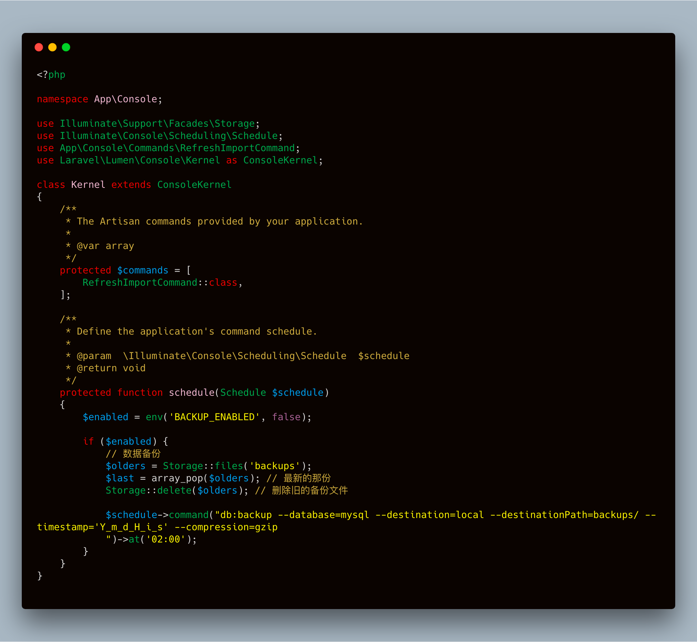

## 起因

> 因为博客是运行在docker上的，docker volume 总感觉不安全，而且博客项目的文章多了，如果不及时备份，则会丢失数据。

## 经过

####  **step1**

因为博客后台是 lumen ，相关的扩展包没有 laravel 那么多，所以处理起来还是比较麻烦的。

之前 star 了一个扩展包 [spatie/laravel-backup](https://github.com/spatie/laravel-backup)，它有2800+ &#x2b50;，本以为用这个包就能很愉快的解决备份问题，但是。。。👉


好吧！！！作者都说不支持了，那就是没戏了。

 那就再找找吧！ 

<br/>


####  step2

[backup-manager/laravel](https://github.com/backup-manager/laravel) chrome 搜来搜去又找到了这个包，才 500+ 多个 star，不管了先试试把

1.  首先安装 `composer require backup-manager/laravel` 
2.  配置，我用的是 lumen 5.7.* 
  ```php
  // FOR LUMEN 5.5 AND ABOVE
  app->configure('backup-manager'); 
  app->register(BackupManager\Laravel\Lumen55ServiceProvider::class);
  ```
3.  配置完后就是使用了
  
4.  它自带了三个命令

- `db:backup`  
   ```bash
   php artisan db:backup --database=mysql --destination=dropbox --destinationPath=project --timestamp="d-m-Y" --compression=gzip
   ```
- `db:list`  查看命令帮助即可
-  `db:restore`  
   ```bash
   php artisan db:restore --database=mysql --compression=gzip --source=local --sourcePath=/backups/{$lastDumpFile}
   ```


## 以为这样就轻松解决了吗？？？

> 如果不是docker驱动的，那是真的就这样解决了

因为我是docker驱动，那么问题出现了：

1.   作为docker驱动的app，在我的app images中是没有 `mysqldump` 这个命令的，但是如果我 `apt install mysql-client-5.7` 再打包制作镜像，这就不太好，毕竟我好几个app都用这个image
2.   那么如何在不修改image镜像的情况下，让它运行起来呢？？


## 我的解决方案

1.  当然是加脚本咯
      ```bash
      #!/usr/bin/env bash 
      # init.sh
      test -f /usr/bin/mysqldump && echo "mysqldump exists" || (apt update && apt install -y mysql-client-5.7)
      ```
2. 在我的image中允许添加用户脚本，只需要在环境变量中加入 `BASH_NAMES:init.sh`
3. done!这样加好之后，docker-compose 启动的时候就会在不修改镜像的情况下自动安装mysql客户端
4. 但是问题又出现了！？？&#x26a0; 当容器 `down` 之后再次启动就会重新下载mysql客户端，这个问题用脚指头想想就知道了，没有持久化数据，即需要用voulmes存储修改的内容

```yaml
installdata:/usr/bin # 嗯在vlume中加这一句
```


## 将数据库备份加到定时任务中去




## 备份结果


> 我知道你们看不懂，我懂就行了，哈哈哈哈哈哈哈哈哈


&#x1f9c0; 👏