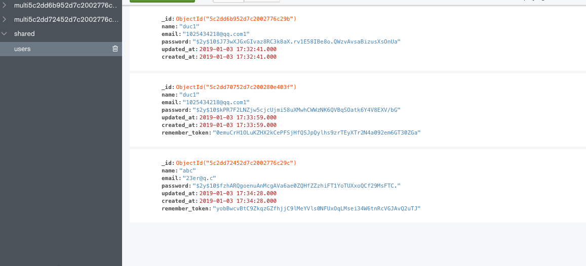

> 1. 由于有些系统需要数据保密，各个用户之间没有任何关联，如果单个数据库那么必须要使用全局的scope来过滤数据，包括如果用户需要他自己的所有相关数据，单个数据去搜索必然是一件很麻烦的事情，所以本文来实现不同用户不同数据
> 2. 多租户系统里面常常需要一个用户一个数据库，每个用户都是一个独立的个体，这里我使用laravel和mongodb来简单的尝试下

1. 安装 `laravel` 以及 `jenssegers/laravel-mongodb`

2. 这里我建立了一张表来实现做测试

   ```php
   namespace App;
   
   use Jenssegers\Mongodb\Eloquent\Model as Eloquent;
   
   class MongoTable extends Eloquent
   {
       protected $connection = 'mongodb';
   
       protected $guarded = [];
   
       public function user()
       {
           return $this->belongsTo(User::class, 'user_id');
       }
   }
   ```

3. 一个中间件 `DynamicChangeMongodb`，暂时想到的是用中间件动态改变数据库的连接来达到目的

```php
   <?php

namespace App\Http\Middleware;

use Closure;

class DynamicChangeMongodb
{
    /**
     * Handle an incoming request.
     *
     * @param  \Illuminate\Http\Request  $request
     * @param  \Closure  $next
     * @return mixed
     */
    public function handle($request, Closure $next)
    {
        if (! auth()->guest()) {
            $user = auth()->user();

            config()->set('database.connections.mongodb.database', env('MONGO_DATABASE') . $user->id);
        }

        return $next($request);
    }
}

```


## 相关配置

> 这里加了一个 `shared` 和 `mongodb` ，第一个是共享数据，第二个是单独用户的所有数据

```php

    'connections' => [

        'shared' => [
            'driver'   => 'mongodb',
            'host'     => 'mongo', // env('DB_HOST', 'localhost'),
            'port'     => '27017', env('DB_PORT', 27017),
            'database' => 'shared',
            'username' => env('MONGO_USERNAME'),
            'password' => env('MONGO_PASSWORD'),
            'options'  => [
                'database' => 'admin' // sets the authentication database required by mongo 3
            ]
        ],

        'mongodb' => [
            'driver'   => 'mongodb',
            'host'     => 'mongo', // env('DB_HOST', 'localhost'),
            'port'     => '27017', env('DB_PORT', 27017),
            'database' => env('MONGO_DATABASE'),
            'username' => env('MONGO_USERNAME'),
            'password' => env('MONGO_PASSWORD'),
            'options'  => [
                'database' => 'admin' // sets the authentication database required by mongo 3
            ]
        ],

       ...

    ],
```


## preview

> 可以看到用户有他自己的数据库，以及一个公有的数据库




## end

这样就可以简单的实现多租户系统了。简单的想了想，到时候在深入吧！

