> 从2018年开始接触这个搜索引擎，并把es用在了我博客的的搜索上，只是浅显了学习和使用了，今天再次来系统的学习下

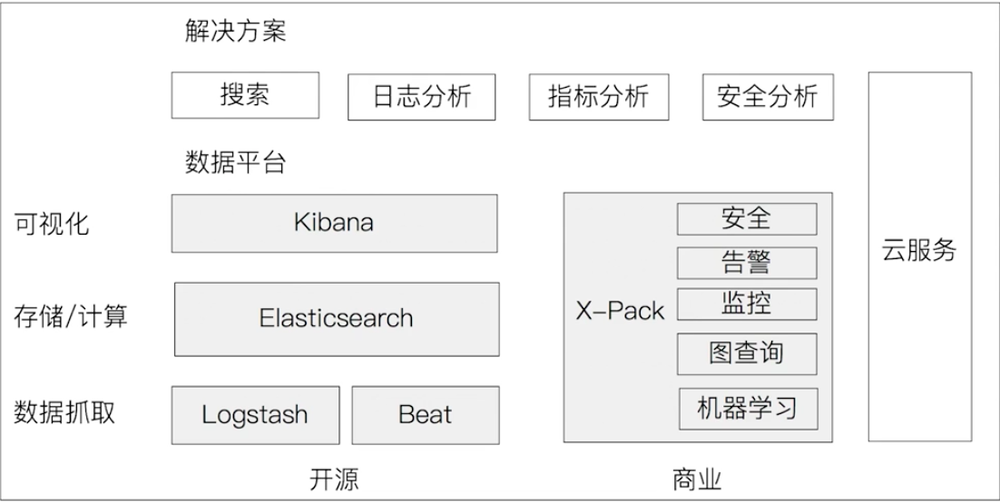


## Logstash特性

- 实时解析和转换数据
  - 从IP地址破译出地理坐标
  - 将PII数据匿名化，完全排除敏感字段
- 可扩展
    - 200 多个插件(日志/数据库/Arcsigh/Netflow)
- 可靠性安全性
    - Logstash会通过持久化队列来保证至少将运行中的事件送达一-次
    - 数据传输加密
- 监控


## Elasticsearch的文件目录结构

| 目录 | 配置文件 | 描述 |
| ---- | -------- | ------------------------|
| bin  |      | 脚本文件，包括启动elasticsearch,安装插件。运行统计数据等 |
| config | elasticsearch.yml | 集群配置文件，user, role based相关配置 |
| JDK | | Java运行坏境 |
| data | path.data | 数据文件 |
| lib | | Java类库 |
| logs | path.log | 日志文件 |
| modules | | 包含所有ES模块 |
| plugins | | 包含所有已安装插件 |


## 安装

1. tar 方式

   - 下载解压

   - 执行 bin/elasticsearch

   - 插件安装 bin/elasticsearch-plugin [install|list]

   - ```bash
     # 需要重启es
     bin/elasticsearch-plugin install analysis-icu
     ```


## 如何在开发机上运行多个Elasticsearch实例

- bin/elasticsearch -E node.name=node1 -E cluster name=geektime -E path.data=node1. data -d
- bin/elasticsearch -E node.name=node2 -E cluster name=geektime -E path.data=node2. data -d
- bin/elasticsearch -E node.name=node3 -E cluster name=geektime -E path.data=node3_ data -d
- 删除进程 ps| grep elasticsearch
- kill pid


分布式运行

```bash
// 节点名称
/// 集群名字
// 数据储存地址
bin/elasticsearch -E node.name=node1 -E cluster.name=geektime -E path.data=node1_data -d
```


查看集群节点

```
localhost:9200/_cat/nodes
```


## docker-compose.yaml

```yaml
version: '3'
services:
# 监控工具
  cerebro:
    image: lmenezes/cerebro:0.8.3
    container_name: cerebro
    ports:
      - 9000:9000
    command:
      - -Dhttp.port=9200 -Dhttp.address=es02
    networks:
      - esnet
  kibana:
    image: docker.elastic.co/kibana/kibana:7.3.2
    environment:
      ELASTICSEARCH_HOSTS: http://es02:9200
      I18N_LOCALE: zh-CN
    ports:
      - 5601:5601
#    volumes:
#      - ./kibana.yml:/usr/share/kibana/config/kibana.yml
    networks:
      - esnet
  es03:
    image: docker.elastic.co/elasticsearch/elasticsearch:7.3.2
    container_name: es03
    environment:
      - node.name=es03
      - discovery.seed_hosts=es02
      - cluster.initial_master_nodes=es01,es02
      - cluster.name=docker-cluster
      - bootstrap.memory_lock=true
      - "ES_JAVA_OPTS=-Xms512m -Xmx512m"
    ulimits:
      memlock:
        soft: -1
        hard: -1
    volumes:
      - esdata03:/usr/share/elasticsearch/data
    networks:
      - esnet
  es01:
    image: docker.elastic.co/elasticsearch/elasticsearch:7.3.2
    container_name: es01
    environment:
      - node.name=es01
      - discovery.seed_hosts=es02
      - cluster.initial_master_nodes=es01,es02
      - cluster.name=docker-cluster
      - bootstrap.memory_lock=true
      - "ES_JAVA_OPTS=-Xms512m -Xmx512m"
    ulimits:
      memlock:
        soft: -1
        hard: -1
    volumes:
      - esdata01:/usr/share/elasticsearch/data
    ports:
      - 9200:9200
    networks:
      - esnet
  es02:
    image: docker.elastic.co/elasticsearch/elasticsearch:7.3.2
    container_name: es02
    environment:
      - node.name=es02
      - discovery.seed_hosts=es01
      - cluster.initial_master_nodes=es01,es02
      - cluster.name=docker-cluster
      - bootstrap.memory_lock=true
      - "ES_JAVA_OPTS=-Xms512m -Xmx512m"
    ulimits:
      memlock:
        soft: -1
        hard: -1
    volumes:
      - esdata02:/usr/share/elasticsearch/data
    networks:
      - esnet

volumes:
  esdata01:
    driver: local
  esdata02:
    driver: local
  esdata03:
    driver: local

networks:
  esnet:

```


## Kibana 安装插件


...


## 抽象与类比(和mysql对比)

| mysql | es   |
| ----- | ---- |
|RDBMS|Elasticsearch|
|Table|Index (Type)|
|Row|Doucment|
|Column|Field |
|Schema|Mapping|
|SQL|DSL|


## docker使用logstash导入数据

https://honghuhu.github.io/2019/6/29/


### 查看进群健康状况

```json
// _cluster/health
{
  "cluster_name": "docker-cluster",
  "status": "green",
  "timed_out": false,
  "number_of_nodes": 3,
  "number_of_data_nodes": 3,
  "active_primary_shards": 6,
  "active_shards": 12,
  "relocating_shards": 0,
  "initializing_shards": 0,
  "unassigned_shards": 0,
  "delayed_unassigned_shards": 0,
  "number_of_pending_tasks": 0,
  "number_of_in_flight_fetch": 0,
  "task_max_waiting_in_queue_millis": 0,
  "active_shards_percent_as_number": 100.0
}
```


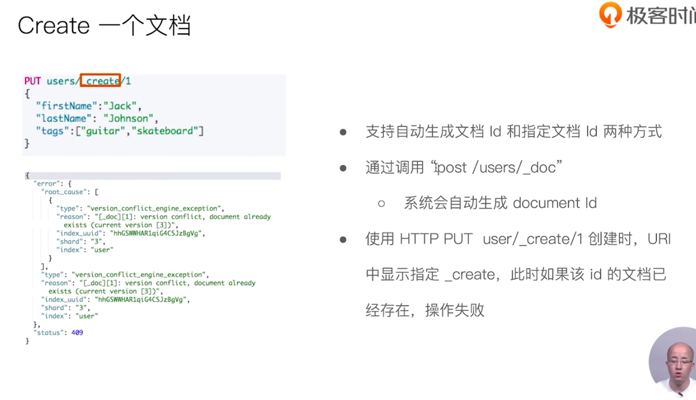
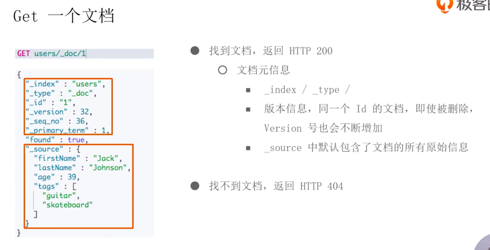

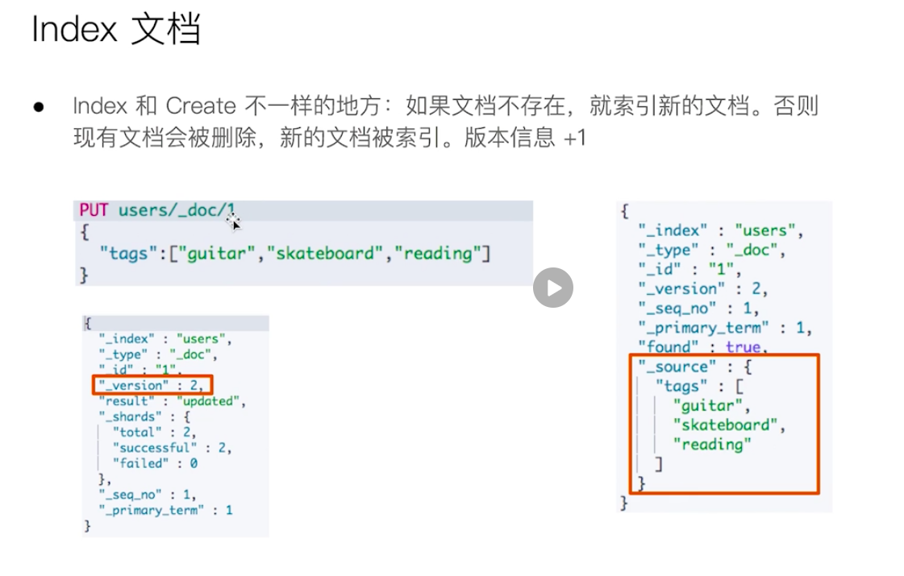


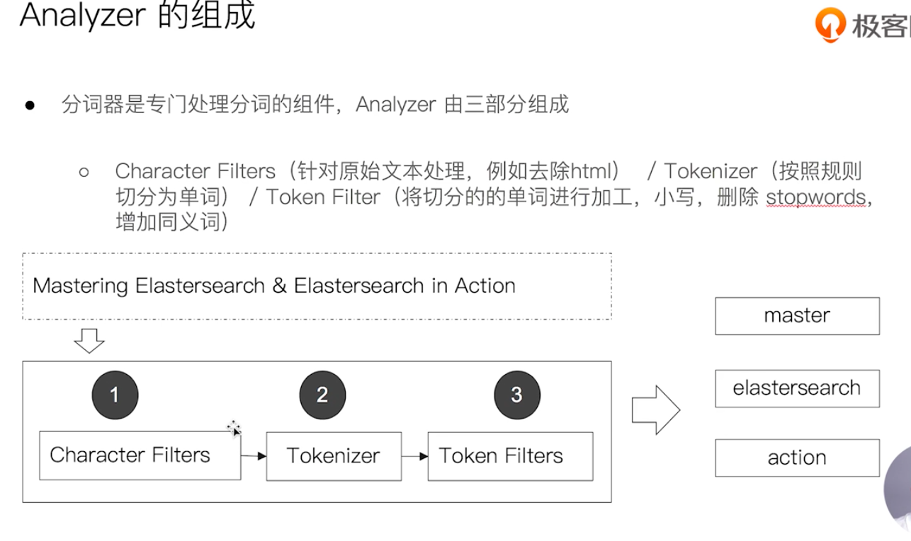

## Elasticsearch的内置分词器

- Standard Analyzer一默认分词器，按词切分，小写处理, in the，这些停用词没去掉
- Simple Analyzer一按照非字母切分(符号被过滤)，小写处理
- Stop Analyzer一小写处理，停用词过滤(the, a, is),相比simple，多去除了修饰性词语
- Whitespace Analyzer一按照空格切分，不转小写
- Keyword Analyzer一不分词，直接将输入当作输出
- Patter Analyzer一正则表达式，默认\W+ (非字符分隔)
- Language -提供了30多种常见语言的分词器
- Customer Analyzer自定义分词器


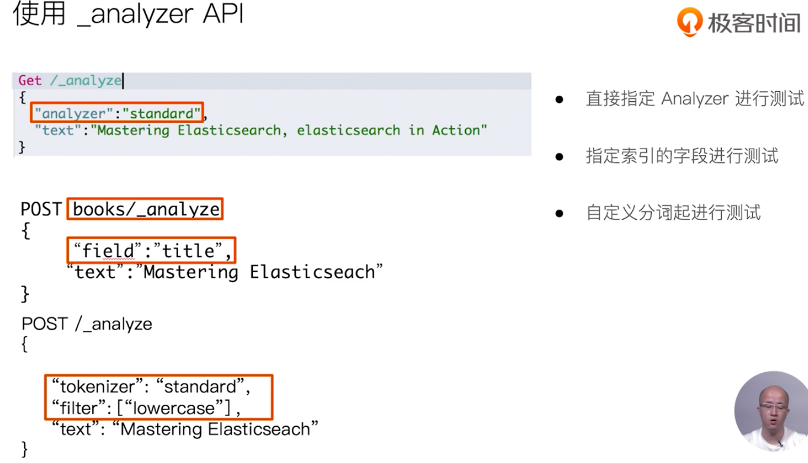


### 安装 ik 分词器

```bash
elasticsearch-plugin  install https://github.com/medcl/elasticsearch-analysis-ik/releases/download/v7.3.2/elasticsearch-analysis-ik-7.3.2.zip
```


## 更多中文分词器

- IK
  - 支持自定义词库，支持热更新分词字典
  - Github.com/medcl/elasticsearch-analysis-ik
- THULAC
  - 清华大学自然语言处理和社会人文计算实验室的一套中文分词器
  - Github.com/microbun/elasticsearch-thulac-plugin


### 指定查询的索引


| 语法 | 范围 |
| ---- | ---- |
|/_ search|集群上所有的索引|
|/index1/_ search|index1 |
|/index1,index-2/_search|index1和index2|
|/index*/_ search|以index开头的索引|


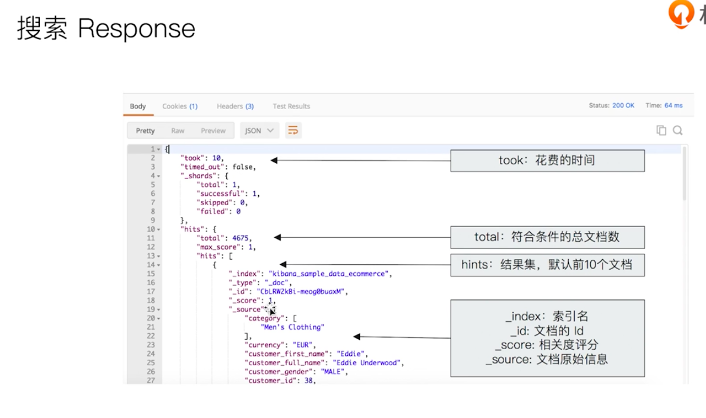


## Url search

> 通过url query 实现搜索

`GET /movies/_search?q=2012&df=title&sort=year:desc&from=O&size=10&time=1s`


- q 指定查询语句，使用Query String Syntax
- df默认字段，不指定时,会对所有字段进行查询
- Sort排序/from和size用于分页.
- Profile 可以查看查询是如何被执行的


### Query String Syntax (2)

- 布尔操作
- AND/ OR/ NOT 或者 && / || / !
- 必须大写
- title:(matrix NOT reloaded)
- 分组
- `+` 表示must
- `-` 表示must_ not
- title:(+matrix -reloaded)


```json

# 泛查询，全部字段查询
GET movies/_search?q=2012
{
  "profile": "true"
}

# 指定字段查询
GET movies/_search?q=title:2012
{
  "profile": "true"
}

# PhraseQuery 表示beatful && mind 要同时出现
GET movies/_search?q=title:"Beautiful Mind"
{
  "profile": "true"
}

# PhraseQuery 表示beatful || mind
GET movies/_search?q=title:(Beautiful Mind)
{
  "profile": "true"
}

# 必须包括 beautiful 和 mind
GET movies/_search?q=title:(Beautiful AND Mind)
{
  "profile": "true"
}

# 必须包括 beautiful 但不能包括 mind
GET movies/_search?q=title:(Beautiful NOT Mind)
{
  "profile": "true"
}

# beautiful +mind %2B=>+
GET movies/_search?q=title:(Beautiful %2BMind)
{
  "profile": "true"
}
```

### Query String Syntax (3)

- 范围查询
- 区间表示:[] 闭区间，{}开区间
- year:{2019 TO 2018]
- year:[* TO 2018]
- 算数符号
- year:>2010
- year:(>2010 && <=2018)
- year:(+>2010 +<=2018)


### Query String Syntax (4)

- 通配符査洵(通配符査洵效率低，占用内存大，不建以使用。特別是放在最前面)
  -  `?` 代表1个字符，`*` 代表0或多个字符
    - `title:mi?d`
    - `tltle:be*`
- 正则表达式
  -  title:[bt]oy
- 模糊匹配与近似査洵
  - `title:befutifl~1`
  - `title:"lord rings" ~2`


```json

# 范围查询 区间/数学写法
GET movies/_search?q=year:>1980
{
  "profile": "true"
}

# 通配符查询
GET movies/_search?q=title:b*
{
  "profile": "true"
}

# 模糊查询&近似度匹配，单词出错的情况
GET movies/_search?q=title:beautifua~1
{
  "profile": "true"
}

# 模糊查询&近似度匹配，单词出错的情况
GET movies/_search?q=title:"lord rings"~2
{
  "profile": "true"
}
```


## Request body search

> 建议使用这个，因为高阶的查询只能在这里用


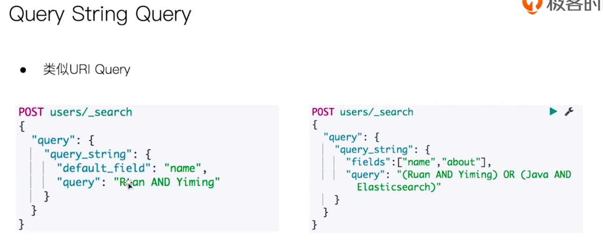

```json

# 对日期排序
GET kibana_sample_data_ecommerce/_search
{
  "sort": [
    {
      "order_date": "desc"
    }
  ],
  "query": {
    "match_all": {}
  }
}

# 只拿需要的信息(order_date)
GET kibana_sample_data_ecommerce/_search
{
  "_source": "order_date", 
  "query": {
    "match_all": {}
  }
}

# 脚本字段
GET kibana_sample_data_ecommerce/_search
{
  "script_fields": {
    "new_field": {
      "script": {
        "lang": "painless",
        "source": "doc['order_date'].value +'_hello'"
      }
    }
  }
}


# or 查询
GET movies/_search
{
  "query": {
    "match": {
      "title": {
        "query": "Beautiful Mind"
      }
    }
  },
  "profile": "true"
}

# and 查询
GET movies/_search
{
  "query": {
    "match": {
      "title": {
        "query": "Beautiful Mind",
        "operator": "AND"
      }
    }
  },
  "profile": "true"
}


# phrase 查询
GET movies/_search
{
  "query": {
    "match_phrase": {
      "title": {
        "query": "one love"
      }
    }
  },
  "profile": "true"
}

# phrase 查询
GET movies/_search
{
  "query": {
    "match_phrase": {
      "title": {
        "query": "one love",
        "slop": 1
      }
    }
  },
  "profile": "true"
}
```


```json

PUT /users/_doc/1
{
  "name": "ruan yiming",
  "about": "php, golang, vue, js, docker, k8s"
}

PUT /users/_doc/2
{
  "name": "li yiming",
  "about": "handoop"
}

POST users/_search
{
  "query": {
    "query_string": {
      "default_field": "name",
      "query": "ruan AND yiming"
    }
  }
}

POST users/_search
{
  "query": {
    "query_string": {
      "fields": ["name", "about"],
      "query": "(ruan AND yiming) OR (java AND k8s)"
    }
  }
}

# 不支持and ， 默认是 or
POST users/_search
{
  "query": {
    "simple_query_string": {
      "fields": ["name"],
      "query": "ruan yiming"
    }
  }
}

# 修改默认操作符
POST users/_search
{
  "query": {
    "simple_query_string": {
      "fields": ["name"],
      "query": "ruan yiming",
      "default_operator": "AND"
    }
  }
}
```


### 什么是Mapping

- Mapping 类似数据库中的schema的定义，作用如下
  - 定义索引中的字段的名称
  - 定义字段的数据类型， 例如字符串，数字，布..... 
  - 字段， 倒排索引的相关配置，(Analyzed or Not Analyzed,
    Analyzer)
- Mapping会把JSON文档映射成Lucene所需要的扁平格式
- 一个Mapping属于一个索引的Type
  - 每个文档都属于-一个Type
  - 一个Type有一个Mapping定义
  - 7.0 开始，不需要在Mapping定义中指定type信息


## 字段的数据类型


- 简单类型
  - Text / Keyword
  - Date
  - Integer / Floating
  - Boolean
  - IPv4 & IPv6
- 复杂类型-对象和嵌套对象
  - 对象类型/嵌套类型
- 特殊类型
  - geo_ point & geo_ shape / percolator


### 类型的自动识别

| JSON类型 | Elasticsearch类型 |
| -------- | ----------------- |
| 布尔值 | boolean |
|字符串|1. 匹配日期格式，设置成Date 2. 配置数字设置为float或者long, 该选项默认关闭 3.设置为text，并且增加 keyword 字段 |
|float|浮点数 |
|整数|long |
|对象|Object |
|数组|由第一个非空数值的类型所决定 |
|空值|忽略 |


```json


PUT mapping_test/_doc/1
{
  "firstName":"du",
  "lastName":"cong",
  "loginDate":"2019-08-08T10:29:29.103Z"
}

DELETE mapping_test

GET mapping_test/_mapping

PUT mapping_test/_doc/1
{
  "uid":"123",
  "vip":false,
  "isVip":"true"
}

```

### 能否更改Mapping的字段类型

- 两种情况
- 新增加字段
- Dynamic设为true时，-旦有新增字段的文档写入，Mapping也同时被更新
- Dynamic设为false, Mapping不会被更新，新增字段的数据无法被索引，但是信息会出现在_ source中
- Dynamip设置成Strict, 文档写入失败
- 对已有字段，一旦已经有数据写入，就不再支持修改字段定义
- Lucene实现的倒排索引，-旦生成后,就不允许修改
- 如果希望改变字段类型，必须Reindex API， 重建索引
- 原因
- 如果修改了字段的数据类型，会导致已被索引的属于无法被搜索
- 但是如果是增加新的字段，就不会有这样的影响


## 定义mapping

```json
PUT movies
{
  "mapping": {
    //
  }
}
```

### 自定义Mapping的一些建议

- 可以参考 API手册，纯手写
- 为了 减少输入的工作量，减少出错概率，可以依照以下步骤
  - 创建一个临时的jindex，写入-些样本数据
  - 通过访问Mapping API获得该临时文件的动态Mapping定义
  - 修改后用，使用该配置创建你的索引
  - 删除临时索引


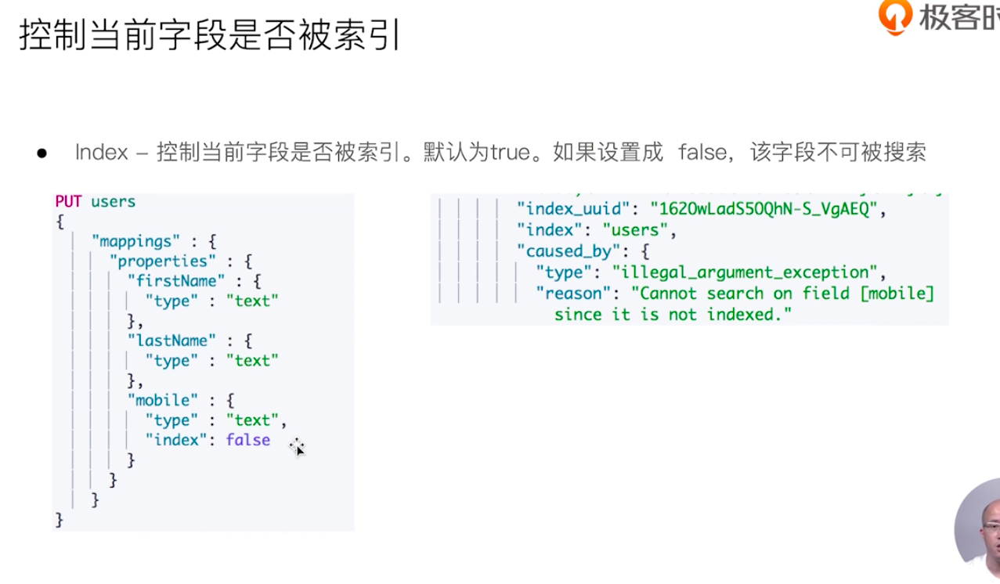

```json


DELETE users

# 不给 mobile建立索引
PUT users
{
  "mappings": {
    "properties": {
      "firstname": {
        "type": "text"
      },
      
      "lastname": {
        "type": "text"
      },
      
      "mobile": {
        "type": "text",
        "index": false
      }
    }
  }
}

GET users/_mapping

PUT users/_doc/1
{
  "firstname": "du",
  "lastname": "cong",
  "mobile": "18888780080"
}

GET users/_search
{
  "query": {
    "match": {
      "firstname": "du"
    }
  }
}

GET users/_search
{
  "query": {
    "match": {
      "mobile": "18888"
    }
  }
}
```


### 倒排索引建立的四种级别

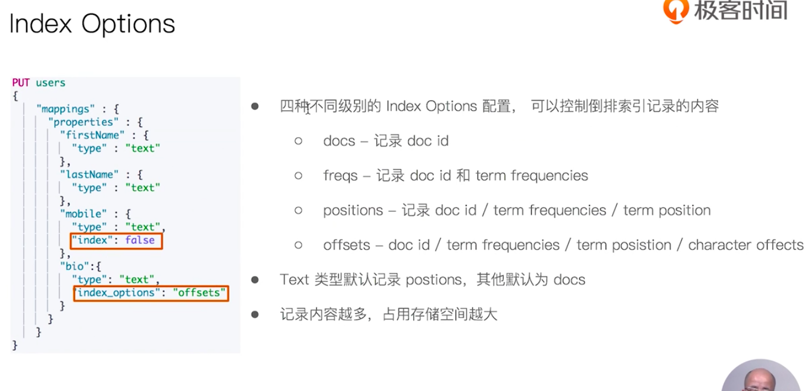


### 对 null 值搜索


```json

DELETE users

# copy to 拷贝到fullname字段，不会出现在查询中
PUT users
{
  "mappings": {
    "properties": {
      "firstname": {
        "type": "text",
        "copy_to": "fullname"
      },
      
      "lastname": {
        "type": "text",
        "copy_to": "fullname"
      },
      
      "mobile": {
        "type": "keyword",
        "null_value": "NULL"
      }
    }
  }
}


PUT users/_doc/1
{
  "firstname": "du",
  "lastname": "cong",
  "mobile": null
}

GET users/_search
{
  "query": {
    "match": {
      "fullname": "du"
    }
  }
}

```


```json

DELETE users

# 不给 mobile建立索引
PUT users
{
  "mappings": {
    "properties": {
      "firstname": {
        "type": "text"
      },
      
      "lastname": {
        "type": "text"
      },
      
      "mobile": {
        "type": "keyword",
        "null_value": "NULL"
      }
    }
  }
}

GET users/_mapping

PUT users/_doc/1
{
  "firstname": "du",
  "lastname": "cong",
  "mobile": null
}

GET users/_search
{
  "query": {
    "match": {
      "mobile": "NULL"
    }
  }
}
```


## 多字段类型


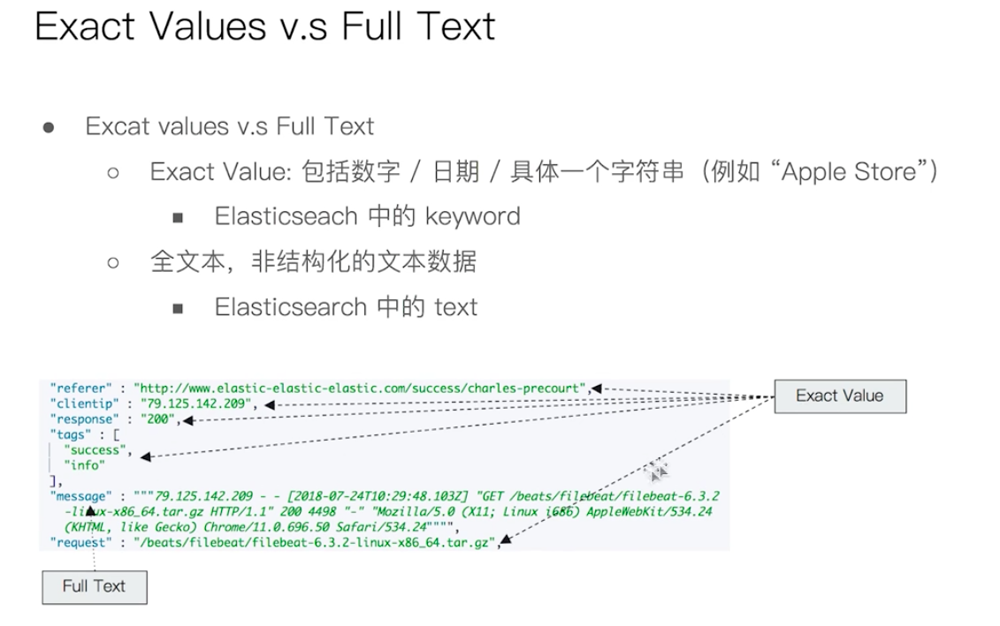


- Exact Values keywork 类型，不需要分词
- Full Text  需要分词


## 自定义分词器


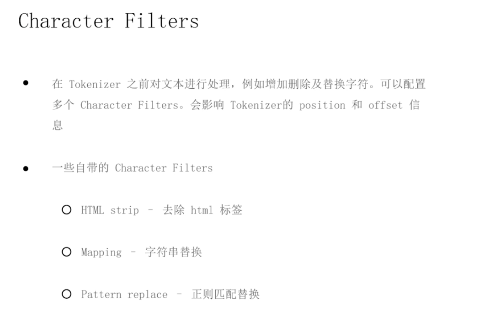


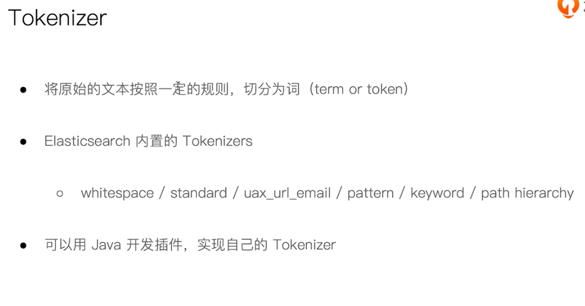


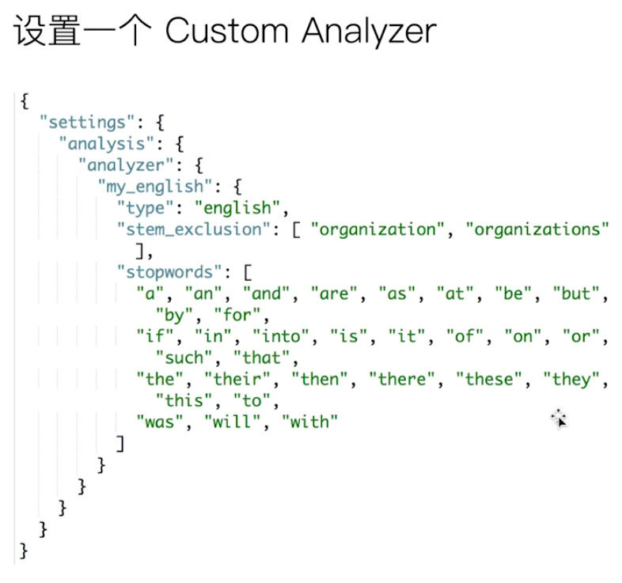


```json
POST _analyze
{
  "tokenizer": "keyword",
  "char_filter": ["html_strip"],
  "text": "<b>hi</b>"
}


# 输入替换
POST _analyze
{
  "tokenizer": "standard",
  "char_filter": [
    {
     "type": "mapping",
     "mappings": ["- => _"]
    }
  ],
  "text": "1-2,3-4,5-6"
}
```

## 自定义

```json

# 给索引定义 自定义 解析器
DELETE my_index
PUT my_index
{
  "settings": {
    "analysis": {
      "analyzer": {
        "custom": {
          "type": "custom",
          "char_filter": [
            "emoticons"
          ],
          "tokenizer": "punctuation",
          "filter": [
            "lowercase",
            "english_stop"
          ]
        }
      },
      "tokenizer": {
        "punctuation": {
          "type": "pattern",
          "pattern": "[,.!?]"
        }
      },
      "char_filter": {
        "emoticons": {
          "type": "mapping",
          "mappings": [":) => happy", ":( => sad"]
        }
      },
      "filter": {
        "english_stop": {
          "type": "stop",
          "stopwords": "_english_"
        }
      }
    }
  }
}

GET my_index

POST my_index/_analyze
{
  "analyzer": "custom",
  "text": ":) hi in the home! HAHHA"
}
```


