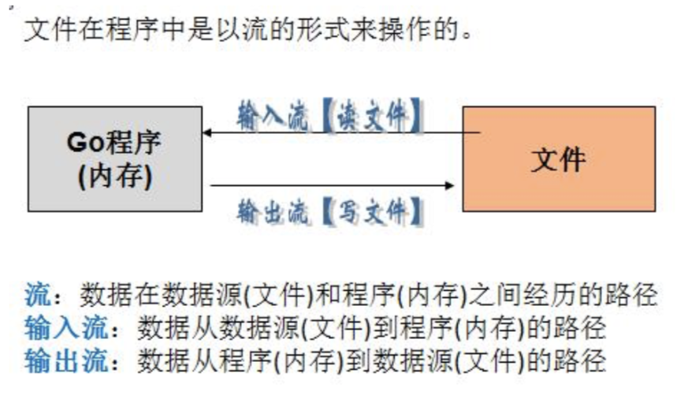
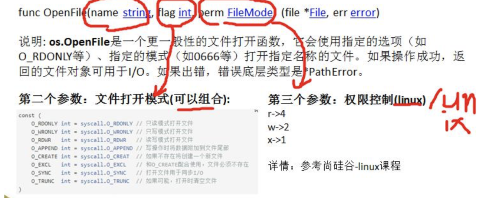
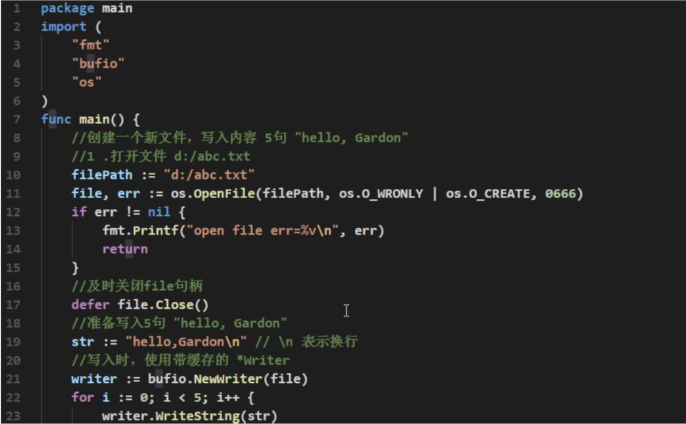
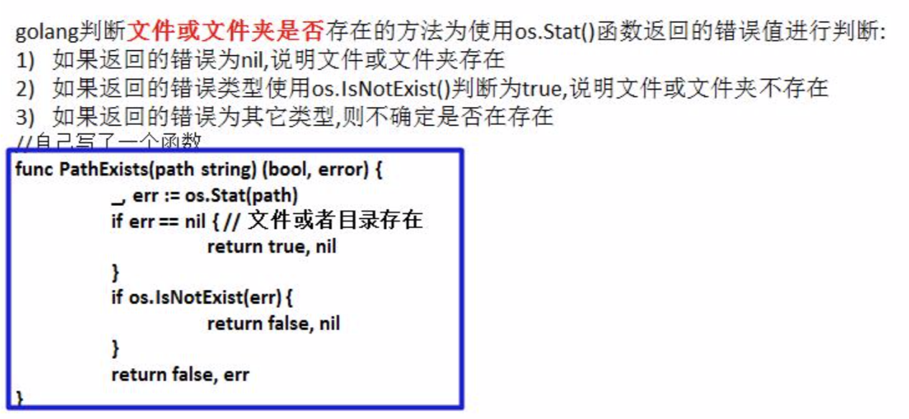

# 文件操作

输入流和输出流



os.File 封装所有文件相关操作，File 是一个结构体


## 读文件操作应用实例

1. 读取文件的内容并显示在终端(带缓冲区的方式)，使用 os.Open, file.Close, bufio.NewReader(),reader.ReadString 函数和方法.


```go
func main() { 
    //打开文件
    //概念说明: file 的叫法
    //1. file 叫 file 对象
    //2. file 叫 file 指针
    //3. file 叫 file 文件句柄
    file , err := os.Open("d:/test.txt") 
    if err != nil {
    	fmt.Println("open file err=", err) 
    }
    
    //当函数退出时，要及时的关闭 file
    defer file.Close() //要及时关闭 file 句柄，否则会有内存泄漏.

    // 创建一个 *Reader ，是带缓冲的
    /*
    const (
    	defaultBufSize = 4096 //默认的缓冲区为 4096 
    )
    */
    reader := bufio.NewReader(file) //循环的读取文件的内容
	for ; ;  {
		str ,err:=reader.ReadString('\n')
		fmt.Printf("str=%s err=%v\n",str,err)

		if err == io.EOF {
			break
		}
	}
}
```

2. 读取文件的内容并显示在终端(使用ioutil一次将整个文件读入到内存中)，这种方式适用于文件不大的情况。相关方法和函数(ioutil.ReadFile)


### os.OpenFile 函数







### 判断文件是否存在




### 拷贝文件

```go
package main

import (
	"bufio"
	"fmt"
	"io"
	"os"
)

//自己编写一个函数，接收两个文件路径 srcFileName dstFileName
func CopyFile(dstFileName string, srcFileName string) (written int64, err error) {
	srcFile, err := os.Open(srcFileName)

	if err != nil {
		fmt.Printf("open file err=%v\n", err)
	}

	defer srcFile.Close()

	//通过 srcfile ,获取到 Reader
	reader := bufio.NewReader(srcFile)

	//打开 dstFileName
	dstFile, err := os.OpenFile(dstFileName, os.O_WRONLY|os.O_CREATE, 0666)
	if err != nil {
		fmt.Printf("open file err=%v\n", err)
		return
	}

	//通过 dstFile, 获取到 Writer
	writer := bufio.NewWriter(dstFile)
	defer dstFile.Close()

	return io.Copy(writer, reader)
}
func main() {

	//将 d:/flower.jpg 文件拷贝到 e:/abc.jpg
	//调用 CopyFile 完成文件拷贝
	srcFile := "demo/dux.txt"
	dstFile := "demo/abc.txt"

	_, err := CopyFile(dstFile, srcFile)
	if err == nil {
		fmt.Printf("拷贝完成\n")
	} else {
		fmt.Printf("拷贝错误 err=%v\n", err)
	}
}

```


### 处理命令行参数

> os.Args 是一个 string 的切片，用来存储所有的命令行参数

```go
package main

import (
	"fmt"
	"os"
)

func main() {
	s := os.Args
	for key, value := range s {
		fmt.Printf("%v %v\n", key,value)
	}
}

```


### flag 包用来解析命令行参数

```go
package main

import (
	"flag"
	"fmt"
)

var (
	host string
	port uint64
	pwd string
)

func main() {
	flag.StringVar(&host, "h", "localhost", "主机名")
	flag.Uint64Var(&port, "p", 3306, "端口")
	flag.StringVar(&pwd, "pwd", "123456", "pwd")
	flag.Parse()
	fmt.Println(host,port,pwd)
}

```


## json 

### 序列化

```go
package main

import (
	"encoding/json"
	"fmt"
)

type Cat struct {
	Name string `json:"name"`
	Age  int8   `json:"age"`
}

func main() {
	res,err:=json.Marshal(Cat{Name: "拖鞋", Age: 2})
	if err != nil{
		fmt.Println(err)
		return
	}
	fmt.Println(string(res))
}


package main

import (
	"encoding/json"
	"fmt"
)

func main() {

	m := make(map[string]string, 100)
	m["name"] = "duc"
	m["age"] = "23"
	m["home"] = "绍兴"

	res,err := json.Marshal(m)
	if err != nil {
		fmt.Println(err)
		return
	}
	fmt.Println(m, string(res))
}

// ------------------

package main

import (
	"encoding/json"
	"fmt"
)

func main() {

	m := make(map[string]string, 100)
	m["name"] = "duc"
	m["age"] = "23"
	m["home"] = "绍兴"

	res,err := json.Marshal(m)
	if err != nil {
		fmt.Println(err)
		return
	}
	fmt.Println(m, string(res))
}

```

- 对于结构体的序列化，如果我们希望序列化后的 key 的名字，又我们自己重新制定，那么可以给 struct 指定一个 tag 标签. 


### 反序列化

```go
package main

import (
	"encoding/json"
	"fmt"
)

type Cat struct {
	Name string `json:"name"`
	Age int8 `json:"age"`
}

func main() {
	str:=`{"name":"拖鞋","age":2}`
	data := Cat{}
	err := json.Unmarshal([]byte(str), &data)
	if err != nil{
		fmt.Println(err)
		return
	}
	fmt.Println(data)
}

```

- 在反序列化一个json字符串时，要确保反序列化后的数据类型和原来序列化前的数据类型一致。
- 如果 json 字符串是通过程序获取到的，则不需要再对 “ 转义处理

