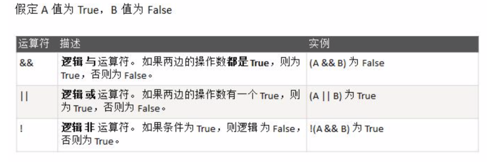
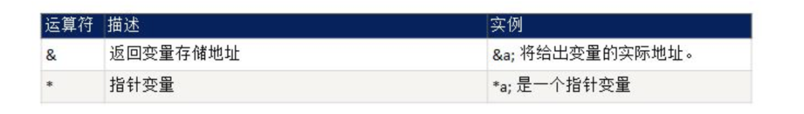
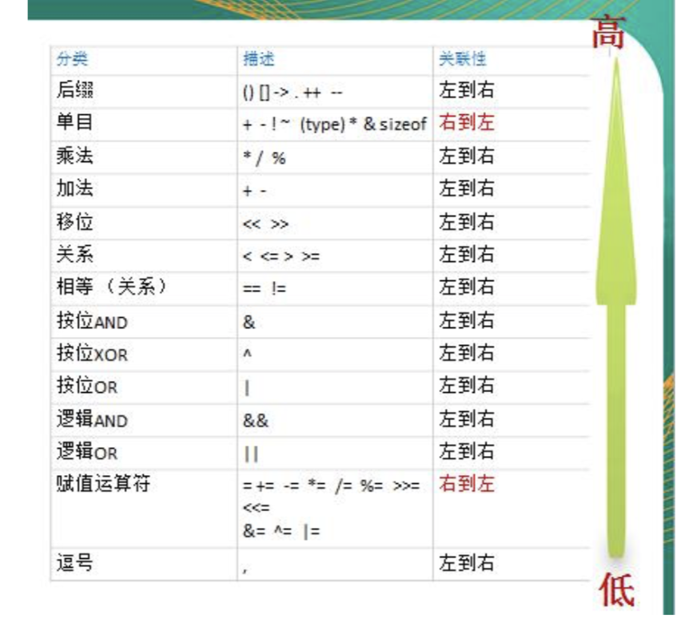
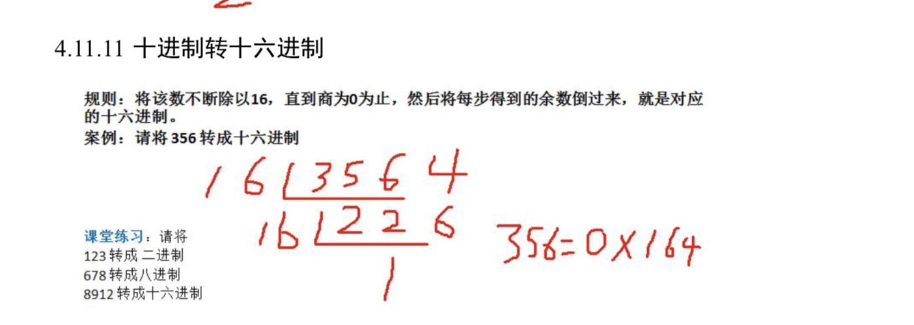
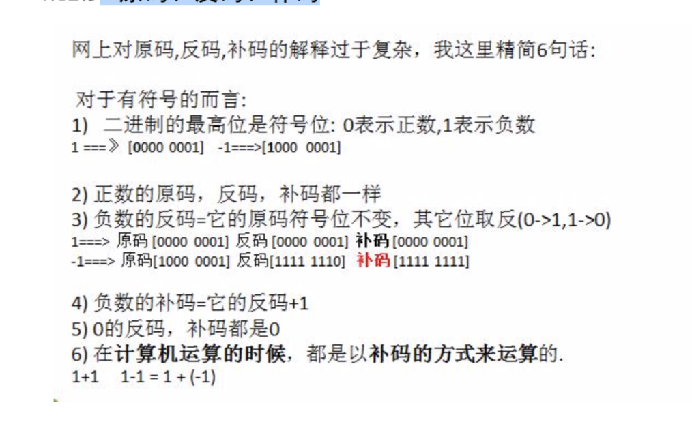
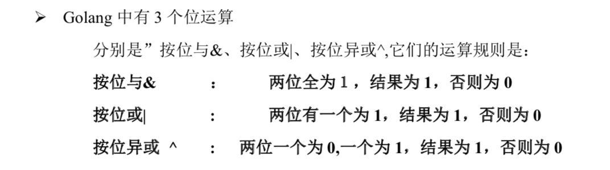

# 运算符

-  / 的使用的特点  符号跟着前者走

#### 算术运算符使用的注意事项

- 对于除号 "/"，它的整数除和小数除是有区别的:整数之间做除法时，只保留整数部分而舍弃小数部分。 例如: x := 19/5 ,结果是 3
- Golang 的自增自减只能当做一个独立语言使用
- Golang 的++ 和 -- 只能写在变量的后面，不能写在变量的前面，即:只有 a++ a-- 没有 ++a、--a

### 逻辑运算符

#### 注意事项和细节说明

- &&也叫短路与:如果第一个条件为 false，则第二个条件不会判断，最终结果为 false
- ||也叫短路或:如果第一个条件为 true，则第二个条件不会判断，最终结果为 true

###  赋值运算符的分类

### 位运算符

### 其它运算符说明

> Go 明确不支持三元运算符

### 运算符的优先级

### 进制

对于**整数**，有四种表示方式: 

1. 二进制:0,1 ，满 2 进 1。 

2. 在 golang 中，不能直接使用二进制来表示一个整数，它沿用了 c 的特点。 2) 十进制:0-9 ，满 10 进 1。

3. 八进制:0-7 ，满 8 进 1. 以数字 0 开头表示。

4. 十六进制:0-9及A-F，满16进1. 以0x或0X开头表示。 

   此处的 A-F 不区分大小写。 

#### 进制转换的介绍

> 其它进制转十进制

二进制如何转十进制

> 十进制如何转成其它进制

十进制转成八进制

####  二进制转换成八进制、十六进制

### 八进制、十六进制转成二进制

###  原码、反码、补码

### 位运算符和移位运算符

