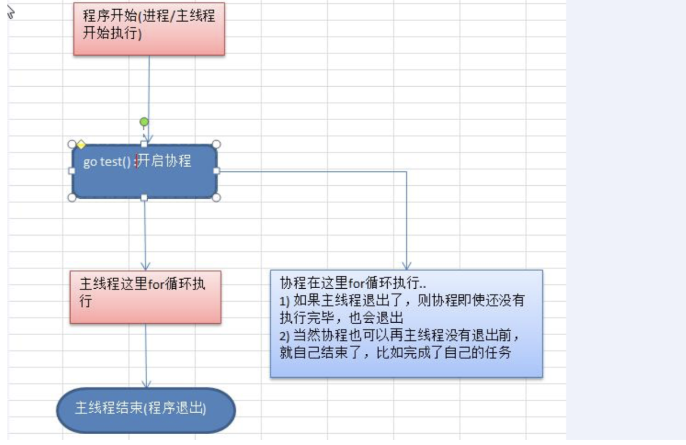
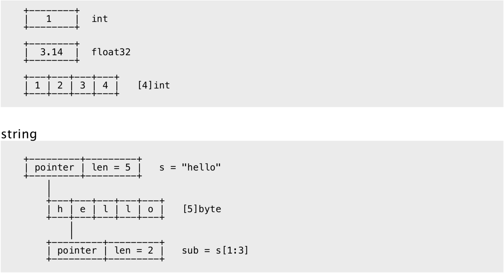
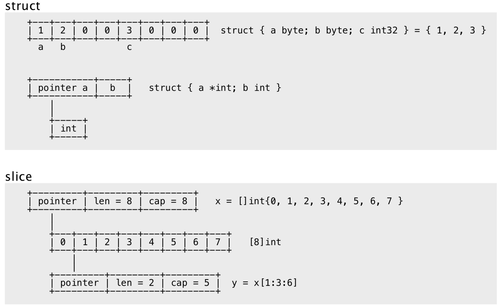
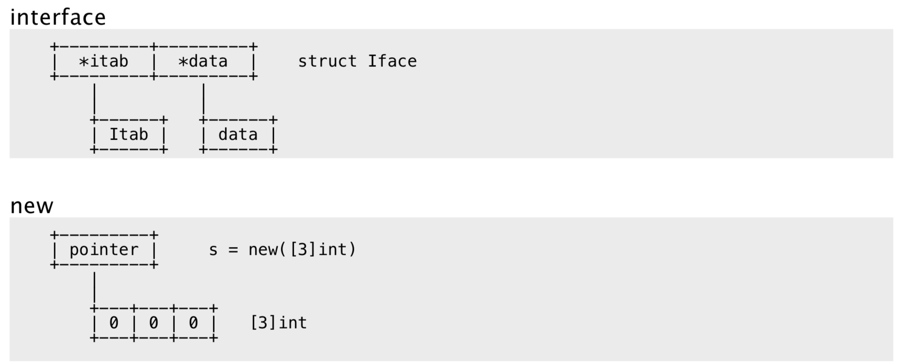
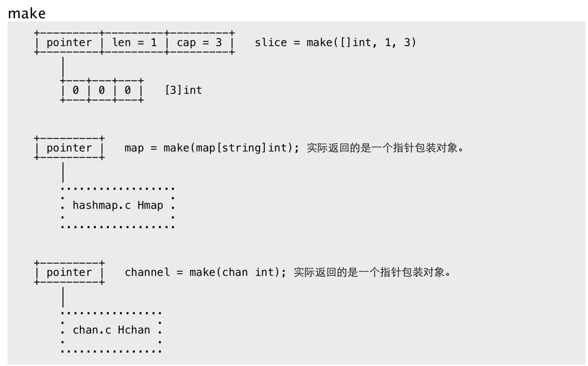

> Go 语言中自带有一个轻量级的测试框架 testing 和自带的 go test 命令来实现单元测试和性能测试，testing 框架和其他语言中的测试框架类似，可以基于这个框架写针对相应函数的测试用例，也可以基 于该框架写相应的压力测试用例 。

### 单元测试快速入门总结

- 测试用例文件名必须以 _test.go 结尾。 比如 cal_test.go , cal 不是固定的。
- 测试用例函数必须以 Test 开头，一般来说就是 Test+被测试的函数名，比如 TestAddUpper
- TestAddUpper(t *tesing.T) 的形参类型必须是 *testing.T 【看一下手册】
- 一个测试用例文件中，可以有多个测试用例函数，比如 TestAddUpper、TestSub
- 运行测试用例指令
  1. cmd>go test [如果运行正确，无日志，错误时，会输出日志]
  2. cmd>go test -v [运行正确或是错误，都输出日志]
- 当出现错误时，可以使用 t.Fatalf 来格式化输出错误信息，并退出程序
-  t.Logf 方法可以输出相应的日志
- 测试用例函数，并没有放在 main 函数中，也执行了，这就是测试用例的方便之处[原理图].
- PASS 表示测试用例运行成功，FAIL 表示测试用例运行失败
- 测试单个文件，一定要带上被测试的原文件
  1. go test -v cal_test.go cal.go
- 测试单个方法
  1. go test -v -test.run TestAddUpper


# goroutine 和 channel

## 进程和线程介绍


## 程序、进程和线程的关系示意图


## 并发和并行

1. 多线程程序在单核上运行，就是并发
2. 多线程程序在多核上运行，就是并行


## Go 协程和 Go 主线程


> Go 主线程(有程序员直接称为线程/也可以理解成进程): 一个 Go 线程上，可以起多个协程，你可以 这样理解，协程是轻量级的线程[编译器做优化]。


### Go 协程的特点

- 有独立的栈空间
- 共享程序堆空间
- 调度由用户控制
- 协程是轻量级的线程


### 主线程和协程执行流程图




### 快速入门小结

- 协程从主线程开启的，是轻量级的线程，是逻辑态。对资源消耗相对小。
- 主线程是一个物理线程，直接作用在 cpu 上的。是重量级的，非常耗费 cpu 资源。
- Golang 的协程机制是重要的特点，可以轻松的开启上万个协程。其它编程语言的并发机制是一般基于线程的，开启过多的线程，资源耗费大，这里就突显 Golang 在并发上的优势了


## goroutine 的调度模型

### MPG 模式基本介绍


MPG 模式运行的状态 1


MPG 模式运行的状态 2


## 不同 goroutine 之间如何通讯

- 全局变量的互斥锁
- 使用管道 channel 来解决


### 为什么需要 channel

- 主线程在等待所有 goroutine 全部完成的时间很难确定，我们这里设置 10 秒，仅仅是估算
- 前面使用全局变量加锁同步来解决 goroutine 的通讯，但不完美
- 如果主线程休眠时间长了，会加长等待时间，如果等待时间短了，可能还有 goroutine 处于工作状态，这时也会随主线程的退出而销毁
- 通过全局变量加锁同步来实现通讯，也并不利用多个协程对全局变量的读写操作。


### channel 的基本介绍

- 数据是先进先出【FIFO : first in first out】
- channle 本质就是一个数据结构-队列
- 线程安全，多 goroutine 访问时，不需要加锁，就是说 channel 本身就是线程安全的
- channel 有类型的，一个 string 的 channel 只能存放 string 类型数据。


### 定义/声明 channel

> var 变量名 chan 数据类型


```go
var intChan chan int (intChan 用于存放 int 数据)
var mapChan chan map[int]string (mapChan 用于存放 map[int]string 类型) var perChan chan Person
var perChan2 chan *Person
```

- channel 是引用类型
- channel 必须初始化才能写入数据, 即 make 后才能使用
- 管道是有类型的，intChan 只能写入 整数 int


### 管道的初始化，写入数据到管道，从管道读取数据及基本的注意事项

- channel 中只能存放指定的数据类型
- channle 的数据放满后，就不能再放入了
- 如果从 channel 取出数据后，可以继续放入
- 在没有使用协程的情况下，如果 channel 数据取完了，再取，就会报 dead lock


### channel 的遍历和关闭

> 使用内置函数 close 可以关闭 channel, 当 channel 关闭后，就不能再向 channel 写数据了，但是仍然 可以从该 channel 读取数据


### channel 支持 for--range 的方式进行遍历，请注意两个细节

- 在遍历时，如果 channel 没有关闭，则回出现 deadlock 的错误
- 在遍历时，如果 channel 已经关闭，则会正常遍历数据，遍历完后，就会退出遍历。


### channel 使用细节和注意事项

- channel 可以声明为只读，或者只写性质 


- goroutine 中使用 recover，解决协程中出现 panic，导致程序崩溃问题


# 反射

- 反射可以在运行时动态获取变量的各种信息, 比如变量的类型(type)，类别(kind)
- 如果是结构体变量，还可以获取到结构体本身的信息(包括结构体的字段、方法)
- 通过反射，可以修改变量的值，可以调用关联的方法。
- 使用反射，需要 import (“reflect”)


# 内存布局












# exapmle


```go
package main

import "fmt"

type fibonacci func() int

func GetClosure() fibonacci {
	a, b := -1, 1

	return func() int {
		a, b = b, a+b
		return b
	}
}

func main() {
	fn := GetClosure()
	for i := 1; i < 10; i++ {
		fmt.Println(fn())
	}
}

```


```go
// Squarer
go func() {
    for {
        x, ok := <-naturals
        if !ok {
            break // channel was closed and drained
        }
        squares <- x * x
    }
    close(squares)
}()
```

因为上面的语法是笨拙的，而且这种处理模式很场景，因此Go语言的range循环可直接在channels上面迭代。使用range循环是上面处理模式的简洁语法，它依次从channel接收数据，当channel被关闭并且没有值可接收时跳出循环。


爬成语

```go
package main

import (
	"database/sql"
	"fmt"
	_ "github.com/go-sql-driver/mysql"
	"github.com/gocolly/colly"
	"strconv"
	"strings"
	"unicode"
)

const (
	userName = "root"
	password = ""
	ip       = "localhost"
	port     = "3306"
	dbName   = "jw"
)

type Idiom struct {
	idiom       string
	pinyin      string
	description string
}

var DB *sql.DB

func init() {
	//构建连接："用户名:密码@tcp(IP:端口)/数据库?charset=utf8"
	path := strings.Join([]string{userName, ":", password, "@tcp(", ip, ":", port, ")/", dbName, "?charset=utf8"}, "")

	//打开数据库,前者是驱动名，所以要导入： _ "github.com/go-sql-driver/mysql"
	DB, _ = sql.Open("mysql", path)
	//设置数据库最大连接数
	DB.SetConnMaxLifetime(200)
	//设置上数据库最大闲置连接数
	DB.SetMaxIdleConns(5)
	//验证连接
	if err := DB.Ping(); err != nil {
		//fmt.Println("open database fail")
		return
	}
	//fmt.Println("connnect success")
}

func main() {

	c := colly.NewCollector(
		colly.AllowedDomains(),
	)

	c.UserAgent = "Mozilla/5.0 (Windows NT 10.0; Win64; x64) AppleWebKit/537.36 (KHTML, like Gecko) Chrome/58.0.3029.110 Safari/537.36 Edge/16.16299"

	c.OnHTML(".main_article_list>.list_content", func(e *colly.HTMLElement) {
		dict := make(map[int]Idiom)
		e.ForEach("ul>li", func(i int, element *colly.HTMLElement) {
			obj := element.DOM.Clone().Find("a")
			obj.Children().Remove()
			pinyin := element.DOM.Find(".lt").Text()
			p := ""
			m := ""
			for _, v := range pinyin {
				if !unicode.IsPunct(v) {
					if unicode.Is(unicode.Scripts["Han"], v) {
						m += string(v)
					} else {
						p = fmt.Sprintf("%s%s", p, string(v))
					}
				}
			}
			idiom := Idiom{obj.Text(), p, m}

			dict[i] = idiom
		})
		InsertUser(dict)
	})

	// 在请求发起之前输出 url
	c.OnRequest(func(r *colly.Request) {
		//fmt.Println("Visiting", r.URL.String())
	})

	ch := make(chan int, 1000)
	var page = 100
	for i := 1; i < page; i++ {
		if i == 1 {
			go Crawl(c, ch, "https://xiaoxue.hujiang.com/cyu/chengyudaquan/")
		} else {
			go Crawl(c, ch, "https://xiaoxue.hujiang.com/cyu/chengyudaquan_"+strconv.Itoa(i))
		}
	}

	for i := 1; i < page; i++ {
		r:=<-ch
		fmt.Println(r)
	}
}

func Crawl(c *colly.Collector, ch chan int, url string) {
	err := c.Visit(url)
	if err != nil {
		fmt.Println(err)
	}
	ch <- 1
}

func InsertUser(idioms map[int]Idiom) bool {
	//开启事务
	tx, err := DB.Begin()
	if err != nil {
		fmt.Println("tx fail")
		return false
	}
	//准备sql语句
	stmt, err := tx.Prepare("INSERT INTO idiom(`idiom`, `description`,`pinyin`) VALUES (?, ?,?)")
	if err != nil {
		//fmt.Println(err)
		return false
	}
	for _, idiom := range idioms {
		//将参数传递到sql语句中并且执行
		_, err := stmt.Exec(idiom.idiom, idiom.description, idiom.pinyin)
		if err != nil {
			//fmt.Println("Exec fail")
			return false
		}
		//fmt.Println(res.LastInsertId())
	}
	//将事务提交
	tx.Commit()
	//获得上一个插入自增的id
	return true
}

```

爬虫速度限制

https://www.kancloud.cn/hartnett/gopl-zh/126058


[Goroutines和线程](https://www.kancloud.cn/hartnett/gopl-zh/126059)

### 9.8.1. 动态栈

每一个OS线程都有一个固定大小的内存块(一般会是2MB)来做栈，这个栈会用来存储当前正在被调用或挂起(指在调用其它函数时)的函数的内部变量。这个固定大小的栈同时很大又很小。因为2MB的栈对于一个小小的goroutine来说是很大的内存浪费，比如对于我们用到的，一个只是用来WaitGroup之后关闭channel的goroutine来说。而对于go程序来说，同时创建成百上千个gorutine是非常普遍的，如果每一个goroutine都需要这么大的栈的话，那这么多的goroutine就不太可能了。除去大小的问题之外，固定大小的栈对于更复杂或者更深层次的递归函数调用来说显然是不够的。修改固定的大小可以提升空间的利用率允许创建更多的线程，并且可以允许更深的递归调用，不过这两者是没法同时兼备的。

相反，一个goroutine会以一个很小的栈开始其生命周期，一般只需要2KB。一个goroutine的栈，和操作系统线程一样，会保存其活跃或挂起的函数调用的本地变量，但是和OS线程不太一样的是一个goroutine的栈大小并不是固定的；栈的大小会根据需要动态地伸缩。而goroutine的栈的最大值有1GB，比传统的固定大小的线程栈要大得多，尽管一般情况下，大多goroutine都不需要这么大的栈。


> 包名一般采用单数的形式。标准库的bytes、errors和strings使用了复数形式，这是为了避免和预定义的类型冲突，同样还有go/types是为了避免和type关键字冲突。


`go install`命令和`go build`命令很相似，但是它会保存每个包的编译成果，而不是将它们都丢弃。被编译的包会被保存到 `$GOPATH/pkg` 目录*下*，目录路径和`src`目录路径对应，可执行程序被保存到`$GOPATH/bin`目录。（很多用户会将`$GOPATH/bin`添加到可执行程序的搜索列表中。）


## [Go 各种命令](https://www.kancloud.cn/hartnett/gopl-zh/126061)

 // 注释的作用

有些包可能需要针对不同平台和处理器类型使用不同版本的代码文件，以便于处理底层的可移植性问题或提供为一些特定代码提供优化。如果一个文件名包含了一个操作系统或处理器类型名字，例如net_linux.go或asm_amd64.s，Go语言的构建工具将只在对应的平台编译这些文件。还有一个特别的构建注释注释可以提供更多的构建过程控制。例如，文件中可能包含下面的注释：

```go
// +build linux darwin
```


**在包声明和包注释的前面**，该构建注释参数告诉`go build`只在编译程序对应的目标操作系统是Linux或Mac OS X时才编译这个文件。下面的构建注释则表示不编译这个文件：

```go
// +build ignore
```


### 10.7.5. 内部包

在Go语音程序中，包的封装机制是一个重要的特性。没有导出的标识符只在同一个包内部可以访问，而导出的标识符则是面向全宇宙都是可见的。

有时候，一个中间的状态可能也是有用的，对于一小部分信任的包是可见的，但并不是对所有调用者都可见。例如，当我们计划将一个大的包拆分为很多小的更容易维护的子包，但是我们并不想将内部的子包结构也完全暴露出去。同时，我们可能还希望在内部子包之间共享一些通用的处理包，或者我们只是想实验一个新包的还并不稳定的接口，暂时只暴露给一些受限制的用户使用。


为了满足这些需求，Go语言的构建工具对包含internal名字的路径段的包导入路径做了特殊处理。这种包叫internal包，一个internal包只能被和internal目录有同一个父目录的包所导入。例如，net/http/internal/chunked内部包只能被net/http/httputil或net/http包导入，但是不能被net/url包导入。不过net/url包却可以导入net/http/httputil包。

```text
net/http
net/http/internal/chunked
net/http/httputil
net/url
```


testing


```go
// demo.go
package demo

func a(s string) bool {
	slice := []rune(s)

	for i := range slice {
		if slice[i] != slice[len(slice)-1-i] {
			return false
		}
	}

	return true
}

// demo_test.go
package demo

import (
	"github.com/stretchr/testify/assert"
	"testing"
)

var (
	testPassedStrings = [...]string{
		"中国人国中",
		"abcba",
		"1234321",
	}

	testErrorStrings = [...]string{
		"qwer",
		"暗示",
		"123",
	}
)

func TestA(t *testing.T) {
	for _, s := range testPassedStrings {
		assert.True(t, a(s))
	}

	for _, s := range testErrorStrings {
		assert.False(t, a(s))
	}
}

```


测试时，循环导入问题 11.2.4. 扩展测试包

https://www.kancloud.cn/hartnett/gopl-zh/126062


https://www.kancloud.cn/hartnett/gopl-zh/126066

考虑到可移植性，引用类型或包含引用类型的大小在32位平台上是4个字节，在64位平台上是8个字节。


类型 | 大小 ----------------------------- | ---- bool | 1个字节 

intN, uintN, floatN, complexN | N/8个字节(例如float64是8个字节) 

int, uint, uintptr | 1个机器字 *T | 1个机器字 

string | 2个机器字

(data,len) []T | 3个机器字

(data,len,cap) map | 1个机器字 

func | 1个机器字 

chan | 1个机器字 

interface | 2个机器字(type,value)


机器字：大概是指当前操作系统一次能处理的字节数(64位的相同，一次处理64个bit,也就是8个byte)


interface | 2个机器字(type,value)

Go语言的规范并没有要求一个字段的声明顺序和内存中的顺序是一致的，所以理论上一个编译器可以随意地重新排列每个字段的内存位置，随然在写作本书的时候编译器还没有这么做。下面的三个结构体虽然有着相同的字段，但是第一种写法比另外的两个需要多50%的内存。

```go
                               // 64-bit  32-bit
struct{ bool; float64; int16 } // 3 words 4words
struct{ float64; int16; bool } // 2 words 3words
struct{ bool; int16; float64 } // 2 words 3words

// 分析 同样对于64位操作系统
struct{ bool; float64; int16 } // bool 一个字节 float64 8个 字节 int16 2 个字节
// 用于保证后面每个字段或元素的地址相对于结构或数组的开始地址能够合理地对齐
1 1 1

struct{ float64; int16; bool }
1 2/8 1/8 < 2 
```

关于内存地址对齐算法的细节超出了本书的范围，也不是每一个结构体都需要担心这个问题，不过有效的包装可以使数据结构更加紧凑（译注：未来的Go语言编译器应该会默认优化结构体的顺序，当然用于应该也能够指定具体的内存布局，相同讨论请参考 [Issue10014](https://github.com/golang/go/issues/10014) ），内存使用率和性能都可能会受益。