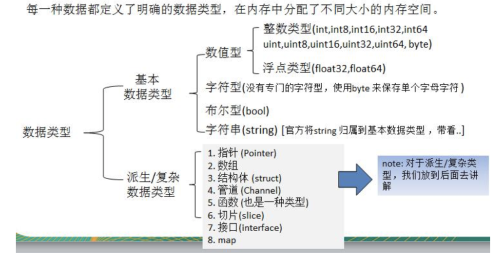
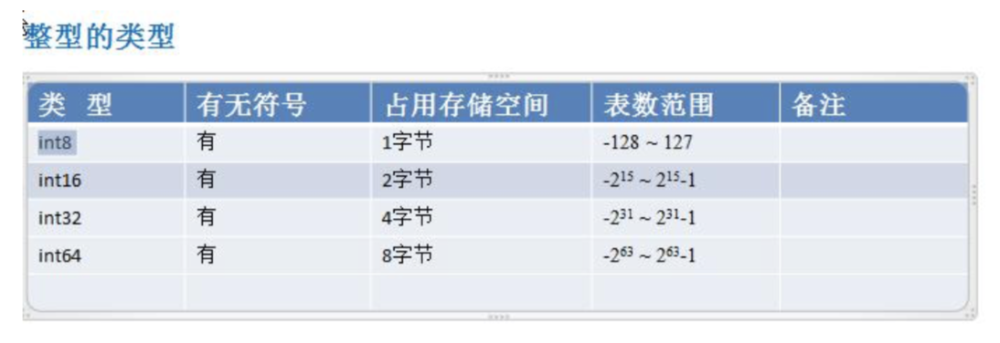
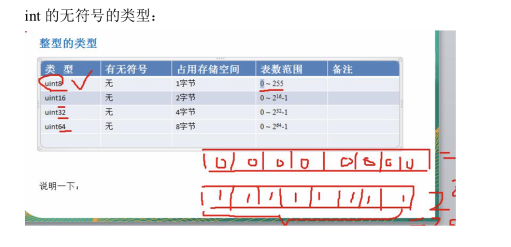
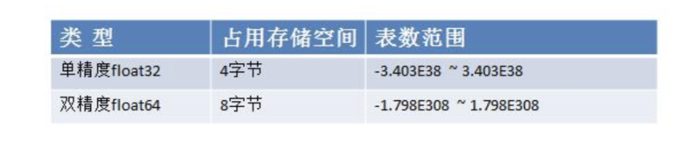
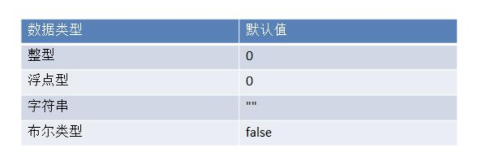
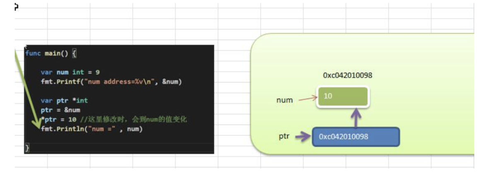
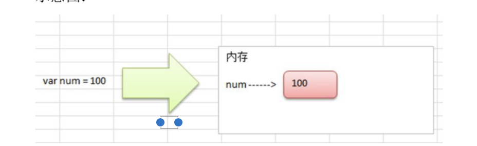
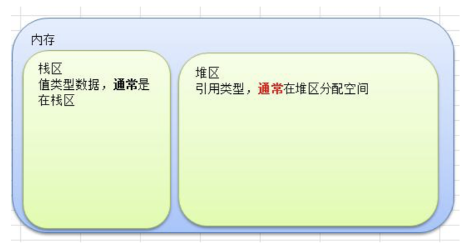

```go
var i int
var num = 10
name := "tom"
m,n := 100, "a"

var (
	a = 10
    b = 20
    c = "jack"
)
```








### 查看变量字节大小和数据类型

```go
var n int64 = 10

fmt.Printf("n 的类型是 %T, 字节数是 %d", n, unsafe.Sizeof(n))
```

> bit: 计算机中的最小存储单位。byte:计算机中基本存储单元。[二进制再详细说] 1byte = 8 bit



### 浮点数使用细节

1) Golang 浮点类型有固定的范围和字段长度，不受具体 OS(操作系统)的影响。 2) Golang 的浮点型默认声明为 float64 类型。 

3) 浮点型常量有两种表示形式
 十进制数形式:如:5.12 .512 (必须有小数点) 科学计数法形式:如:5.1234e2 = 5.12 * 10 的 2 次方 5.12E-2 = 5.12/10 的 2 次方 

4) 通常情况下，应该使用 float64 ，因为它比 float32 更精确。[开发中，推荐使用 float64] 

```go
fmt.Printf("%c", byte)
```


### 字符类型使用细节 

1. 字符常量是用单引号('')括起来的单个字符。例如:var c1 byte = 'a' var c2 int = '中' var c3 byte = '9' 

2. Go 中允许使用转义字符 '\’来将其后的字符转变为特殊字符型常量。例如:var c3 char = ‘\n’ // '\n'表示换行符 

3. Go 语言的字符使用 UTF-8 编码 ，如果想查询字符对应的 utf8 码值 

   http://www.mytju.com/classcode/tools/encode_utf8.asp 

   英文字母-1 个字节 汉字-3 个字节 

4. 在 Go 中，字符的本质是一个整数，直接输出时，是该字符对应的 UTF-8 编码的码值。

5. **可以直接给某个变量赋一个数字，然后按格式化输出时%c，会输出该数字对应的 unicode 字符** 

6. 字符类型是可以进行运算的，相当于一个整数，因为它都对应有 Unicode 码.


### 字符类型本质探讨 

- 字符型 存储到 计算机中，需要将字符对应的码值(整数)找出来 存储:字符--->对应码值---->二进制-->存储
   读取:二进制----> 码值 ----> 字符 --> 读取 
- 字符和码值的对应关系是通过字符编码表决定的(是规定好)
- Go 语言的编码都统一成了 utf-8。非常的方便，很统一，再也没有编码乱码的困扰了 


### 布尔值

1. 布尔类型也叫 bool 类型，bool 类型数据只允许取值 true 和 false
2.  bool 类型占 1 个字节。
3.  bool 类型适于逻辑运算，一般用于程序流程控制[注:这个后面会详细介绍]:


### string 使用注意事项和细节

-  Go 语言的字符串的字节使用 UTF-8 编码标识 Unicode 文本，这样 Golang 统一使用 UTF-8 编码,中文乱码问题不会再困扰程序员。

- 字符串一旦赋值了，字符串就不能修改了:在 Go 中字符串是不可变的。

- 字符串的两种表示形式

  1. 双引号, 会识别转义字符
  2. 反引号，以字符串的原生形式输出，包括换行和特殊字符，可以实现防止攻击、输出源代码等效果

- 字符串拼接方式

```go
var str = "hello " + "world"
str += " haha!"
```

- 当一行字符串太长时，需要使用到多行字符串，可以如下处理

```go
str := "a" +
"b" + 
"c"
```

  

### 基本数据类型默认值



### 基本类型转换

#### 基本语法

> 表达式 T(v) 将值 v 转换为类型 T
> T: 就是数据类型，比如 int32，int64，float32 等等
> v: 就是需要转换的变量


大到小会溢出

```go
	var a int32 = 128
	c := int8(a)
	fmt.Println(a,c) // 128 -128
```


#### 基本数据和 string 的转换

1. fmt.Sprintf("%参数", 表达式) 【个人习惯这个，灵活】
2. 使用 strconv 包的函数
   - FormatBool
   - FormatFloat
   - FormatInt
   - FormatUint
   - ...


### 指针

> 基本数据类型，变量存的就是值，也叫值类型
>
> 获取变量的地址，用&，比如: var num int, 获取 num 的地址:&num
>
> 指针类型，指针变量存的是一个地址，这个地址指向的空间存的才是值




#### 指针的使用细节

1. 值类型，都有对应的指针类型， 形式为 *数据类型，比如 int 的对应的指针就是 *int, float32对应的指针类型就是 *float32, 依次类推
2. 值类型包括:基本数据类型 int 系列, float 系列, bool, string 、数组和结构体 struct


#### 值类型和引用类型的说明

- 值类型:基本数据类型 int 系列, float 系列, bool, string 、数组和结构体 struct
- 引用类型:指针、slice 切片、map、管道 chan、interface 等都是引用类型


#### 值类型和引用类型的使用特点

1. 值类型:变量直接存储值，内存通常在栈中分配



2. 引用类型:变量存储的是一个地址，这个地址对应的空间才真正存储数据(值)，内存通常在堆上分配，当没有任何变量引用这个地址时，该地址对应的数据空间就成为一个垃圾，由 GC 来回收


### 内存的栈区和堆区示意图




### 系统保留关键字


### 系统的预定义标识符


