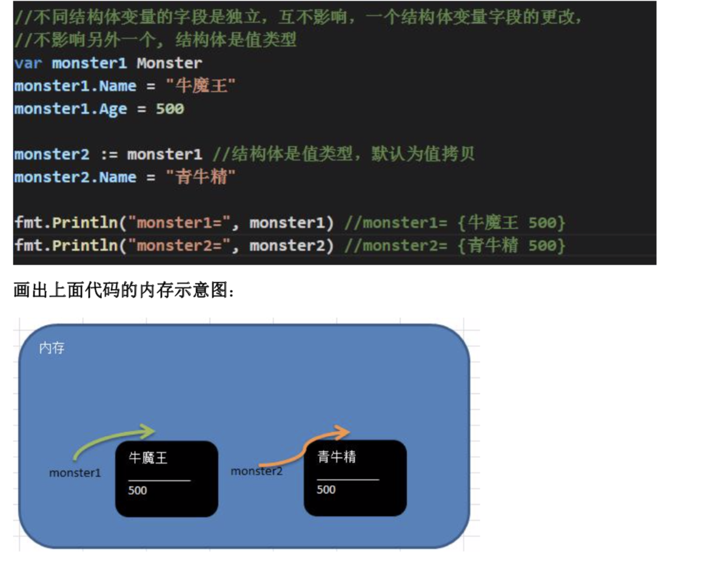
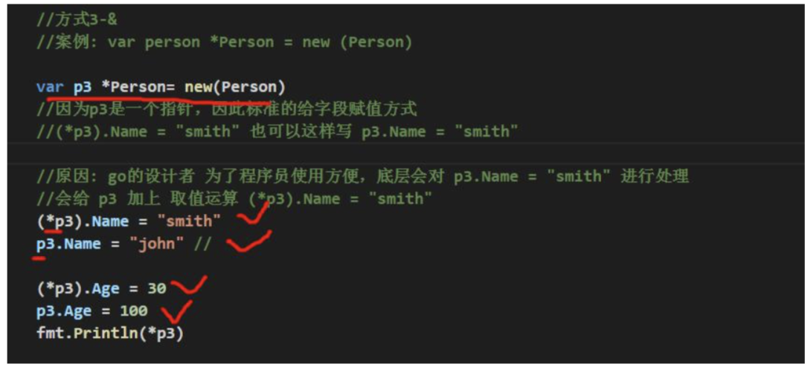
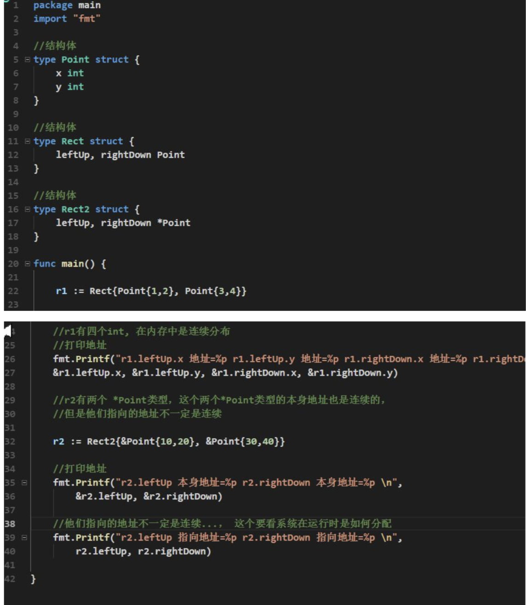
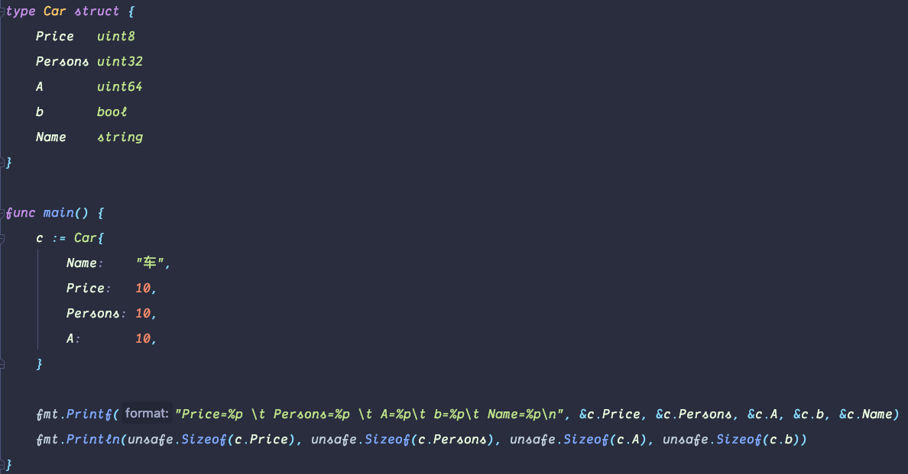
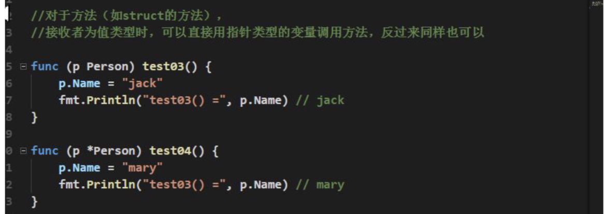
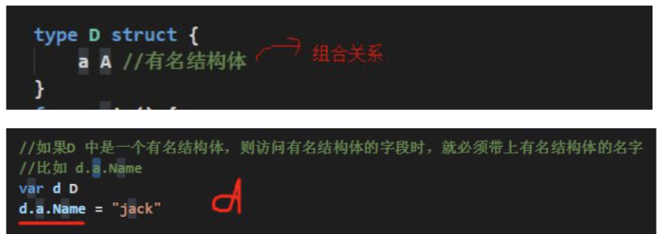
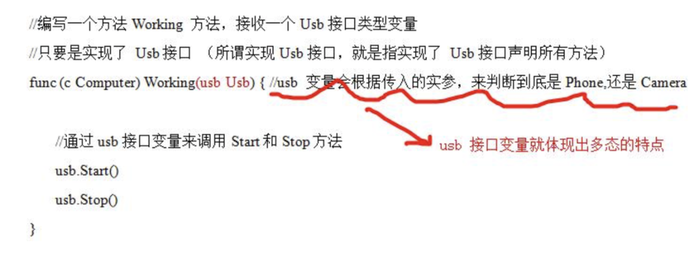
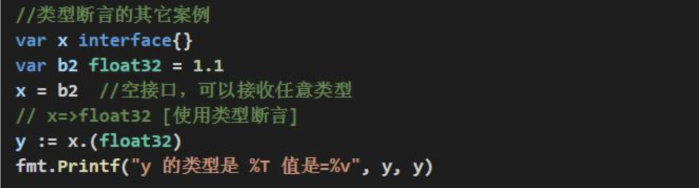

### 结构体

􏰁 基本语法

```go
type 结构体名称 struct {
    field1 type 
    field2 type 
}
```

注意事项和细节说明

- 字段声明语法同变量，示例:字段名 字段类型
- 字段的类型可以为:基本类型、数组或引用类型
- 在创建一个结构体变量后，如果没有给字段赋值，都对应一个零值(默认值)
- 指针，slice，和 map 的零值都是 nil ，即还没有分配空间。


> 不同结构体变量的字段是独立，互不影响，一个结构体变量字段的更改，不影响另外一个, 结构体是值类型。




### 创建结构体变量和访问结构体字段

- var person Person 
-  var person Person = Person{} 


- var person *Person = new (Person)



- var person *Person = &Person{}


1. 第 3 种和第 4 种方式返回的是 结构体指针。
2. 结构体指针访问字段的标准方式应该是:(*结构体指针).字段名 ，比如 (*person).Name = "tom"
3. 但go做了一个简化，也支持结构体指针.字段名, 比如person.Name="tom"。更加符合程序员 使用的习惯，go 编译器底层 对 person.Name 做了转化 (*person).Name。 


### struct 类型的内存分配机制


结构体使用注意事项和细节

- 结构体的所有字段在内存中是连续的




### 疑问⁉️

为什么uint8内存中占了4位，bool占了8位？

难道是内存中还存了额外的属性，比如类型？




- 结构体是用户单独定义的类型，和其它类型进行转换时需要有完全相同的字段(名字、个数和类型)


- 结构体进行 type 重新定义(相当于取别名)，Golang 认为是新的数据类型，但是相互间可以强转
- struct 的每个字段上，可以写上一个 tag, 该 tag 可以通过反射机制获取，常见的使用场景就是序列化和反序列化


### 方法

> Golang 中的方法是作用在指定的数据类型上的(即:和指定的数据类型绑定)，因此自定义类型， 都可以有方法，而不仅仅是 struct。 

#### 方法的声明和调用

```go
type A struct { Num int
}
func (a A) test() {
fmt.Println(a.Num) }
```

- func (a A) test() {} 表示 A 结构体有一方法，方法名为 test
- (a A) 体现 test 方法是和 A 类型绑定的


-  test 方法和 Person 类型绑定
- test 方法只能通过 Person 类型的变量来调用，而不能直接调用，也不能使用其它类型变量来调
- func (p Person) test() {}... p 表示哪个 Person 变量调用，这个 p 就是它的副本, 这点和函数传参非常相似。
- p 这个名字，有程序员指定，不是固定, 比如修改成 person 也是可以


### 方法快速入门

方法的调用和传参机制原理

方法的调用和传参机制和函数基本一样，不一样的地方是方法调用时，会将调用方法的变量，当做实参也传递给方法。下面我们举例说明

- 在通过一个变量去调用方法时，其调用机制和函数一样
- 不一样的地方时，变量调用方法时，该变量本身也会作为一个参数传递到方法(如果变量是值类型，则进行值拷贝，如果变量是引用类型，则进行地质拷贝) 


方法的声明(定义)

```go
func (recevier type) methodName(参数列表) (返回值列表){ 
    方法体
	return 返回值
}
```


### 方法的注意事项和细节

- 结构体类型是值类型，在方法调用中，遵守值类型的传递机制，是值拷贝传递方式
- 如程序员希望在方法中，修改结构体变量的值，可以通过结构体指针的方式来处理


-  Golang 中的方法作用在指定的数据类型上的(即:和指定的数据类型绑定)，因此自定义类型，都可以有方法，而不仅仅是 struct， 比如 int , float32 等都可以有方法
- 方法的访问范围控制的规则，和函数一样。方法名首字母小写，只能在本包访问，方法首字母大写，可以在本包和其它包访问。
- **如果一个类型实现了 String()这个方法，那么 fmt.Println 默认会调用这个变量的 String()进行输出**


```go
type Car struct {
    Name string
}

func (car Car) String() string {
    return "car String"
}

func main() {
    car := Car{
        Name: "duc",
    }
    
    fmt.Println(car) // car String
    
    car1 := &Car{
        Name: "duc",
    }
    
    fmt.Println(car) // car String
    // 因为底层会处理 car -> *car
}


############################

type Car struct {
    Name string
}

func (car *Car) String() string {
    return "car String"
}

func main() {
    car := &Car{
        Name: "duc",
    }
    
    fmt.Println(car) // {duc} 底层处理后调用不到String
    fmt.Println(&car) // car String
}
```

### 方法和函数区别

- 调用方式不一样
  - 函数的调用方式: 函数名(实参列表)
  - 方法的调用方式: 变量.方法名(实参列表)
- 对于普通函数，接收者为值类型时，不能将指针类型的数据直接传递，反之亦然


- 对于方法(如 struct 的方法)，接收者为值类型时，可以直接用指针类型的变量调用方法，反过来同样也可以




### 创建结构体变量时指定字段值

- Golang 在创建结构体实例(变量)时，可以直接指定字段的值

```go
type Car struct {
    Name string
    Price int
}

car := Car{"car", 10000}
car1 := Car{
    Name: "car",
    Price: 10000,
}

########
car := &Car{"car", 10000}
car1 := &Car{
    Name: "car",
    Price: 10000,
}
```


### 继承基本介绍和示意图


> 在 Golang 中，如果一个 struct 嵌套了另一个匿名结构体，那么这个结构体可以直接访问匿名结构体的字段和方法，从而实现了继承特性。


### 嵌套匿名结构体的基本语法

```go
type Goods struct { 
    Name string
	Price int 
}
type Book struct {
	Goods //这里就是嵌套匿名结构体 Goods Writer string
}
```

- 结构体可以使用嵌套匿名结构体所有的字段和方法，即:首字母大写或者小写的字段、方法，都可以使用。


- 匿名结构体字段访问可以简化


1. 当我们直接通过 b 访问字段或方法时，其执行流程如下比如 b.Name
2. 编译器会先看 b 对应的类型有没有 Name, 如果有，则直接调用 B 类型的 Name 字段
3. 如果没有就去看 B 中嵌入的匿名结构体 A 有没有声明 Name 字段，如果有就调用,如果没有继续查找..如果都找不到就报错. 

- 当结构体和匿名结构体有相同的字段或者方法时，编译器采用就近访问原则访问，如希望访问匿名结构体的字段和方法，可以通过匿名结构体名来区分


- 结构体嵌入两个(或多个)匿名结构体，如两个匿名结构体有相同的字段和方法(同时结构体本身没有同名的字段和方法)，在访问时，就必须明确指定匿名结构体名字，否则编译报错
- 如果一个 struct 嵌套了一个有名结构体，这种模式就是组合，如果是组合关系，那么在访问组合的结构体的字段或方法时，必须带上结构体的名字



- 嵌套匿名结构体后，也可以在创建结构体变量(实例)时，直接指定各个匿名结构体字段的值
- 字段是基本数据类型

```go
type Car struct {
	int
}

car := Car{
    int: 1000
}

car.int // 1000
```


### 多重继承

> 如一个 struct 嵌套了多个匿名结构体，那么该结构体可以直接访问嵌套的匿名结构体的字段和方法，从而实现了多重继承。 

- 如嵌入的匿名结构体有相同的字段名或者方法名，则在访问时，需要通过匿名结构体类型名来
- 为了保证代码的简洁性，建议大家尽量不使用多重继承


### 接口(interface)

> 按顺序,我们应该讲解多态,但是在讲解多态前,我们需要讲解接口(interface)，因为在 Golang 中 多态特性主要是通过接口来体现的。


Golang 中的接口，不需要显式的实现。只要一个变量，含有接口类型中的所有方法，那么这个变量就实现这个接口。因此，Golang 中没有 implement 这样的关键字。

#### 注意事项和细节

1. 接口本身不能创建实例,但是可以指向一个实现了该接口的自定义类型的变量(实例)
2. 接口中所有的方法都没有方法体,即都是没有实现的方法
3. 在 Golang 中，一个自定义类型需要将某个接口的所有方法都实现，我们说这个自定义类型实现了该接口
4. 一个自定义类型只有实现了某个接口，才能将该自定义类型的实例(变量)赋给接口类型
5. 只要是自定义数据类型，就可以实现接口，不仅仅是结构体类型。


6. 一个自定义类型可以实现多个接口


7. Golang 接口中不能有任何变量
8. 一个接口(比如 A 接口)可以继承多个别的接口(比如 B,C 接口)，这时如果要实现 A 接口，也必须将 B,C 接口的方法也全部实现。
9. interface 类型默认是一个指针(引用类型)，如果没有对 interface 初始化就使用，那么会输出 nil
10. 空接口 interface{} 没有任何方法，所以**所有类型都实现了空接口**, 即我们可以把任何一个变量赋给空接口。


### 多态 




### 类型断言

> 类型断言，由于接口是一般类型，不知道具体类型，如果要转成具体类型，就需要使用类型断言




