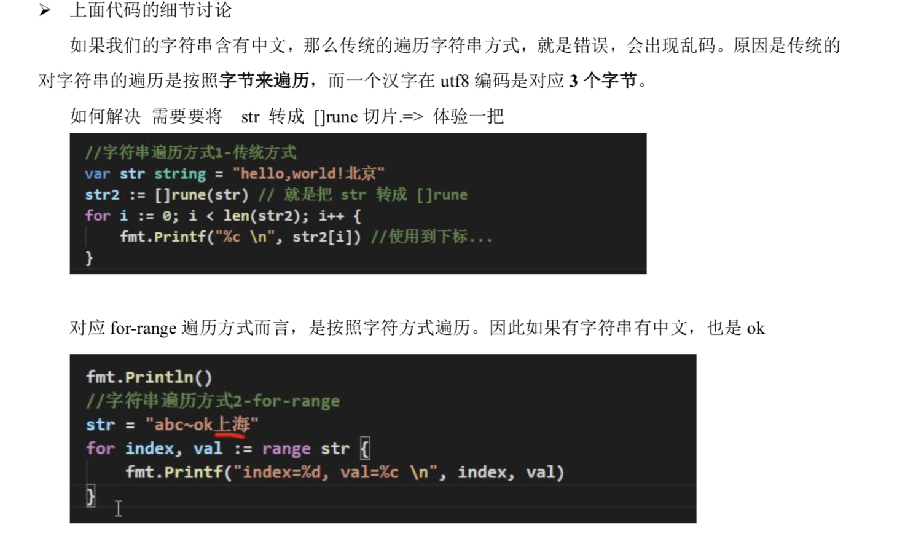
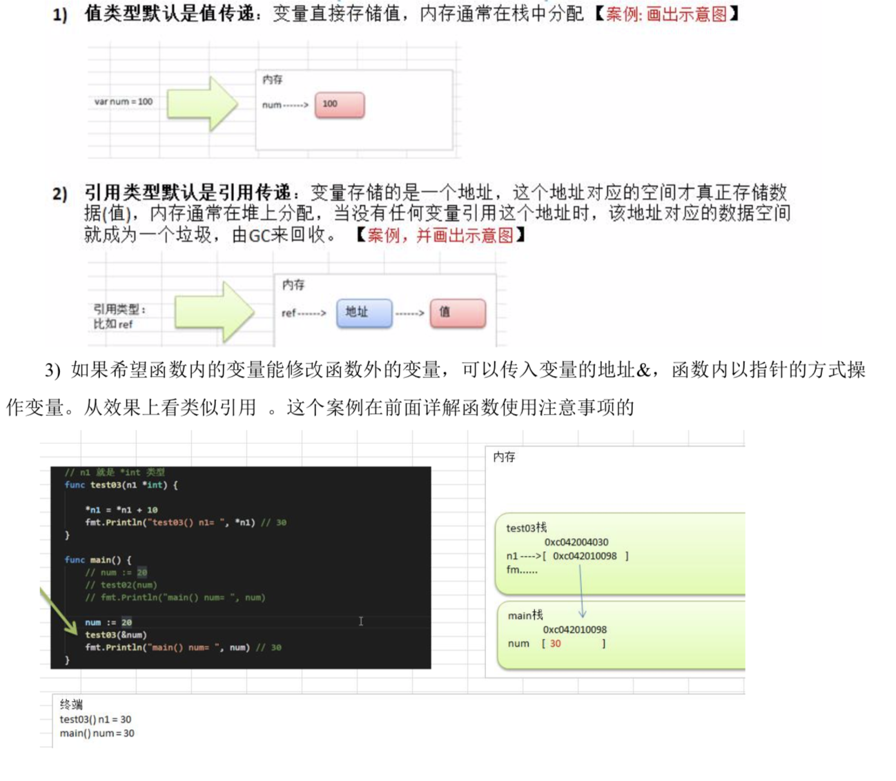
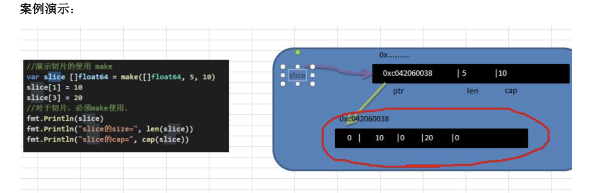
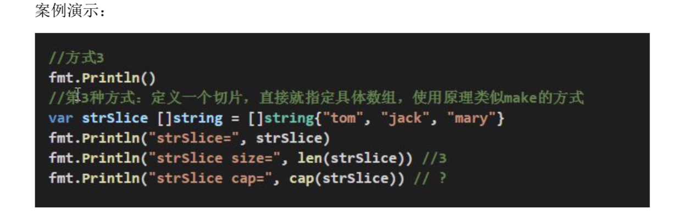
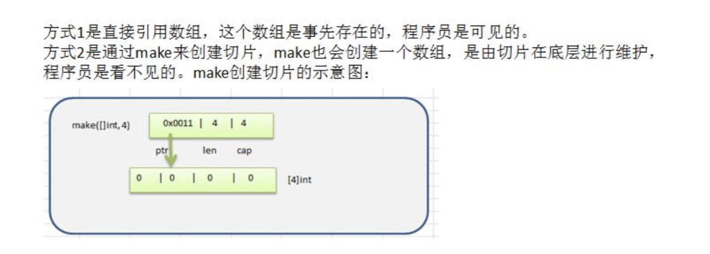
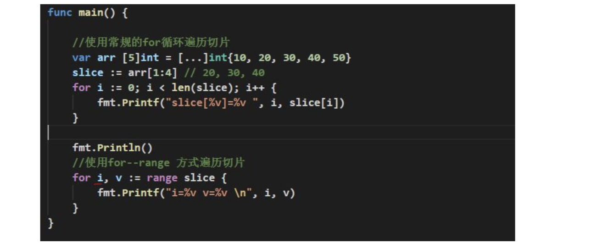
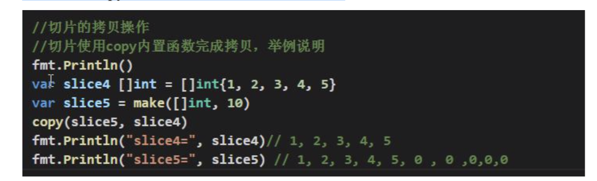
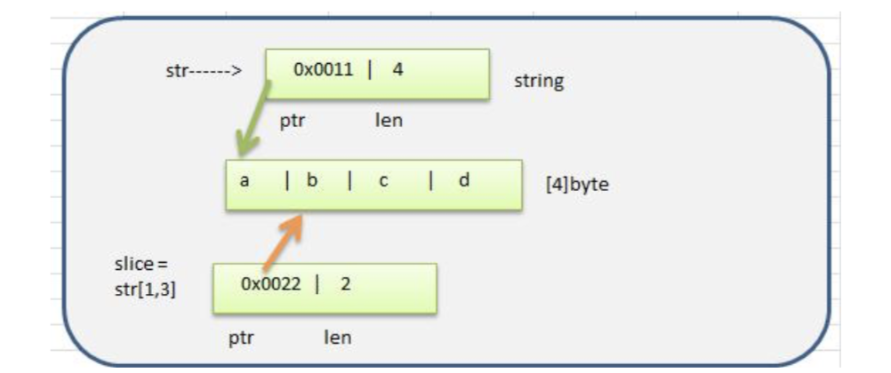
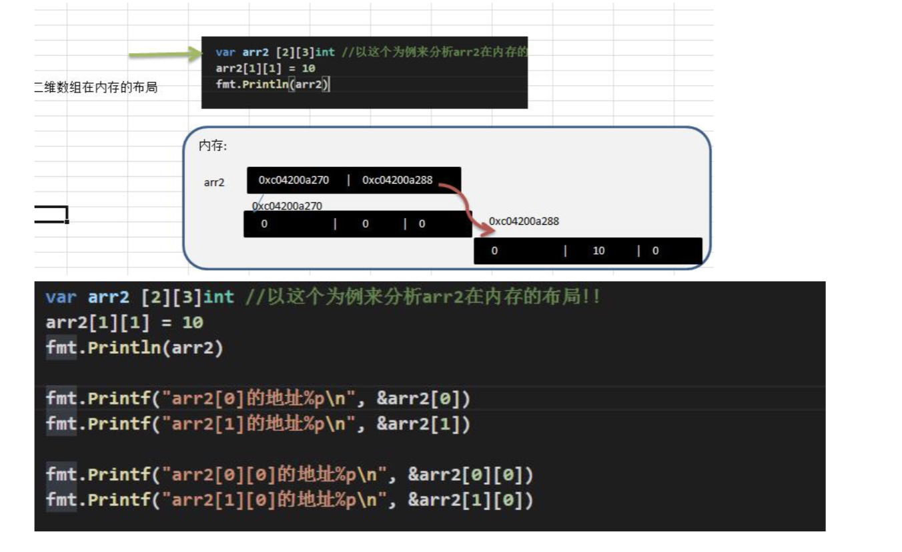
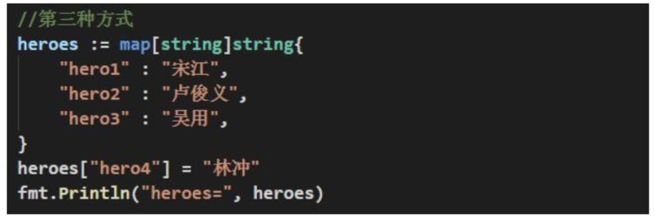

   > go 没有变量提升


### if


### switch


- switch 语句用于基于不同条件执行不同动作，每一个 case 分支都是唯一的，从上到下逐一测试，直到匹配为止。

- 匹配项后面也不需要再加 break

- switch 的执行的流程是，先执行表达式，得到值，然后和 case 的表达式进行比较，如果相等， 就匹配到，然后执行对应的 case 的语句块，然后退出 switch 控制。

- 如果 switch 的表达式的值没有和任何的 case 的表达式匹配成功，则执行 default 的语句块。执行后退出 switch 的控制.

- golang 的 case 后的表达式可以有多个，使用 逗号 间隔.

- golang 中的 case 语句块不需要写 break , 因为默认会有,即在默认情况下，当程序执行完 case 语 句块后，就直接退出该 switch 控制结构。 


### switch 的使用的注意事项和细节


- case/switch 后是一个表达式( 即:常量值、变量、一个有返回值的函数等都可以)

- case 后的各个表达式的值的数据类型，必须和 switch 的表达式数据类型一致

- case 后面可以带多个表达式，使用逗号间隔。比如 case 表达式 1, 表达式 2 ...


```go

switch n {

    case 1, 5, 10:

    fmt.Println("ok")

    case 5:

    ....

}

```


- switch 后也可以不带表达式，类似 if --else 分支来使用。


- switch 后也可以直接声明/定义一个变量，分号结束，不推荐


- ```go
    
    switch grade := 90; {
    
        case grade > 90:
    
        ...
    
    }

```


- switch 穿透-fallthrough ，如果在 case 语句块后增加 fallthrough ,则会继续执行下一个 case，也叫 switch 穿透


- Type Switch:switch 语句还可以被用于 type-switch 来判断某个 interface 变量中实际指向的变量类型


​```go

    var x interface{}

    

    switch i := x.(type) {

        case nil:

        .....

        case int:

        ...

    }

```


### switch 和 if 的比较


总结了什么情况下使用 switch ,什么情况下使用 if 


1) 如果判断的具体数值不多，而且符合整数、浮点数、字符、字符串这几种类型。建议使用 swtich 语句，简洁高效。 


2) 其他情况:对区间判断和结果为 bool 类型的判断，使用 if，if 的使用范围更广。 


### for


```go

for {

   *//* 

}


*// 等价于*

for ;; {

    *//*

}


for index, val := range str {

    *//* 

}


for i := 0; i < len(str); i++ {

    *// 遍历会出问题*

}


*// 解决*

[]rune(str)

```





## 函数、包和错误处理


> go 的每一个文件都是属于一个包的，也就是说 go 是以包的形式来管理文件和项目目录结构的*


### 包使用的注意事项和细节讨论


- 在给一个文件打包时，该包对应一个文件夹，比如这里的 utils 文件夹对应的包名就是 utils,文件的包名通常和文件所在的文件夹名一致，一般为小写字母。


- 当一个文件要使用其它包函数或变量时，需要先引入对应的包


-   在 import 包时，路径从 $GOPATH 的 src 下开始，不用带 src , 编译器会自动从 src 下开始引入 


- 为了让其它包的文件，可以访问到本包的函数，则该函数名的首字母需要大写，类似其它语言 的 public ,这样才能跨包访问。


- 在访问其它包函数，变量时，其语法是 包名.函数名，


- 如果包名较长，Go 支持给包取别名， 注意细节:取别名后，原来的包名就不能使用了


- 在同一包下，不能有相同的函数名(也不能有相同的全局变量名)，否则报重复定义


- 如果你要编译成一个可执行程序文件，就需要将这个包声明为 main , 即 package main .这个就 是一个语法规范，如果你是写一个库 ，包名可以自定义 


- 当使用`.` 来做为包的别名时，你可以不通过包名来使用其中的项目。例如：`test := ReturnStr()`。


- pack1 包只导入其副作用，也就是说，***\*只执行它的 init 函数并初始化其中的全局变量\****。

```go

    import _ "./pack1" *// 原来以为不使用包，现在看来这样会执行 init 函数*

```


1. 在调用一个函数时，会给该函数分配一个新的空间，编译器会通过自身的处理让这个新的空间和其它的栈的空间区分开来

2. 在每个函数对应的栈中，数据空间是独立的，不会混淆

3. 当一个函数调用完毕(执行完毕)后，程序会销毁这个函数对应的栈空间。


### 递归调用


- 执行一个函数时，就创建一个新的受保护的独立空间(新函数栈)

- 函数的局部变量是独立的，不会相互影响

- 递归必须向退出递归的条件逼近，否则就是无限递归，死龟了:)

- 当一个函数执行完毕，或者遇到 return，就会返回，遵守谁调用，就将结果返回给谁，同时当函数执行完毕或者返回时，该函数本身也会被系统销毁


### 函数使用的注意事项和细节讨论


- 函数的形参列表可以是多个，返回值列表也可以是多个


-  形参列表和返回值列表的数据类型可以是值类型和引用类型。


- 函数的命名遵循标识符命名规范，首字母不能是数字，首字母大写该函数可以被本包文件和其 


  它包文件使用，类似 public , 首字母小写，只能被本包文件使用，其它包文件不能使用，类似 private


- 函数中的变量是局部的，函数外不生效


- 基本数据类型和数组默认都是值传递的，即进行值拷贝。在函数内修改，不会影响到原来的值。(引用类型实际上传入的是地址拷贝，也是值传递)


- 如果希望函数内的变量能修改函数外的变量(指的是默认以值传递的方式的数据类型)，可以传入变量的地址&，函数内以指针的方式操作变量。从效果上看类似引用 。


- 在 Go 中，函数也是一种数据类型，可以赋值给一个变量，则该变量就是一个函数类型的变量了。通过该变量可以对函数调用（匿名函数当参数）


- Go 函数不支持函数重载


- 为了简化数据类型定义，Go 支持自定义数据类型，struct 支持函数定义


- 支持对函数返回值命名


- Go 支持可变参数


```go

type fn func(int, int) (string, int) 


func fff () (name string) {

name = "duc"

return 

}


*// args 是切片*

*// args... int 和 args ...int 都可以写，亲测*

func sum(args... int) sum int {

    sum = 100

    return

}

```


### init 函数


> 每一个源文件都可以包含一个或者多个 init 函数，该函数会在 main 函数执行前，被 Go 运行框架调用，也就是说 init 会在 main 函数前被调用。init 不能被其他函数调用*


###  init 函数的注意事项和细节


- 如果一个文件同时包含全局变量定义，init 函数和 main 函数，则执行的流程全局变量定义->init 函数->main 函数 


### 匿名函数


- 在定义匿名函数时就直接调用，这种方式匿名函数只能调用一次。


```go

    func main() {

        fn := func() int {

            return 1

        }()

    }

```


- 将匿名函数赋给一个变量(函数变量)，再通过该变量来调用匿名函数


 ```go

    a := func () int {

        return 1

    }

    a()

    a()

 ```


- 如果将匿名函数赋给一个全局变量，那么这个匿名函数，就成为一个全局匿名函数，可以在程序有效。


###  闭包


> 闭包就是一个函数和与其相关的引用环境组合的一个整体(实体)*

>

> 好处是不用重复传入变量*


```go

func closure() func (int) int {

    var num = 10


    return func (x int) int {

        num = num + x

        return num

    }

}


c := closure()

c(1)

```


1. 大家可以这样理解: 闭包是类, 函数是操作，n 是字段。函数和它使用到 n 构成闭包。


## 函数的 defer


> 在函数中，程序员经常需要创建资源(比如:数据库连接、文件句柄、锁等) ，为了在函数执行完毕后，及时的释放资源，Go 的设计者􏰂供 defer (延时机制)。*


### defer 的注意事项和细节


- 当 go 执行到一个 defer 时，不会立即执行 defer 后的语句，而是将 defer 后的语句压入到一个栈中

- 当函数执行完毕后，在从 defer 栈中，依次从栈顶取出语句执行(注:遵守栈 先入后出的机制)，

- 在 defer 将语句放入到栈时，也会将相关的值拷贝同时入栈

- defer 最主要的价值是在，当函数执行完毕后，可以及时的释放函数创建的资源


### 函数参数传递方式


- 值传递

- 引用传递


其实，不管是值传递还是引用传递，***\*传递给函数的都是变量的副本\****，不同的是，值传递的是值的 拷贝，***\*引用传递的是地址的拷贝\****，一般来说，地址拷贝效率高，因为数据量小，而值拷贝决定拷贝的 数据大小，数据越大，效率越低。 


### 值类型和引用类型


- 值类型:基本数据类型 int 系列, float 系列, bool, string 、数组和结构体 struct

- 指针、slice 切片、map、管道 chan、interface 等都是引用类型


### 值传递和引用传递使用特点





### 变量作用域


- 函数内部声明/定义的变量叫局部变量，作用域仅限于函数内部

- 函数外部声明/定义的变量叫全局变量，作用域在整个包都有效，如果其首字母为大写，则作用域在整个程序有效

- 如果变量是在一个代码块，比如 for / if 中，那么这个变量的的作用域就在该代码块


### 字符串常用的系统函数


- 统计字符串的长度，按字节 len(str)

- 字符串遍历，同时处理有中文的问题 r := []rune(str)

- 字符串转整数: n, err := strconv.Atoi("12")

- 整数转字符串 str = strconv.Itoa(12345)

- 字符串 转 []byte: var bytes = []byte("hello go")

- []byte 转 字符串: str = string([]byte{97, 98, 99})

- 10 进制转 2, 8, 16 进制: str = strconv.FormatInt(123, 2) // 2-> 8 , 16

- 查找子串是否在指定的字符串中: strings.Contains("seafood", "foo") //true

- 统计一个字符串有几个指定的子串 : strings.Count("ceheese", "e") //4

- 不区分大小写的字符串比较(==是区分字母大小写的):fmt.Println(strings.EqualFold("abc","Abc")) // true

- 返回子串在字符串第一次出现的 index 值，如果没有返回-1 : strings.Index("NLT_abc", "abc") // 4

- 返回子串在字符串最后一次出现的 index，如没有返回-1 : strings.LastIndex("go golang", "go")

- 将指定的子串替换成 另外一个子串: strings.Replace("go go hello", "go", "go 语言", n) n 可以指定你希望替换几个，如果 n=-1 表示全部替换

- 按 照 指 定 的 某 个 字 符 ， 为 分 割 标 识 ， 将 一 个 字 符 串 拆 分 成 字 符 串 数 组 : strings.Split("hello,wrold,ok", ",") 

- 将字符串的字母进行大小写的转换: strings.ToLower("Go") // go strings.ToUpper("Go") // GO

- 将字符串左右两边的空格去掉: strings.TrimSpace(" tn a lone gopher ntrn ")

- 将字符串左右两边指定的字符去掉 : strings.Trim("! hello! ", " !")

    和 ""去掉

- 将字符串左边指定的字符去掉 : strings.TrimLeft("! hello! ", " !")

    "去掉

- 判断字符串是否以指定的字符串开头: strings.HasPrefix("ftp://192.168.10.1", "ftp") // true

- 判断字符串是否以指定的字符串结束: strings.HasSuffix("NLT_abc.jpg", "abc") //false


#### 时间和日期相关函数


### 内置函数


- len:用来求长度，比如 string、array、slice、map、channel

- new:用来分配内存，主要用来分配值类型，比如 int、float32,struct...返回的是指针


#### 使用 defer+recover 来处理错误


### 自定义错误


-  errors.New("错误说明") , 会返回一个 error 类型的值，表示一个错误

- panic 内置函数 ,接收一个 interface{}类型的值(也就是任何值了)作为参数。可以接收 error 类型的变量，输出错误信息，并退出程序. 


## 数组与切片


#### 数组定义


- var 数组名 [数组大小]数据类型 


#### 数组在内存布局(重要)

> 数组是一种非常有用的数据结构，因为其占用的内存是连续分配的。


### 数组使用的注意事项和细节


- 数组是多个相同类型数据的组合,一个数组一旦声明/定义了,其长度是固定的, 不能动态变化

- 数组中的元素可以是任何数据类型，包括值类型和引用类型，但是不能混用。

- 数组创建后，如果没有赋值，有对应类型默认值

- 使用数组的步骤 1. 声明数组并开辟空间 2 给数组各个元素赋值(默认零值) 3 使用数组

- 数组的下标是从 0 开始的

- 数组下标必须在指定范围内使用，否则报 panic:数组越界，

- Go 的数组属值类型， 在默认情况下是值传递， 因此会进行值拷贝。数组间不会相互影响

-  如想在其它函数中，去修改原来的数组，可以使用引用传递(指针方式)

- 长度是数组类型的一部分，在传递函数参数时 需要考虑数组的长度


### 切片


- 切片的英文是 slice

- 切片是数组的一个引用，因此切片是引用类型，在进行传递时，遵守引用传递的机制。

- 切片的使用和数组类似，遍历切片、访问切片的元素和求切片长度 len(slice)都一样。

-  切片的长度是可以变化的，因此切片是一个可以动态变化数组。

- var 切片名 []类型


#### 切片在内存中形式(重要)


#### 切片的使用


- 第一种方式:定义一个切片，然后让切片去引用一个已经创建好的数组，比如前面的案例就是这样的。

- 第二种方式:通过 make 来创建切片.

​    - 基本语法:var 切片名 []type = make([]type, len, [cap])

​    - 参数说明: type: 就是数据类型 len : 大小 cap :指定切片容量，可选， 如果你分配了 cap,则要 求 cap>=len.  




对上面代码的小结:


\1. 通过 make 方式创建切片可以指定切片的大小和容量

\2. 如果没有给切片的各个元素赋值，那么就会使用默认值

\3. 通过 make 方式创建的切片对应的数组是由 make ***\*底层维护\****，对外不可见，即只能通过 slice 去访问各个元素.


- 定义一个切片，直接就指定具体数组，使用原理类似 make 的方式





#### 方式 1 和方式 2 的区别





### 切片的遍历


1. for 循环常规方式遍历

2. for-range 结构遍历切片





### 切片的使用的注意事项和细节讨论


1. 切片初始化时 var slice = arr[startIndex:endIndex]

2. 切片初始化时，仍然不能越界。范围在 [0-len(arr)] 之间，但是可以动态增长

3. var slice = arr[0:end] 可以简写 var slice = arr[:end]

​    var slice = arr[start:len(arr)] 可以简写: var slice = arr[start:]

​    var slice = arr[0:len(arr)] 可以简写: var slice = arr[:]

4. cap 是一个内置函数，用于统计切片的容量，即最大可以存放多少个元素

5. 切片定义完后，还不能使用，因为本身是一个空的，需要让其引用到一个数组，或者 make 一 个空间供切片来使用

6. 切片可以继续切片


7. 用 append 内置函数，可以对切片进行动态追加


### 切片 append 操作的底层原理分析


- 切片 append 操作的本质就是对数组扩容

- go 底层会创建一下新的数组 newArr(安装扩容后大小)

- 将 slice 原来包含的元素拷贝到新的数组 newArr

- slice 重新引用到 newArr

- 注意 newArr 是在底层来维护的，程序员不可见.


8. 切片的拷贝操作


​    - 切片使用 copy 内置函数完成拷贝，举例说明





对上面代码的说明


- copy(para1, par

- a2) 参数的数据类型是切片

- 按照上面的代码来看,slice4和slice5的数据空间是独立，相互不影响，也就是说 slice4[0]=999,slice5[0] 仍然是 1

- slice5 长度比4短也行的，有多长拷贝多长


### string 和 slice


1. string 底层是一个 byte 数组，因此 string 也可以进行切片处理 案例演示:


2. string 和切片在内存的形式，以 "abcd" 画出内存示意图





3. string 是不可变的，也就说不能通过 str[0] = 'z' 方式来修改字符串

4. 如果需要修改字符串，可以先将 string -> []byte / 或者 []rune -> 修改 -> 重写转成 string


### 二维数组快速入门


1. 使用方式 1: 先声明/定义,再赋值 `var name [大小][大小]类型`


#### 内存中存在形式





2. 使用方式 2: 直接初始化


- var 数组名 [大小][大小]类型 = [大小][大小]类型{{初值..},{初值..}} 

- 赋值(有默认值，比如 int 类型的就是 0) 

- 二维数组在声明/定义时也对应有四种写法[和一维数组类似] 

​    - `var 数组名 [大小][大小]类型 = [大小][大小]类型{{初值..},{初值..}}` 

​    - `var 数组名 [大小][大小]类型 = [...][大小]类型{{初值..},{初值..}}` 

​    - `var 数组名 = [大小][大小]类型{{初值..},{初值..}}` 

​    - `var 数组名 = [...][大小]类型{{初值..},{初值..}}`


### 二维数组的遍历


- 双层 for 循环完成遍历 

- for-range 方式完成遍历 


## map


> map 是 key-value 数据结构，又称为字段或者****\*关联数组\*****。类似其它编程语言的集合，在编程中是经常使用到*


### 基本语法


```
var map 变量名 map[keytype]valuetype
```


### key 可以是什么类型


golang 中的 map，的 key 可以是很多种类型，比如 bool, 数字，string, 指针, channel , 还可以是只包含前面几个类型的 接口, 结构体, 数组。


> 通常 key 为 int 、string*

> 注意: slice， map 还有 function 不可以，因为这几个没法用 == 来判断*


valuetype 可以是什么类型


valuetype 的类型和 key 基本一样，这里我就不再赘述了，通常为: 数字(整数,浮点数),string,map,struct


### map 声明的举例


- `var a map[string]string`

- `var a map[string]int`

- `var a map[int]string`

- `var a map[string]map[string]string`


> 注意:声明是不会分配内存的，初始化需要 make ，分配内存后才能赋值和使用。*


1. map 在使用前一定要 make

2. map 的 key 是不能重复，如果重复了，则以最后这个 key-value 为准

3.  map 的 value 是可以相同的.

4. map 的 key-value 是无序(现在是有序的)

5. make 内置函数数目


### map 的使用





### map 的增删改查操作


- map 增加和更新

- delete(map，"key") ，delete 是一个内置函数，如果 key 存在，就删除该 key-value,如果 key 不存在，不操作，但是也不会报错

- 如果我们要删除 map 的所有 key ,没有一个专门的方法一次删除，可以遍历一下 key, 逐个删除或者 map = make(...)，make 一个新的，让原来的成为垃圾，被 gc回收


### map 遍历


> 案例演示相对复杂的 map 遍历:该 map 的 value 又是一个 map

>

> 说明:map 的遍历使用 for-range 的结构遍历*


### map 的长度


### map 切片


> 切片的数据类型如果是 map，则我们称为 slice of map，map 切片，这样使用则 map 个数就可以动态变化了*


#### map 使用细节


- map 是引用类型，遵守引用类型传递的机制，在一个函数接收 map，修改后，会直接修改原来的 map 

- map 的容量达到后，再想 map 增加元素，会自动扩容，并不会发生 panic，也就是说 map 能动态的增长 键值对(key-value)

- map 的 value 也经常使用 struct 类型，更适合管理复杂的数据(比前面 value 是一个 map 更好)


## 切片容量相关


### Q: 为什么nil切片打印出来是[] 而不是nil⁉️


> 函数 append 会智能地处理底层数组的容量增长。在切片的容量小于 1000 个元素时，总是 会成倍地增加容量。一旦元素个数超过 1000，容量的增长因子会设为 1.25，也就是会每次增加 25%的容量。随着语言的演化，这种增长算法可能会有所改变。*


> 上面有错，扩容策略并不是简单的扩为原切片容量的* *`2`* *倍或* *`1.25`* *倍，还有内存对齐的操作。扩容后的容量 >= 原容量的* *`2`* *倍或* *`1.25`* *倍。https://juejin.im/post/5ca2b75f51882543ea4b81c8*


```go

package main


import "fmt"


func main() {

*// 长度和容量都为3*

s1 := make([]int, 3)

s1[0] = 0

s1[1] = 1

s1[2] = 2


s2 := s1[1:]

s2 = append(s2, 3)

s2[0] = 10

fmt.Print(s1, s2)

*// Output: [0 1 2] [10 2 3]*


*// 长度3和容量4*

a1 := make([]int, 3, 4)

a1[0] = 0

a1[1] = 1

a1[2] = 2


a2 := a1[1:]

a2 = append(a2, 3)

a2[0] = 10

fmt.Print(a1, a2)

*// Output: [0 10 2] [10 2 3]*

}


```


```go

*// 创建两个切片，并分别用两个整数进行初始化* 

s1 := []int{1, 2}

s2 := []int{3, 4}

*// 将两个切片追加在一起，并显示结果* 

fmt.Printf("%v", append(s1, s2...))

*//    Output:    [1 2 3 4]*

```


> 映射的键可以是任何值。这个值的类型可以是内置的类型，也可以是结构类型，只要这个值 可以使用==运算符做比较。切片、函数以及包含切片的结构类型这些类型由于具有引用语义， 不能作为映射的键，使用这些类型会造成编译错误。*