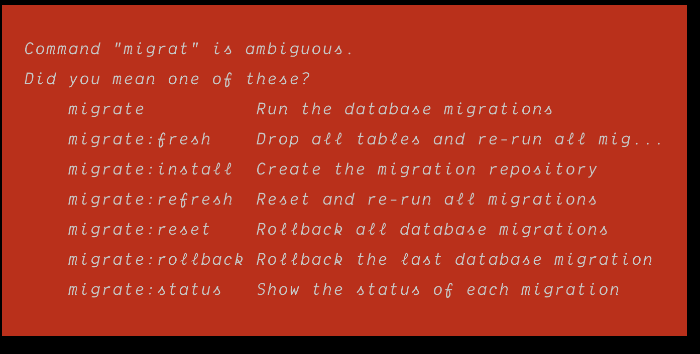

## artisan 命令，不用每次都敲全

- `art key:generate`  你可以直接敲 `art k:g`
- `art migrate:fresh`  你可以敲 `art mi:fr`
- …. 
- 许多命令你都可以只敲一部分

请看源码👇

```php
public function find($name)
{
    $this->init();

    $aliases = [];

    foreach ($this->commands as $command) {
        foreach ($command->getAliases() as $alias) {
            if (!$this->has($alias)) {
                $this->commands[$alias] = $command;
            }
        }
    }

    $allCommands = $this->commandLoader ? array_merge($this->commandLoader->getNames(), array_keys($this->commands)) : array_keys($this->commands);
    $expr = preg_replace_callback('{([^:]+|)}', function ($matches) { return preg_quote($matches[1]).'[^:]*'; }, $name);
    $commands = preg_grep('{^'.$expr.'}', $allCommands);

    if (empty($commands)) {
        $commands = preg_grep('{^'.$expr.'}i', $allCommands);
    }

    // if no commands matched or we just matched namespaces
    if (empty($commands) || \count(preg_grep('{^'.$expr.'$}i', $commands)) < 1) {
        if (false !== $pos = strrpos($name, ':')) {
            // check if a namespace exists and contains commands
            $this->findNamespace(substr($name, 0, $pos));
        }

        $message = sprintf('Command "%s" is not defined.', $name);

        if ($alternatives = $this->findAlternatives($name, $allCommands)) {
            if (1 == \count($alternatives)) {
                $message .= "\n\nDid you mean this?\n    ";
            } else {
                $message .= "\n\nDid you mean one of these?\n    ";
            }
            $message .= implode("\n    ", $alternatives);
        }

        throw new CommandNotFoundException($message, $alternatives);
    }

    // filter out aliases for commands which are already on the list
    if (\count($commands) > 1) {
        $commandList = $this->commandLoader ? array_merge(array_flip($this->commandLoader->getNames()), $this->commands) : $this->commands;
        $commands = array_unique(array_filter($commands, function ($nameOrAlias) use ($commandList, $commands, &$aliases) {
            $commandName = $commandList[$nameOrAlias] instanceof Command ? $commandList[$nameOrAlias]->getName() : $nameOrAlias;
            $aliases[$nameOrAlias] = $commandName;

            return $commandName === $nameOrAlias || !\in_array($commandName, $commands);
        }));
    }

    $exact = \in_array($name, $commands, true) || isset($aliases[$name]);
    if (\count($commands) > 1 && !$exact) {
        $usableWidth = $this->terminal->getWidth() - 10;
        $abbrevs = array_values($commands);
        $maxLen = 0;
        foreach ($abbrevs as $abbrev) {
            $maxLen = max(Helper::strlen($abbrev), $maxLen);
        }
        $abbrevs = array_map(function ($cmd) use ($commandList, $usableWidth, $maxLen) {
            if (!$commandList[$cmd] instanceof Command) {
                return $cmd;
            }
            $abbrev = str_pad($cmd, $maxLen, ' ').' '.$commandList[$cmd]->getDescription();

            return Helper::strlen($abbrev) > $usableWidth ? Helper::substr($abbrev, 0, $usableWidth - 3).'...' : $abbrev;
        }, array_values($commands));
        $suggestions = $this->getAbbreviationSuggestions($abbrevs);

        throw new CommandNotFoundException(sprintf("Command \"%s\" is ambiguous.\nDid you mean one of these?\n%s", $name, $suggestions), array_values($commands));
    }

    return $this->get($exact ? $name : reset($commands));
}
```

所以我敲 `art k:g` 框架会推导出这个表达式 `"k[^:]*[^:]*:g[^:]*[^:]*"`, 而符合这个正则表达式的命令就只有 `key:generate ` 所以可以直接写 `art k:g`

所有的推导出来的表达式都符合 `"k[^:]*[^:]*:g[^:]*[^:]*"` 这样的格式，那么你可能会问如果只有单个命令呢？比如 `migrate` , `list`, `optimize` … 等，那么框架会怎么去处理，答案这里，

```php
// 框架会去判断你敲的命令是否完全匹配，如果 true 则直接执行该命令
$exact = \in_array($name, $commands, true) || isset($aliases[$name]);
// 比如 migrate
"migrate[^:]*[^:]*"
array:7 [
  25 => "migrate"
  26 => "migrate:fresh"
  27 => "migrate:install"
  28 => "migrate:refresh"
  29 => "migrate:reset"
  30 => "migrate:rollback"
  31 => "migrate:status"
]
    
// migrate 在数组中所以直接执行 migrate
// 所以你对于 migrate 这样的命令你没办法用简写，必须完全匹配
```

最后，对于匹配有多个值的，框架会返回




## 根据不同的环境设置不同的.env
## (需要事先在环境变量中注入APP_ENV属性，如果环境变量没有值，那么即使你有.env.production框架也不会拿，2020/7/9更新)
## 要使用.env.production 的2个必须条件，1.环境变量中必须有APP_ENV事先注入2.框架根目录下有.env.production 文件，两者缺一不可
> 如果环境变量中没有 APP_ENV 属性，框架拿的还是.env, 如果环境变量中有APP_ENV=production, 但实际上目录下并没有，它还是会取.env, 只有当环境变量设置了APP_ENV=production并且有.env.production文件的时候才会走.env.production。注意： 你本地跑 art serve 这样测是测不出来的，因为它执行的是 ServerCommand 实现已经注入过APP_ENV属性了

根据不同的 APP_ENV，你可以在项目中设置对应的 ".env.{$APP_ENV}" 文件，使得根据不同的环境加载不同的配置文件，和 vue的环境加载一模一样，example：`APP_ENV=testing`, 配置文件为 `.env.testing`

```php
  protected function checkForSpecificEnvironmentFile($app)
  {
      if ($app->runningInConsole() && ($input = new ArgvInput)->hasParameterOption('--env')) {
          if ($this->setEnvironmentFilePath(
              $app, $app->environmentFile().'.'.$input->getParameterOption('--env')
          )) {
              return;
          }
      }
  
      if (! env('APP_ENV')) {
          return;
      }
  	// 源码在此
      $this->setEnvironmentFilePath(
          $app, $app->environmentFile().'.'.env('APP_ENV')
      );
  }
```

❣️注意：新的测试环境需要 `APP_KEY=`，你必须在你的 `.env.testing` 中添加 `APP_KEY=` 一个字都不能少，不然在你运行 ` art k:g --env=testing`的时候是不会写入 key 值的，源码如下

  ```php
  protected function writeNewEnvironmentFileWith($key)
  {
      file_put_contents($this->laravel->environmentFilePath(), preg_replace(
          $this->keyReplacementPattern(),
          'APP_KEY='.$key,
          file_get_contents($this->laravel->environmentFilePath())
      ));
  }
  ```

 还有 通过 `env()` 方法拿到的是环境变量 `$_ENV` 和 `$_SERVER` 的数据，优先从 `$_ENV`中拿，再从系统`env`中拿，再从 `$_SERVER`中拿 ，实际上框架会把 `.env` 中的变量在 `$_ENV` 和 `$_SERVER` 中都写一份。

```php
// 按照你传入的顺序拿变量
$variables = (new DotenvFactory([new EnvConstAdapter, new PutenvAdapter, new ServerConstAdapter]))->createImmutable();

```


## query 不要赋值，要使用 clone
```php
public function testBasicTest()
    {
        $users = factory(User::class, 3)->create(['name'=>'duc']);
        $a = User::query();
        $b = $a;
        $a->where('name', 'duc');
        $b->where('id', $users->first()->id);
        $this->assertSame($a, $b);
        $this->assertEquals(1, count($a->get()->toArray()));
    }

    public function testBasicTest1()
    {
        $users = factory(User::class, 3)->create(['name'=>'duc']);
        $a = User::query();
        $b = clone $a;
        $a->where('name', 'duc');
        $b->where('id', $users->first()->id);
        $this->assertNotSame($a, $b);
        $this->assertEquals(3, count($a->get()->toArray()));
    }
```

## laravel 中的数据库是单例，每个server只有一个mysql连接，所以要测锁表必须开两个server

同一个server，同时请求 / 是没用的！！！！因为只有一个连接
```php
Route::get('/', function () {
    DB::transaction(function () {
        $u = User::sharedLock()->find(1);
        sleep(10);
        dump($u->toArray());
    });
});
```
