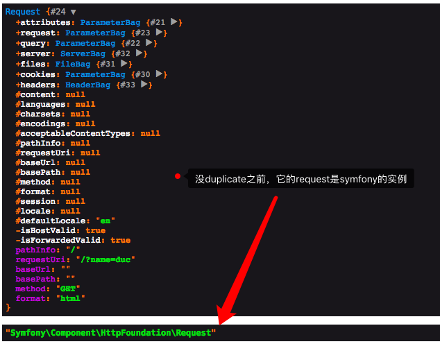
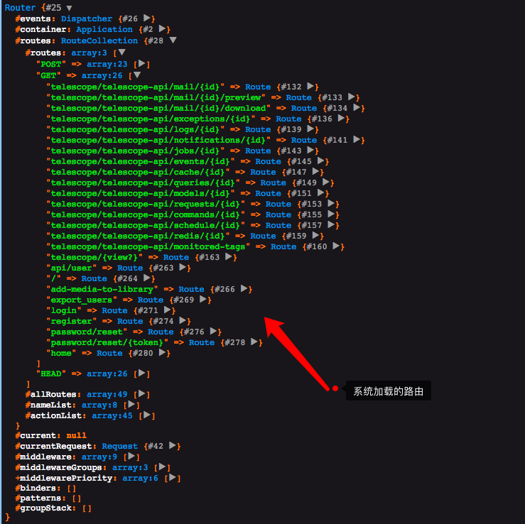

> 比较难懂

解析 Pipeline 之前，我觉得有必要好好看一下 这个 $request 是怎么生成的，底层用了 `Symfony` 的 request 类。

```php
$response = $kernel->handle(
    $request = Illuminate\Http\Request::capture()
);
```

首先进入 `capture` 方法

```php
public static function capture()
{
    # 开启 http 方法重写，之前一篇文章已经讲到过了，你也可以看看它的注释，你会懂的
    static::enableHttpMethodParameterOverride();

    return static::createFromBase(SymfonyRequest::createFromGlobals());
}
```

>  tips: application/x-www-form-urlencoded: 数据被编码成以 '&' 分隔的键-值对, 同时以 '=' 分隔键和值. 非字母或数字的字符会被 percent-encoding: 这也就是为什么这种类型不支持二进制数据的原因 (应使用 multipart/form-data 代替).

```php
# parse_str 的使用
<?php
$str = "first=value&arr[]=foo+bar&arr[]=baz";

// Recommended
parse_str($str, $output);
echo $output['first'];  // value
echo $output['arr'][0]; // foo bar
echo $output['arr'][1]; // baz
```


```php
public static function createFromGlobals()
{
    # 拿到全局变量中的 $_GET, $_POST, $_COOKIE,$_FILES,$_SERVER
    $request = self::createRequestFromFactory($_GET, $_POST, array(), $_COOKIE, $_FILES, $_SERVER);

    # 前半句判断请求是否是form表单的形式发送的，后半句判断请求的方法是否是 put patch 或者 delete，因为php本身不支持 put 或者 delete 方法
    if (0 === strpos($request->headers->get('CONTENT_TYPE'), 'application/x-www-form-urlencoded')
        && \in_array(strtoupper($request->server->get('REQUEST_METHOD', 'GET')), array('PUT', 'DELETE', 'PATCH'))
       ) {
        # 如果是 application/x-www-form-urlencoded 形式的，那么需要解析参数
        parse_str($request->getContent(), $data);
        # 把初始化的 request 覆盖掉
        $request->request = new ParameterBag($data);
    }

    return $request;
}
```

```php
private static function createRequestFromFactory(
    array $query = array(), 
    array $request = array(), 
    array $attributes = array(), 
    array $cookies = array(), 
    array $files = array(), 
    array $server = array(), 
    $content = null
) {
    # 如果已经有实例？ $requestFactory ，这一步情景暂时看不出，但可以肯定的是一个新的请求，这个判断返回 false
    if (self::$requestFactory) {
        $request = \call_user_func(self::$requestFactory, $query, $request, $attributes, $cookies, $files, $server, $content);

        if (!$request instanceof self) {
            throw new \LogicException('The Request factory must return an instance of Symfony\Component\HttpFoundation\Request.');
        }

        return $request;
    }

    # 生成一个 request 实例
    return new static($query, $request, $attributes, $cookies, $files, $server, $content);
}
```

```php
# Request 构造函数
public function __construct(
    array $query = array(), 
    array $request = array(), 
    array $attributes = array(), 
    array $cookies = array(), 
    array $files = array(), 
    array $server = array(), 
    $content = null
) {
    $this->initialize($query, $request, $attributes, $cookies, $files, $server, $content);
}
```

初始化了相关类，这里把不同的属性不同的参数给到不同的类做了解耦，good！

```php
public function initialize(
    array $query = array(), 
    array $request = array(), 
    array $attributes = array(), 
    array $cookies = array(), 
    array $files = array(), 
    array $server = array(), 
    $content = null
) {
    $this->request = new ParameterBag($request);
    $this->query = new ParameterBag($query);
    $this->attributes = new ParameterBag($attributes);
    $this->cookies = new ParameterBag($cookies);
    $this->files = new FileBag($files);
    $this->server = new ServerBag($server);
    $this->headers = new HeaderBag($this->server->getHeaders());

    $this->content = $content;
    $this->languages = null;
    $this->charsets = null;
    $this->encodings = null;
    $this->acceptableContentTypes = null;
    $this->pathInfo = null;
    $this->requestUri = null;
    $this->baseUrl = null;
    $this->basePath = null;
    $this->method = null;
    $this->format = null;
}
```

```php
# 注意这里传入的 $request 实例！这个实例是 SymfonyRequest 的实例，而第一句判断中的 static 是 Illuminate\Http\Request，所以是 false，laravel 框架还要对其进一步包装
public static function createFromBase(SymfonyRequest $request)
{
    if ($request instanceof static) {
        return $request;
    }

    $content = $request->content;

    # laravel clone 了一份 request
    $request = (new static)->duplicate(
        $request->query->all(), $request->request->all(), $request->attributes->all(),
        $request->cookies->all(), $request->files->all(), $request->server->all()
    );

    $request->content = $content;
	# 如果请求给的是json数据格式，那么将其转化为 ParameterBag 实例，因为 SymfonyRequest 对 json 请求格式没有做处理
    $request->request = $request->getInputSource();

    return $request;
}
```



## 了解了 request 的实例过程之后，我们来看 Pipeline

```php
return (new Pipeline($this->app)) # 传入 app 实例(单例)
    ->send($request) # 传入 request，赋值给 Pipeline 的 passable 属性
    ->through($this->app->shouldSkipMiddleware() ? [] : $this->middleware) # 传入中间件，这个判断是为了测试时候禁用中间件而写的，把 对应的中间件类传入，赋值给 Pipeline 的 pipes
    ->then($this->dispatchToRouter());
```

```php
public function then(Closure $destination)
{
    # array_reduce 如果有三个参数，先看第三个，它初始化传入的值
    $pipeline = array_reduce(
        array_reverse($this->pipes), $this->carry(), $this->prepareDestination($destination)
    );

    return $pipeline($this->passable);
}
```


```php

# 第三个参数传入了dispatchToRouter这个闭包
protected function dispatchToRouter()
{
    return function ($request) {
        $this->app->instance('request', $request);

        return $this->router->dispatch($request);
    };
}
```

```php
protected function carry()
{
    # $stack -> 闭包，$pipe -> 在这里是中间件的类名
    return function ($stack, $pipe) {
        return function ($passable) use ($stack, $pipe) {
            if (is_callable($pipe)) {

                return $pipe($passable, $stack);
            } elseif (! is_object($pipe)) {
                [$name, $parameters] = $this->parsePipeString($pipe);

                $pipe = $this->getContainer()->make($name);

                $parameters = array_merge([$passable, $stack], $parameters);
            } else {

                $parameters = [$passable, $stack];
            }

            $response = method_exists($pipe, $this->method)
                ? $pipe->{$this->method}(...$parameters)
            : $pipe(...$parameters);

            return $response instanceof Responsable
                ? $response->toResponse($this->container->make(Request::class))
                : $response;
        };
    };
}
```

```php
$pipeline = array_reduce(
    array_reverse($this->pipes), $this->carry(), $this->prepareDestination($destination)
);


# 合并。最终这个 reduce 将形成一个大大的闭包函数，类似递归，一层嵌套一层
array_reduce(
    array_reverse($this->pipes), 
    function ($stack, $pipe) {
        return function ($passable) use ($stack, $pipe) {
            if (is_callable($pipe)) {

                return $pipe($passable, $stack);
            } elseif (! is_object($pipe)) {
                [$name, $parameters] = $this->parsePipeString($pipe);

                $pipe = $this->getContainer()->make($name);

                $parameters = array_merge([$passable, $stack], $parameters);
            } else {

                $parameters = [$passable, $stack];
            }

            $response = method_exists($pipe, $this->method)
                ? $pipe->{$this->method}(...$parameters)
            : $pipe(...$parameters);

            return $response instanceof Responsable
                ? $response->toResponse($this->container->make(Request::class))
                : $response;
        };
    }
    , function ($passable) use ($destination) {
        return function ($passable) {
            $this->app->instance('request', $passable);

            return $this->router->dispatch($passable);
        };
    };
);
```

## 源码不愧是源码，很那理解，那么我这里先来个简单的

```php
<?php
# laravel pipeline 的简单实现，pipeline 主要用来对数据进行管道化处理，类似于拦截器，层层过滤数据
# 请求 -> 管道1 —> 管道2 -> 管道3 -> 业务逻辑 -> 后置管道 -> 返回结果

 function runPipeline()
{
    return $result = array_reduce(
        array_reverse([new Handler1, new Handler2, new Handler3, new Handler4]),
        function ($start, $handler) {
            return function () use ($start, $handler) {
                $result =  $handler->hanlde($start);

                return $result;
            };
    }, function () {
        echo "处理核心业务逻辑\n";
    });
}

$result = runPipeline();
$result();

/**
 * 前置管道1
 */
class Handler1
{
    function hanlde($callback)
    {
        echo '处理器1' . "\n";

        return $callback();
    }
}

/**
 * 前置管道2
 */
class Handler2
{
    function hanlde($callback)
    {
        echo '处理器2' . "\n";

        return $callback();
    }
}

/**
 * 后置管道3
 */
class Handler3
{
    function hanlde($callback)
    {
        $result = $callback();

        echo '处理器3' . "\n";

        return $result;
    }
}

/**
 * 前置管道4
 */
class Handler4
{
    function hanlde($callback)
    {
        echo '处理器4' . "\n";

        return $callback();
    }
}

```

### 为什么要 array_reverse

```php
# 管道最终的包装之后是这样的，正如 laravel 源码中的 $this->prepareDestination($destination) 是核心逻辑，然后它外面包的是一个有一个的管道，也就是中间件，最先进入的 最后执行，所以取反之后，最先进入的最先执行
function duc() {
    $callback1 = function () {
        echo '处理器1' . "\n";

        $callback2 = function () {
            echo '处理器2' . "\n";

            $callback3 = function () {
                echo "处理核心业务逻辑\n";
            };

            $callback3();
        };

        $callback2();
    };

    $callback1();
}

duc();
```

## 前置和后置？

前置和后置其实就是执行顺序问题，只要把上面的echo放到 callback 之后，就能实现后置

```php
function duc() {
    $callback1 = function () {
        echo '处理器1' . "\n";

        $callback2 = function () {

            $callback3 = function () {
                echo "处理核心业务逻辑\n";
            };

            $callback3();
            
            echo '处理器2' . "\n";
        };

        $callback2();
    };

    $callback1();
}

duc();
```

> 这个pipeline 在laravel 中中间件处理的时候得到了应用，去看文档你会发现中间件的前置和后置和本文的用法一样

到这里你就应该知道中间件的用法了吧！我们继续看下去，由上文可知，`$this->prepareDestination($destination)` 才是核心逻辑实现的地方，下面贴代码

```php
# passable 是 request 实例，在 pipeline send 的时候传入的
return function ($passable) {
    $this->app->instance('request', $passable);

    return $this->router->dispatch($passable);
};
```

```php
public function dispatch(Request $request)
{
    # 为 router  类添加了类属性
    $this->currentRequest = $request;

    # 分发路由
    return $this->dispatchToRoute($request);
}
```

```php
public function dispatchToRoute(Request $request)
{
    return $this->runRoute($request, $this->findRoute($request));
}
```

```php
# 这一步是去从你的路由中寻找相应的控制器和方法
# 你可以打印router类，至于框架什么时候解析了你的路由文件，我告诉你，它是在  bootstrap 阶段，运行 BootProviders 的bootstrap方法，调用所有 providers 的 boot 方法时加载的
protected function findRoute($request)
{
    $this->current = $route = $this->routes->match($request);

    # 框架还把其赋值给了 Route，也就是说，你在控制器中用 app(\Illuminate\Routing\Route::class) 拿到是是下图路由数组中的某一个路由对象，比如 / 你拿到的就是下图中 / 对应的键值，注意这里 app(\Illuminate\Routing\Route::class) !== app('route')
    $this->container->instance(Route::class, $route);

    return $route;
}
```



```php
protected function runRoute(Request $request, Route $route)
{
    $request->setRouteResolver(function () use ($route) {
        return $route;
    });

    # 触发事件，调用对应的 listener
    $this->events->dispatch(new Events\RouteMatched($route, $request));

    return $this->prepareResponse($request,
        $this->runRouteWithinStack($route, $request)
    );
}
```

```php
protected function runRouteWithinStack(Route $route, Request $request)
{
    $shouldSkipMiddleware = $this->container->bound('middleware.disable') &&
        $this->container->make('middleware.disable') === true;

    $middleware = $shouldSkipMiddleware ? [] : $this->gatherRouteMiddleware($route);

    # ???? wtf 这里怎么还有管道
    # 大家都懂的，核心业务代码就是 then 里面的部分
    return (new Pipeline($this->container))
        ->send($request)
        ->through($middleware)
        ->then(function ($request) use ($route) {
            return $this->prepareResponse(
                $request, $route->run()
            );
        });
}
```

```php
# run 执行控制器里面的方法
public function run()
{
    $this->container = $this->container ?: new Container;

    try {
        if ($this->isControllerAction()) {
            return $this->runController();
        }

        return $this->runCallable();
    } catch (HttpResponseException $e) {
        return $e->getResponse();
    }
}
```

```php
# toResponse 转换为相应的返回格式
public static function toResponse($request, $response)
{
    if ($response instanceof Responsable) {
        $response = $response->toResponse($request);
    }

    if ($response instanceof PsrResponseInterface) {
        $response = (new HttpFoundationFactory)->createResponse($response);
    } elseif ($response instanceof Model && $response->wasRecentlyCreated) {
        $response = new JsonResponse($response, 201);
    } elseif (! $response instanceof SymfonyResponse &&
              ($response instanceof Arrayable ||
               $response instanceof Jsonable ||
               $response instanceof ArrayObject ||
               $response instanceof JsonSerializable ||
               is_array($response))) {
        $response = new JsonResponse($response);
    } elseif (! $response instanceof SymfonyResponse) {
        $response = new Response($response);
    }

    if ($response->getStatusCode() === Response::HTTP_NOT_MODIFIED) {
        $response->setNotModified();
    }

    return $response->prepare($request);
}
```

再回过头来看 handle 方法

```php
public function handle($request)
{
    try {
        $request->enableHttpMethodParameterOverride();

        # 这里的种种操作最后返回的是 Symfony\Component\HttpFoundation\Response 实例
        $response = $this->sendRequestThroughRouter($request);
    } catch (Exception $e) {
        $this->reportException($e);

        $response = $this->renderException($request, $e);
    } catch (Throwable $e) {
        $this->reportException($e = new FatalThrowableError($e));

        $response = $this->renderException($request, $e);
    }

    # 请求结束还触发了事件
    $this->app['events']->dispatch(
        new Events\RequestHandled($request, $response)
    );

    return $response;
}
```

```php
$kernel = $app->make(Illuminate\Contracts\Http\Kernel::class);

$response = $kernel->handle(
    $request = Illuminate\Http\Request::capture()
);
# 最后把相应返回给客户端
$response->send();

# 处理中间件中的 terminate 方法
$kernel->terminate($request, $response);
```


```php
/**
* 
* Sends HTTP headers and content.
*
* @return $this
*/
public function send()
{
    $this->sendHeaders();
    $this->sendContent();

    if (\function_exists('fastcgi_finish_request')) {
        fastcgi_finish_request();
    } elseif (!\in_array(\PHP_SAPI, array('cli', 'phpdbg'), true)) {
        static::closeOutputBuffers(0, true);
    }

    return $this;
}
```

## 再多讲一句

```php
# 这个阶段你再dd或者dump是不会有任何输出的，因为服务端已经返回了
$kernel->terminate($request, $response);

# 比如 session 的保存和关闭处理
public function terminate($request, $response)
{
    if ($this->sessionHandled && $this->sessionConfigured() && ! $this->usingCookieSessions()) {
        $this->manager->driver()->save();
    }
}
```

