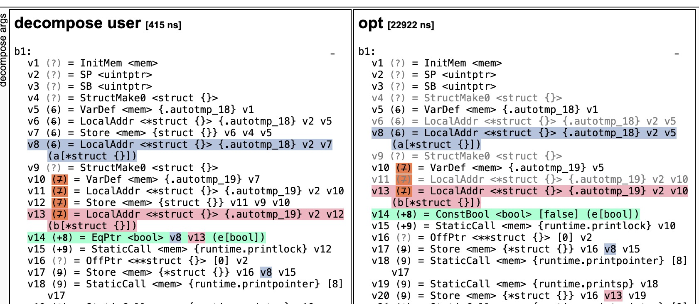

> 转自 https://xargin.com/addr-of-empty-struct-may-not-eq/


https://www.zhihu.com/question/364687707

在知乎上已经说了原因，不过只是讲官方的 spec，我们再来看看实现上具体为什么会是这样的。

```
package main

import "fmt"

func main() {
	a := new(struct{})
	b := new(struct{})
	println(a, b, a == b)

	c := new(struct{})
	d := new(struct{})
	fmt.Println(c, d, c == d)
}
```

结果可能让你很惊讶：

```
0xc00007af1f 0xc00007af1f false
&{} &{} true
```

如果之前碰到过给程序加上 fmt.Println 就导致结果变化的情况的同学，可能会想到这里的原因，是和逃逸分析相关。(可以参考这两个 issue ：[8618](https://github.com/golang/go/issues/8618) 和 [31317](https://github.com/golang/go/issues/31317))

没错：

```
~/test git:master ❯❯❯ cat -n true.go                                                                              ✱ ◼
     1	package main
     2
     3	import "fmt"
     4
     5	func main() {
     6		a := new(struct{})
     7		b := new(struct{})
     8		println(a, b, a == b)
     9
    10		c := new(struct{})
    11		d := new(struct{})
    12		fmt.Println(c, d, c == d)
    13	}
~/test git:master ❯❯❯ go run -gcflags="-m" true.go                           

# command-line-arguments
./true.go:12:13: inlining call to fmt.Println
./true.go:6:10: main new(struct {}) does not escape
./true.go:7:10: main new(struct {}) does not escape
./true.go:10:10: new(struct {}) escapes to heap
./true.go:11:10: new(struct {}) escapes to heap
./true.go:12:13: c escapes to heap
./true.go:12:13: d escapes to heap
./true.go:12:22: c == d escapes to heap
./true.go:12:13: main []interface {} literal does not escape
./true.go:12:13: io.Writer(os.Stdout) escapes to heap
<autogenerated>:1: (*File).close .this does not escape
0xc00007af1f 0xc00007af1f false
&{} &{} true
```

在 fmt.Println 中单独出现了 c，所以 c = new 的时候就发生了逃逸，d 也同理：

- 未逃逸：a，b
- 逃逸：c，d

看过一点 go runtime 代码的同学应该知道，在 runtime 里有这么个东西：

```
// base address for all 0-byte allocations
var zerobase uintptr
```

0 大小的内存分配均会指向该变量地址，所谓的 0 字节，主要就是这种空 struct。不过这里没说清楚的是，只有在**堆上**分配的 0 大小的 struct 才会指向该地址：

```
package main

import "fmt"

var a = new(struct{}) // 堆上

func main() {
	var b = new(struct{})
	fmt.Println(b/*这里单独打印了，所以 b escape 到堆上*/, a == b)
}
```

那么空 struct 逃逸之后其实都是同一个变量，地址相等，我们是可以理解了。

没逃逸的 a 和 b 为什么地址不相等呢？这里可以祭出 SSA 大法：

```
~/test git:master ❯❯❯ sudo GOSSAFUNC=main go build true.go
```



可以看到这个 false，其实是在代码优化阶段(opt)直接被编译后端作为常量优化掉了，直接转成了 false。

所以我们本能地以为 == 是在做指针比较，但是常量优化会替我们做出不那么符合直觉的判断，直接把 a == b rewrite 为 false。

问题到这里也就结束了，既然我们知道这里是优化阶段做的，那是不是我们把优化关闭就会导致输出 true 呢？

确实是的：

```
~/test git:master ❯❯❯ cat true.go                                             

package main

import "fmt"

func main() {
	a := new(struct{})
	b := new(struct{})
	println(a, b, a == b)

	c := new(struct{})
	d := new(struct{})
	fmt.Println(c, d, c == d)
}

~/test git:master ❯❯❯ go run -gcflags="-N -l" true.go 

0xc00007aece 0xc00007aece true
&{} &{} true
```

PS：写这个只是图个乐，我们可以用 Go 附带的 SSA 工具去更深入地认识整个编译阶段干的事情，从而理解官方的所谓“实现细节”和 spec 上的 may or may not 到底是怎么回事。

**要是哪位工程师拿这个去做面试题，那就太缺德啦！**(真实🤣)