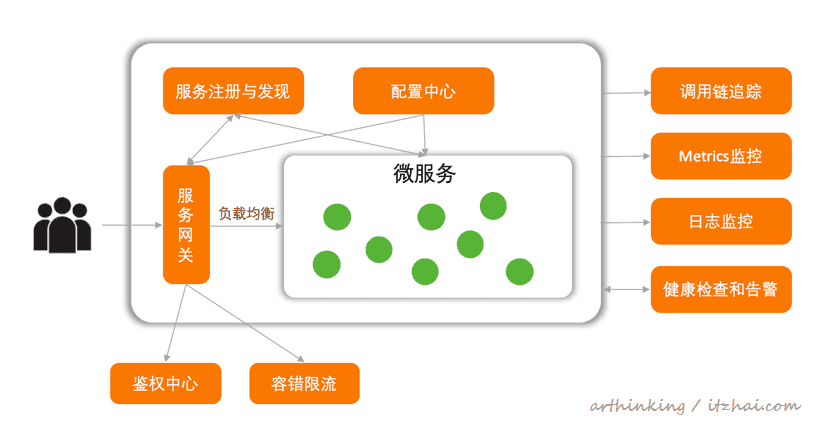
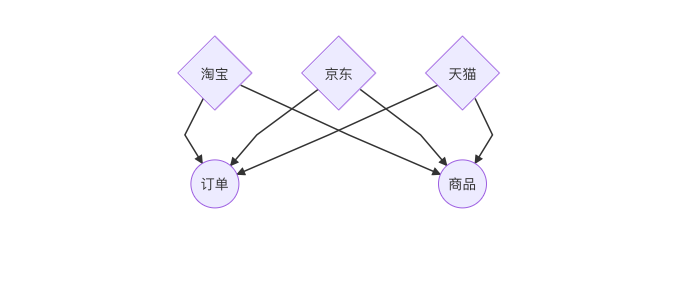

版本化、优雅、简单实现微服务之间的rpc通讯


首先划分业务架构

淘宝、京东、天猫属于业务层

订单、支付属于基础服务



## 实践

>  本文研究的是业务层(php)如何优雅的通过rpc(grpc, protobuf)和基础服务(go)通讯

现在有2个底层服务(商品、订单GOLANG)，一个业务中台(laravel)，

需要实现

1. php和golang之间0配置调用，版本管理
2. rpc和rpc之间proto版本化管理


goods 服务的proto，声明了一个 带有 `getOneByType` 的 `Iphone` svc

```protobuf
syntax="proto3";

package goods;

option go_package="github.com/DuC-cnZj/goods_proto";
option php_metadata_namespace = "Goods";

message Request {
  int32 type = 1;
}

message Response {
  string code = 1;
  string msg = 2;
}

service Iphone {
  rpc getOneByType(Request) returns (Response);
}
```

订单服务的proto，声明了一个带有 `list` `create` 的订单服务

```protobuf
syntax="proto3";

package order;

import "google/protobuf/empty.proto";

option go_package="github.com/DuC-cnZj/order_protos";
option php_metadata_namespace = "Order";

message Request {
  string num = 1;
  string user_name = 2;
}

message Response {
  int32 code = 1;
  string data = 2;
}

service Order {
  rpc list(google.protobuf.Empty) returns (Response);
  rpc create(Request) returns (Response);
}
```

**生成对应的php版本的pb.go文件**，那么php应该如何接入呢？

直接服务pb文件到php项目的目录下？不可行，如果有多个php项目，复用性为0，修改起来麻烦，无法版本化管理。

那么该怎么做呢？

答案是通过composer，生成 package，并且在 ci/cd 阶段自动化打包提交，这时候就会得到可复用的，版本化的composer包。

php client 使用麻烦怎么办？

每次使用都需要这样写，太麻烦了

```php
$client = new IphoneClient("rpc:host", []);
[$data, $response] = $client->getOneByType($request)->wait();
if ($response->code == \Grpc\CALL_OK) {
  if ($asArray) {
    return json_decode($data->serializeToJsonString(), true);
  }

  return $data;
}

throw new \Exception("Goods rpc client error: " . $response->details, $response->code);
```

能否用一行搞定？类似 `IphoneClient::getOneByType(['type' => 1])`，或许你觉得不可能，但是实际上可以。

如果你使用laravel框架，肯定会惊叹它的Facades是多么的好用，它的服务自动发现是多么神奇，如果能用到grpc中那么该多好。

在这里我推荐一个pkg `duc_cnzj/rpc-facades-generator`，自动帮你生成grpc facades，实现零修改，自动生成如下代码

```php
<?php

namespace Goods\Facades;

use Illuminate\Support\Facades\Facade;

/**
 *
 * @method static \Goods\Response|array getOneByType($data = [], bool $asArray = true)
 *
 * Class IphoneClient
 */
class IphoneClient extends Facade
{
    protected static function getFacadeAccessor()
    {
        return \Goods\Services\IphoneClientService::class;
    }
}
```

那么你可能会问，rpc调用的地址在哪里配？

```php
<?php

namespace Goods;

use Goods\IphoneClient;


class ServiceProvider extends \Illuminate\Support\ServiceProvider
{
    public function register()
    {
        $this->app->singleton(IphoneClient::class);
        $this->app->when(IphoneClient::class)
            ->needs('$hostname')
            ->give(env("GOODS_HOST", ""));
        $this->app->when(IphoneClient::class)
            ->needs('$opts')
            ->give([
                'credentials' => \Grpc\ChannelCredentials::createInsecure(),
            ]);
    }
}
```

没错，你只需要在 `.env` 中配置 GOODS_HOST 就可以了，其他的不用管！pkg帮你自动生成！

搞定了php和go之间的版本化管理，那么我们再来谈谈go和go微服务之间的proto版本管理，和php相同原理，这里我们也使用pkd来管理proto文件通过ci/cd 生成pb文件，并且用git打包上传到一个专门的proto仓库，实现版本化管理。


### 源码

[rpc-facades-generator](https://github.com/DuC-cnZj/rpc-facades-generator) grpc laravel facades 生成器，只需要 require --dev 即可

[order_protos](https://github.com/DuC-cnZj/order_protos)  order 服务的proto文件仓库

[micro-order](https://github.com/DuC-cnZj/micro-order)  order 服务

[goods_proto](https://github.com/DuC-cnZj/goods_proto)  goods 服务的proto仓库

[micro-goods](https://github.com/DuC-cnZj/micro-goods) goods服务

核心实现要点：  通过 ci/cd 生成并且上传对应语言的 pb 文件，并且通过pkg管理起来


## 优点

1. 版本化
2. 可复用
3. 简单


## 思考？

单体golang微服务仓库对比多仓库

单体仓库cicd麻烦，并且团队合作相比多仓库难

单体仓库构建流程麻烦不推荐