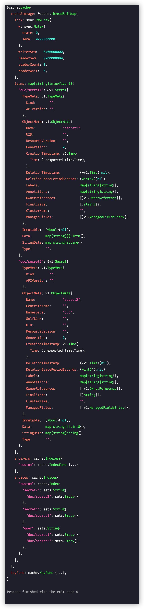

> Indexer 是 client-go 自带索引的本地对象存储

数据结构

```go
type cache struct {
  // 并发安全存储
	cacheStorage ThreadSafeStore
  // 根据资源对象计算出 key 值
	keyFunc KeyFunc
}

type KeyFunc func(obj interface{}) (string, error)

type threadSafeMap struct {
	lock  sync.RWMutex
  // 存了 keyFunc => obj 的对应关系
	items map[string]interface{}

  // 自定义的 index 方法
	indexers Indexers
  // 索引器
	indices Indices
}

type Indexers map[string]IndexFunc
type Indices map[string]Index
type Index map[string]sets.String
```

## demo

```go
c := cache.NewIndexer(cache.MetaNamespaceKeyFunc, cache.Indexers{"custom": func(obj interface{}) ([]string, error) {
  pod := obj.(*corev1.Secret)
  return []string{pod.Name, "qwer"}, nil
}})
c.Add(&corev1.Secret{
  ObjectMeta: metav1.ObjectMeta{
    Name:      "secret1",
    Namespace: "duc",
  },
})
c.Add(&corev1.Secret{
  ObjectMeta: metav1.ObjectMeta{
    Name:      "secret2",
    Namespace: "duc",
  },
})
pp.Println(c)
```



```go
type Indexer interface {
	Store
  
  // 返回 indexName 下的，和 obj.indexFunc 获取到的索引值相同的所有对象
	Index(indexName string, obj interface{}) ([]interface{}, error)
	// 获取 indexName 下的 索引值为 indexedValue 集合的所有 key
	IndexKeys(indexName, indexedValue string) ([]string, error)
	// 获取 indexName 下的所有 key 值
	ListIndexFuncValues(indexName string) []string
  // 搜索 indices[indexName][indexedValue] 然后检索 items, 返回 []obj
	ByIndex(indexName, indexedValue string) ([]interface{}, error)
	// 返回 indexers
	GetIndexers() Indexers

	// AddIndexers adds more indexers to this store.  If you call this after you already have data
	// in the store, the results are undefined.
	AddIndexers(newIndexers Indexers) error
}
```


