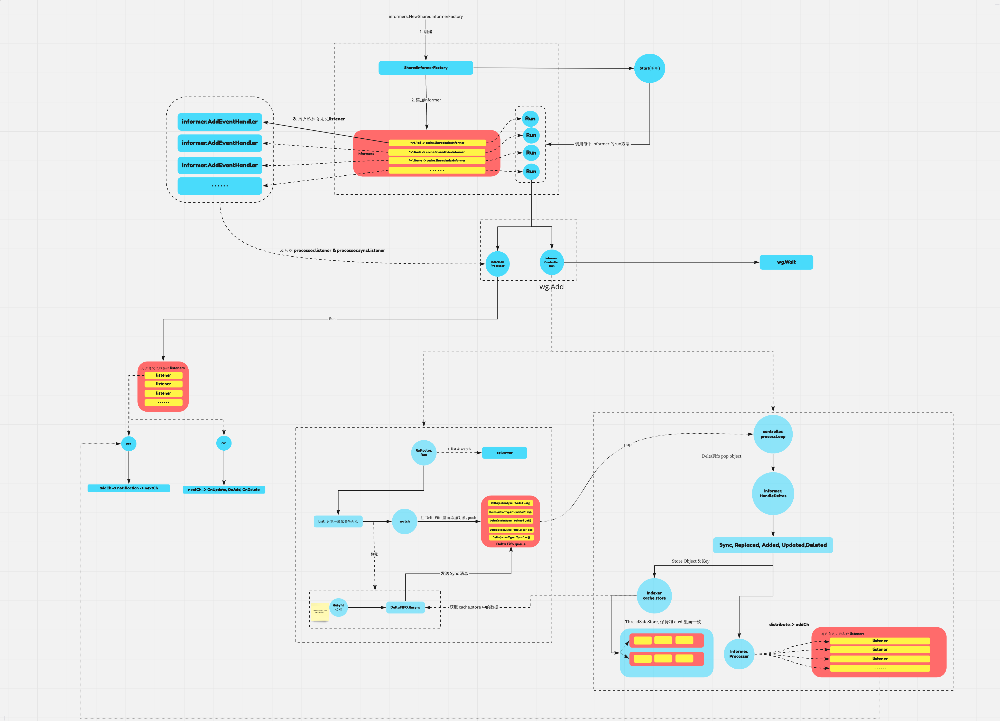

> 网上看了很多关于 informer 的文章以及流程图，感觉不全面，因此自己画了一张

## Resync 机制

开启后会定时从本地 `cache.store` 同步数据，会触发 `UpdateFunc`，所以如果开启 resync 最好检查每次 ResourceVersion 是否发送变更，避免做不必要的操作。

初始化 informerFactory 的时候传入的 resyncPeriod 会因为每个 informer 的 `AddEventHandlerWithResyncPeriod` 操作而改变，如果一开始传入的是 10s 同步一次，但后面加入一个需要 2s 同步一次的 event，informer的同步周期会变成 2s

