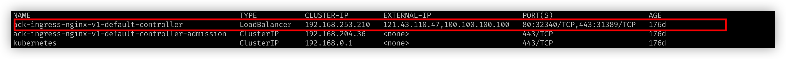
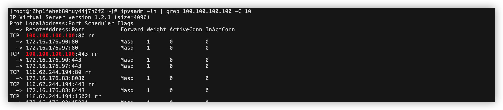
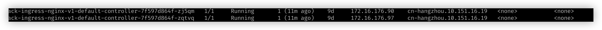

## k8s svc externalIPs 使用

在平时一般用不到这个选项，但是如果你有 svc 是 `loadbalancer` 类型的，并且还配置了 waf

那么你用的到，流量经过 waf 转发到 nginx svc pod 中，试想一下，如果是从集群内部pod访问指向waf的域名，那么是不是流量会绕一圈，但是如果你把waf ip设置到 `externalIPs` 上，流量就会直接在集群内部流动。

### 实验：

给nginx svc 增加一个 100.100.100.100 的ip

查看proxy的mode是ipvs，进入服务器查看ipvs

可以看到访问这个ip被负载到 90,97两个ip上

查看pod ip

90,97 就是nginx pod ip，所以流量会在内部直接转发。

