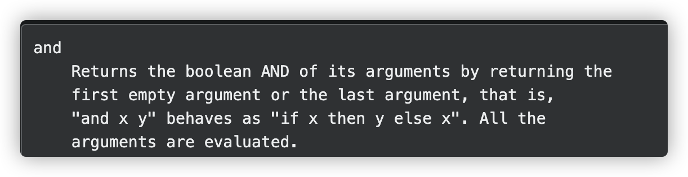
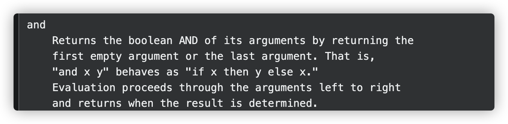

# Go 1.18 vs Go 1.17 小变化


## 1.17



## 1.18




这段代码 1.17 会报错, 1.18 不会，因为1.18 开始是从左往右判断，1.17 是每个判断都会执行

```go
t, _ := template.New("").Parse(`
{{- if and .a.enabled .a.b.enabled }}
ok
{{- end }}
`)
if err := t.Execute(os.Stdout, map[string]interface{}{
  "a": map[string]interface{}{
    "enabled": false,
    "b": nil,
  },
}); err != nil {
  log.Fatalln(err)
}

```


