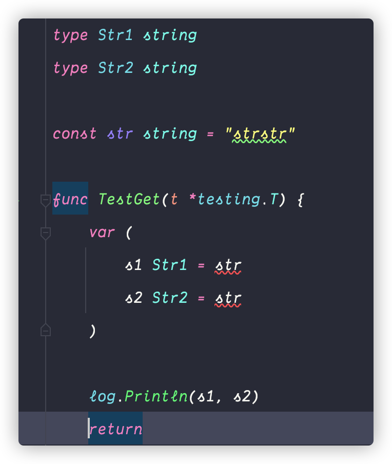
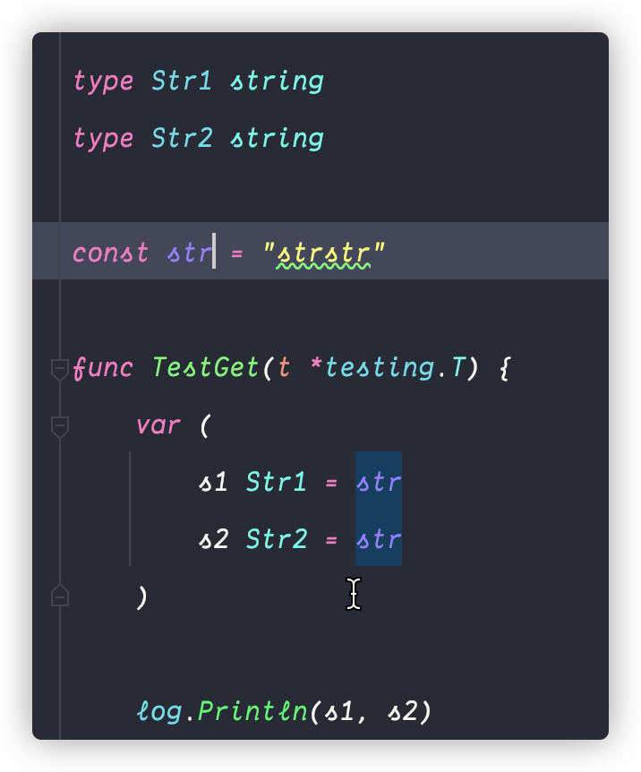

# go 代码风格指南

## 概览

[GitHub - dgryski/awesome-go-style: A collection of Go style guides](https://github.com/dgryski/awesome-go-style)


## 具体，挑了一些平时不知道的

[Go 箴言](https://go-proverbs.github.io/)

[Golang随机数生成和原理 | JWang的博客](https://wangbjun.site/2020/coding/golang/random.html)

## ⭐️ 实现接口的局部方法

> 如果一个结构体没有明确的接口的方法，接口被嵌入到结构体中，并且你没有将接口字段设置为具体的值（即接口字段值为nil），方法调用会panic .
> 
> 当您只想在巨大的接口中实现方法的一个子集时，这在测试中会很有用。
> 
> [When in Go, do as Gophers do](https://talks.golang.org/2014/readability.slide#18)

```go
import "fmt"

type I interface {
    Key() string
    Value() string
}
type S struct{ I }      // S has method sets of I.
func (s S) Key() string { return "type S" }

func main() {
    var s S
    fmt.Println("key", s.Key())
    fmt.Println(s.Value()) // runtime error: invalid memory address or nil pointer deference
}
```

## 把mutex和保护的数据用空行隔开

- 按组组织字段，它们之间有空行。
- 将[sync.Mutex](https://golang.org/pkg/sync/#Mutex)放在互斥锁保护的字段块的顶部。

```go
type Modifier struct {
    client *client.Client

    mu    sync.RWMutex
    pmod  *profile.Modifier
    cache map[string]time.Time
}
```

## ⭐️ 未声明类型的常量是无类型的

> [When in Go, do as Gophers do](https://talks.golang.org/2014/readability.slide#33)
> 
> [Constants - The Go Programming Language](https://go.dev/blog/constants)





## 当有多个返回参数时，要命名

```go
func nextInt(b []byte, pos int) (value, nextPos int) {
}

func ReadFull(r Reader, buf []byte) (n int, err error) {
    for len(buf) > 0 && err == nil {
        var nr int
        nr, err = r.Read(buf)
        n += nr
        buf = buf[nr:]
    }
    return
}
```

## 好的包名设计

[Package names - The Go Programming Language](https://go.dev/blog/package-names)
