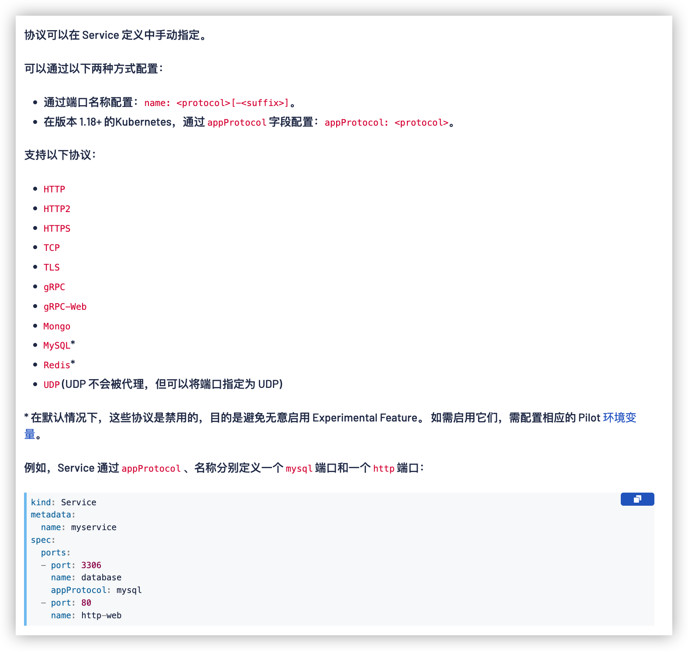

# istio

> 当前版本 `1.15.1`


## 查看集群中都安装了什么

>  拿到的就是 `IstioOperator` 的yaml清单

```shell
kubectl -n istio-system get IstioOperator installed-state -o yaml 
```

## 查看/打印 profile

> dump 出来的就是 IstioOperator  文件

```shell
istioctl profile list
》Istio configuration profiles:
    default
    demo
    empty
    external
    minimal
    openshift
    preview

istioctl profile dump demo
```

## 查看 IstioOperator 差异

> kubectl -n istio-system get IstioOperator installed-state -o yaml  用这个生成现在集群的配置，然后和你本地的比较

```shell
istioctl manifest diff istio.yaml /tmp/istio-1422.yml
# 后面的比前面的多了

》Differences in manifests are:


Object IstioOperator:: has diffs:

spec:
  components:
    pilot:
      k8s: <empty> -> map[hpaSpec:map[maxReplicas:5 metrics:[map[resource:map[name:cpu
        target:map[averageUtilization:80 type:Utilization]] type:Resource]] minReplicas:1
        scaleTargetRef:map[apiVersion:apps/v1 kind:Deployment name:istiod]] replicaCount:1]
        (ADDED)
  values:
    global:
      proxy:
        resources:
          limits: <empty> -> map[cpu:2000m memory:1024Mi] (ADDED)
      proxy_init:
        resources:
          limits: <empty> -> map[cpu:2000m memory:1024Mi] (ADDED)

```

## 检查安装是否成功

```
istioctl verify-install -f istio.yaml
```

## 新增一个 ingress gateway

> https://istio.io/latest/zh/docs/setup/install/istioctl/#configure-gateways

## 自动注入 sidecar

> 注意是在 labels 里面加！不是注解里面
>
> [文档](https://istio.io/latest/zh/docs/setup/additional-setup/sidecar-injection/#controlling-the-injection-policy)


---


## 路由

###  基于身份路由

```yaml
# 基于身份路由 
apiVersion: networking.istio.io/v1beta1
kind: VirtualService
metadata:
  name: route-test
  namespace: duc
spec:
  hosts:
  - web
# When gateways is omitted, the default gateway (mesh) will be used, 没填这个字段默认使用 mesh
#  gateways:
#  - mesh
  http:
  - match:
  # 规则是 '&' 关系, header 包含 user: duc, 并且访问的是 /web.html 去到 v1 服务
    - headers:
        user:
          exact: duc
      uri:
        prefix: "/web.html"
      ignoreUriCase: true
    route:
    - destination:
        host: web
        subset: v1
  - route:
    - destination:
        host: web
        subset: v2
```

### 注入 HTTP abort/延迟 故障注入

```yaml
# 让 user: duc 的访问返回 504
apiVersion: networking.istio.io/v1beta1
kind: VirtualService
metadata:
  name: route-test
  namespace: duc
spec:
  hosts:
  - web
  http:
  - fault:
      abort:
        percentage: 
          value: 100
        httpStatus: 504
    match:
    - headers:
        user:
          exact: duc
      uri:
        prefix: "/web.html"
      ignoreUriCase: true
    route:
    - destination:
        host: web
        subset: v1
  - route:
    - destination:
        host: web
        subset: v2
```

```yaml
# 让 user: duc 的访问延迟 3s
apiVersion: networking.istio.io/v1beta1
kind: VirtualService
metadata:
  name: route-test
  namespace: duc
spec:
  hosts:
  - web
  http:
  - fault:
      delay:
        fixedDelay: 3s
        percentage: 
          value: 100
    match:
    - headers:
        user:
          exact: duc
      uri:
        prefix: "/web.html"
      ignoreUriCase: true
    route:
    - destination:
        host: web
        subset: v1
  - route:
    - destination:
        host: web
        subset: v2
```

### 流量管理

```yaml
# 5% 到 v1 
# 95% 到 v2
apiVersion: networking.istio.io/v1beta1
kind: VirtualService
metadata:
  name: route-test
  namespace: duc
spec:
  hosts:
  - web
  http:
  - route:
    - destination:
        host: web
        subset: v1
      weight: 5
    - destination:
        host: web
        subset: v2
      weight: 95
```

### 请求超时设置

```yaml
apiVersion: networking.istio.io/v1beta1
kind: VirtualService
metadata:
  name: route-test
  namespace: duc
spec:
  hosts:
  - web
  http:
    - timeout: 2ms
      route:
      - destination:
          host: web
          subset: v1
```

---


## 熔断

```yaml
apiVersion: networking.istio.io/v1beta1
kind: DestinationRule
...
spec:
  host: httpbin
  trafficPolicy:
    connectionPool:
      http:
        http1MaxPendingRequests: 1
        maxRequestsPerConnection: 1
      tcp:
        maxConnections: 1
    outlierDetection:
   # 最短弹射时间。主机将保持被弹出的时间等于最小弹出持续时间与主机被弹出次数的乘积。这种技术允许系统自动增加不健康的上游服务器的弹出周期。格式：1h/1m/1s/1ms。必须 >=1 毫秒。默认为 30 秒
      baseEjectionTime: 3m
      # 主机从连接池中弹出之前的 5xx 错误数。当通过不透明的 TCP 连接访问上游主机时，连接超时、连接错误/失败和请求失败事件符合 5xx 错误。此功能默认为 5，但可以通过将值设置为 0 来禁用。
      consecutive5xxErrors: 1
      # 喷射扫描分析之间的时间间隔。格式：1h/1m/1s/1ms。必须 >=1 毫秒。默认为 10 秒。
      interval: 1s
      # 上游服务的负载平衡池中可以弹出的主机的最大百分比。默认为 10%。
      maxEjectionPercent: 100
```

## 流量镜像

```yaml
apiVersion: networking.istio.io/v1beta1
kind: VirtualService
metadata:
  name: route-test
  namespace: duc
spec:
  hosts:
  - web
  http:
    - 
      route:
      - destination:
          host: web
          subset: v1
      mirror:
        host: web
        subset: v2
      mirrorPercentage: 
        value: 100
```

## 地域流量权重分配

```yaml
# 来自 zone-b 的流量到 b，来自 zone-a 的到 a
# 百分比不能为 0
apiVersion: networking.istio.io/v1beta1
kind: DestinationRule
metadata:
  namespace: duc
  name: web-dr
spec:
  host: web
  trafficPolicy:
    loadBalancer:
      localityLbSetting:
        enabled: true
        distribute:
        - from: region-1/zone-b/*
          to:
            "region-1/zone-a/*": 1
            "region-1/zone-b/*": 99
        - from: region-1/zone-a/*
          to:
            "region-1/zone-a/*": 99
            "region-1/zone-b/*": 1
  subsets:
  - name: v1
    labels:
      version: v1
---
apiVersion: networking.istio.io/v1beta1
kind: VirtualService
metadata:
  name: route-test
  namespace: duc
spec:
  hosts:
  - web
  http:
  - route:
    - destination:
        host: web
        subset: v1
      weight: 100
```

### 地域故障转移(TODO: 开三个node验证)

> 配了这个后，流量只会到 region-1 中，除非配置成多个, 如下
>
> ```yaml
>       - from: region-1
>         to: region-2
>       - from: region-2
>         to: region-1
> ```

```yaml
apiVersion: networking.istio.io/v1beta1
kind: DestinationRule
metadata:
  namespace: duc
  name: web-dr
spec:
  host: web
  trafficPolicy:
    connectionPool:
      http:
        maxRequestsPerConnection: 1
    loadBalancer:
      simple: ROUND_ROBIN
      localityLbSetting:
        enabled: true
        # 如果没有指定 OutlierDetection，这将不会生效。
        failover:
          - from: region-1
            to: region-2
    outlierDetection:
      consecutive5xxErrors: 1
      interval: 1s
      baseEjectionTime: 1m
  subsets:
  - name: v1
    labels:
      version: v1
```

---

### 使用 Istio Gateway 配置 Ingress

```yaml
apiVersion: networking.istio.io/v1alpha3
kind: Gateway
metadata:
  name: web-gw
  namespace: duc
spec:
  # 一个或多个标签，指示应在其上应用此网关配置的一组特定 pod/VM。默认情况下，工作负载会根据标签选择器在所有命名空间中进行搜索。这意味着命名空间“foo”中的网关资源可以根据标签选择命名空间“bar”中的 pod。这种行为可以通过PILOT_SCOPE_GATEWAY_TO_NAMESPACE istiod 中的环境变量来控制。如果此变量设置为 true，则标签搜索的范围仅限于资源所在的配置命名空间。换言之，网关资源必须与网关工作负载实例位于相同的命名空间中。如果选择器为 nil，则网关将应用于所有工作负载。
  selector:
    istio: ingressgateway
    service.istio.io/canonical-name: grpc-gateway
  servers:
  - port:
      number: 80
      name: http
      protocol: HTTP
    hosts:
    - "web.my.local"
```

### HTTPS ingress gateway

> kubectl create -n istio-system secret **tls** 

```yaml
apiVersion: networking.istio.io/v1alpha3
kind: Gateway
metadata:
  name: web-gw
  namespace: duc
spec:
  selector:
    istio: ingressgateway
    service.istio.io/canonical-name: grpc-gateway
  servers:
  - port:
      number: 443
      name: https
      protocol: HTTPS
    tls:
      mode: SIMPLE
      credentialName: my-secret
    hosts:
    - "web.k8s.local"
```

### 为同一个gateway配置多个https证书

> 为多个主机配置 TLS 入口网关
>
> kubectl create -n istio-system secret **tls** 

```yaml
apiVersion: networking.istio.io/v1alpha3
kind: Gateway
metadata:
  name: web-gw
  namespace: duc
spec:
  selector:
    istio: ingressgateway
    service.istio.io/canonical-name: grpc-gateway
  servers:
  - port:
      number: 443
      name: https-k8s-local
      protocol: HTTPS
    tls:
      mode: SIMPLE
      credentialName: my-secret
    hosts:
    - "web.k8s.local"
  - port:
      number: 443
      name: https-my-local
      protocol: HTTPS
    tls:
      mode: SIMPLE
      credentialName: my-local
    hosts:
    - "*.my.local"
```

### 配置双向 TLS 入口网关

> 这里创建的 tls secret 不是 tls 类型
>
> kubectl create -n istio-system secret **generic**

```yaml
apiVersion: networking.istio.io/v1alpha3
kind: Gateway
metadata:
  name: web-gw
  namespace: duc
spec:
  selector:
    istio: ingressgateway
    service.istio.io/canonical-name: grpc-gateway
  servers:
  - port:
      number: 443
      name: https-my-local
      protocol: HTTPS
    tls:
      # 这里从 simple 改成 mutual
      mode: MUTUAL
      credentialName: my-local
    hosts:
    - "*.my.local"
```

`curl --resolve web.my.local:30265:192.168.247.10 https://web.my.local:30265/web.html --cacert $(pwd)/certs/ca.pem --key $(pwd)/certs/my-local-key.pem --cert $(pwd)/certs/my-local.pem`


因为普通 https 和双向 tls 证书里面差了一个 ca.crt, 因此istio可以使用下面的方法来兼容

例如上面双向tls,也可以变成 my-local + my-local-cacert


Istio 支持读取不同的 Secret 格式，以支持与各种工具（例如[cert-manager](https://istio.io/latest/zh/docs/ops/integrations/certmanager/))的集成：

- 如上所述，包含 `tls.key` 和 `tls.crt` 的 TLS secret。对于双向 TLS，可以使用 `ca.crt` 密钥。
- 包含 `key` 和 `cert` 的通用 Secret。对于双向 TLS，可以使用 `cacert` 密钥。
- 包含 `key` 和 `cert` 的通用 Secret。对于双向 TLS，还可以单独设置名为 `<secret>-cacert` 的通用 secret，该 secret 含 `cacert` 密钥。例如，`httpbin-credential` 包含 `key` 和 `cert`，而 `httpbin-credential-cacert` 包含 `cacert`。
- `cacert` 密钥可以是由单个 CA 证书连接组成的 CA 包。

---

### HTTPS 透传

> 服务本身就 配置了 https 证书的情况

```yaml
apiVersion: networking.istio.io/v1alpha3
kind: Gateway
metadata:
  name: mygateway
spec:
  selector:
    istio: ingressgateway # use istio default ingress gateway
  servers:
  - port:
      number: 443
      name: https
      protocol: HTTPS
    tls:
      mode: PASSTHROUGH
    hosts:
    - nginx.example.com
---
apiVersion: networking.istio.io/v1alpha3
kind: VirtualService
metadata:
  name: nginx
spec:
  hosts:
  - nginx.example.com
  gateways:
  - mygateway
  tls:
  - match:
    - port: 443
      sniHosts:
      - nginx.example.com
    route:
    - destination:
        host: my-nginx
        port:
          number: 443
```

---

## 管理到外部服务的流量

> 配置 global.outboundTrafficPolicy.mode 为 REGISTRY_ONLY ，拒绝全部外部访问，默认是 ALLOW_ANY。

```yaml
# 即使不再同一个ns也会生效
apiVersion: networking.istio.io/v1alpha3
kind: ServiceEntry
metadata:
  name: baidu-ext
  # namespace: duc
spec:
  hosts:
  - www.baidu.com
  ports:
  - number: 80
    name: http
    protocol: HTTP
  - number: 443
    name: https
    protocol: HTTPs
  resolution: DNS
  location: MESH_EXTERNAL
---
apiVersion: networking.istio.io/v1alpha3
kind: ServiceEntry
metadata:
  name: httpbin-ext
  # namespace: duc
spec:
  hosts:
  - httpbin.org
  ports:
  - number: 80
    name: http
    protocol: HTTP
  resolution: DNS
  location: MESH_EXTERNAL
```

## 用于 egress 流量的 TLS 发起

> 实验没做通，提示需要证书

```yaml
apiVersion: networking.istio.io/v1alpha3
kind: DestinationRule
metadata:
  name: bilibili
spec:
  host: www.bilibili.com
  trafficPolicy:
    portLevelSettings:
    - port:
        number: 80
      tls:
        mode: SIMPLE
---
apiVersion: networking.istio.io/v1alpha3
kind: ServiceEntry
metadata:
  name: bilibili-ext
spec:
  hosts:
  - www.bilibili.com
  ports:
  - number: 80
    name: http
    protocol: HTTP
  - number: 443
    name: https
    protocol: HTTPs
  resolution: DNS
```


### 定义 Egress gateway 并引导 HTTP 流量

> 实验没做通, 官方示例有问题，提示unknown field "sni_hosts"


## Egress 后面几章因为测试与实际不符没继续往下看


## Traceing

> [应用本身必须接入对应的 otel headers ](https://istio.io/latest/zh/docs/tasks/observability/distributed-tracing/overview/)

### 自定义跟踪采样

> 采样率应在 0.0 到 100.0 的范围内，精度为0.01

```yaml
apiVersion: install.istio.io/v1alpha1
kind: IstioOperator
spec:
  meshConfig:
    enableTracing: true
    defaultConfig:
      tracing:
        sampling: 50
```

[
文档](https://istio.io/latest/zh/docs/)[任务](https://istio.io/latest/zh/docs/tasks/)[可观察性](https://istio.io/latest/zh/docs/tasks/observability/)[分布式追踪](https://istio.io/latest/zh/docs/tasks/observability/distributed-tracing/)使用 MeshConfig 和 Pod 注释配置跟踪

# 使用 MeshConfig 和 Pod 注释配置跟踪

 阅读大约需要 2 分钟  [ 页面测试](https://github.com/istio/istio.io/tree/master/README.md#testing-document-content)


鼓励用户使用 [Telemetry API](https://istio.io/latest/zh/docs/tasks/observability/telemetry/) 来跟踪配置。

Istio 提供了配置高级跟踪选项的能力，例如采样率和向报告的跨度添加自定义标记。采样是一个 beta 特性，但是添加自定义标签和跟踪标签长度会考虑在本版本中开发。

## 开始之前

1. 确保您的应用程序按照 [here](https://istio.io/latest/zh/docs/tasks/observability/distributed-tracing/overview/)所述传输追踪标头。
2. 遵循位于 [Integrations](https://istio.io/latest/zh/docs/ops/integrations/) 下的追踪安装指南，根据您喜欢的追踪后端安装适当的插件和配置您的 Istio 代理以将追踪发送到追踪部署。

## 可用的跟踪配置

您可以在 Istio 中配置以下跟踪选项：

1. 将选择用于跟踪生成的请求百分比的随机采样率。
2. 请求路径的最大长度，之后路径将被截断报告。这对于限制跟踪数据存储特别有用，如果您在入口网关收集跟踪。
3. 在spans中添加自定义标签。这些标签可以基于静态文字添加请求标头中的值、环境值或字段。这可以用来在特定于您的环境的跨度中注入其他信息。

有两种方法可以配置跟踪选项：

1. 全局通过 `MeshConfig` 选项。
2. 用于工作负载特定定制的每个 pod 注释。


为了使新的跟踪配置对其中任何一个生效，您需要重新启动注入 Istio 代理的 pod 的选项。


为跟踪配置而添加的任何 pod 注释都会覆盖全局设置。为了保留任何全局设置，你应该将它们从全局网格配置复制到 pod 注释，并进行特定于工作负载的定制。特别是要确保注释中始终提供跟踪后端地址，以确保正确地报告工作负载的跟踪。

## 安装

使用这些特性为在您的环境中管理跟踪提供了新的可能性。

在本例中，我们将对所有跟踪进行采样，并添加一个名为 `clusterID` 的标记，使用 `ISTIO_META_CLUSTER_ID` 环境变量注入到您的 pod。只使用该值的前 256 个字符。

```
$ cat <<EOF > ./tracing.yaml
apiVersion: install.istio.io/v1alpha1
kind: IstioOperator
spec:
  meshConfig:
    enableTracing: true
    defaultConfig:
      tracing:
        sampling: 100.0
        max_path_tag_length: 256
        custom_tags:
          clusterID:
          environment:
            name: ISTIO_META_CLUSTER_ID
EOF
$ istioctl install -f ./tracing.yaml
```


### 使用 MeshConfig 进行跟踪设置

所有跟踪选项都可以通过 `MeshConfig` 全局配置。 为了简化配置，建议创建一个可以传递给 `istioctl install -f` 命令的 YAML 文件。

```yaml
cat <<'EOF' > tracing.yaml
apiVersion: install.istio.io/v1alpha1
kind: IstioOperator
spec:
  meshConfig:
    enableTracing: true
    defaultConfig:
      tracing:
        sampling: 10
        custom_tags:
          my_tag_header:
            header:
              name: host
EOF
```


### 使用 `proxy.istio.io/config` 跟踪设置的注释

您可以添加 `proxy.istio.io/config` 注释到您的 Pod 元数据规范，以覆盖任何网格范围的跟踪设置。 例如，要修改 Istio 附带的 `sleep` 部署，你需要在 `samples/sleep/sleep.yaml` 中添加以下内容:

```yaml
apiVersion: apps/v1
kind: Deployment
metadata:
  name: sleep
spec:
  ...
  template:
    metadata:
      ...
      annotations:
        ...
        proxy.istio.io/config: |
          tracing:
            sampling: 10
            custom_tags:
              my_tag_header:
                header:
                  name: host
    spec:
      ...
```


## 自定义跟踪采样

采样率选项可用于控制向跟踪系统报告的请求的百分比。这应该根据网格中的通信量和想要收集的跟踪数据量进行配置。默认值为 1%。


以前，推荐的方法是在网格设置期间更改 `values.pilot.traceSampling` 设置，或在 pilot 或 istiod 部署中更改 `PILOT_TRACE_SAMPLE` 环境变量。

虽然这种改变抽样的方法仍然有效，但强烈建议改用以下方法

要将默认随机抽样修改为50，请在 `tracing.yaml` 文件中添加以下选项。

```yaml
apiVersion: install.istio.io/v1alpha1
kind: IstioOperator
spec:
  meshConfig:
    enableTracing: true
    defaultConfig:
      tracing:
        sampling: 50
```


采样率应在 0.0 到 100.0 的范围内，精度为0.01。 例如，要跟踪每 10000 个请求中的 5 个，使用 0.05 作为这里的值。

### 定制跟踪标签

可以根据文字、环境变量和客户端请求标头向跨度添加自定义标记

##### Literal 表示添加到每个 span 的静态值。

```yaml
apiVersion: install.istio.io/v1alpha1
kind: IstioOperator
spec:
  meshConfig:
    enableTracing: true
    defaultConfig:
      tracing:
        custom_tags:
          my_tag_literal:
            literal:
              value: <VALUE>
```

##### 在从工作负载代理环境变量填充自定义标记的值时，可以使用环境变量。

```yaml
apiVersion: install.istio.io/v1alpha1
kind: IstioOperator
spec:
  meshConfig:
    enableTracing: true
    defaultConfig:
      tracing:
        custom_tags:
          my_tag_env:
            environment:
              name: <ENV_VARIABLE_NAME>
              defaultValue: <VALUE>      # optional

```

##### 客户端请求头选项可用于填充来自传入客户端请求头的标记值。

```yaml
apiVersion: install.istio.io/v1alpha1
kind: IstioOperator
spec:
  meshConfig:
    enableTracing: true
    defaultConfig:
      tracing:
        custom_tags:
          my_tag_header:
            header:
              name: <CLIENT-HEADER>
              defaultValue: <VALUE>      # optional

```

## kiali

[kiali 可视化](https://istio.io/latest/zh/docs/tasks/observability/kiali/)


## 安全模块没看

### 全局以严格模式启用 Istio 双向 TLS

> 启用后所有pod访问svc都要tls
>
> 没有 sidecar 的 pod 访问不了有 sidecar 的 pod

```yaml
kubectl apply -f - <<EOF
apiVersion: security.istio.io/v1beta1
kind: PeerAuthentication
metadata:
  name: "default"
  namespace: "istio-system"
spec:
  mtls:
    mode: STRICT
EOF

```

### 为每个命名空间或者工作负载启用双向 TLS

```yaml
kubectl apply -f - <<EOF
apiVersion: security.istio.io/v1beta1
kind: PeerAuthentication
metadata:
  name: "default"
  namespace: "foo"
spec:
  mtls:
    mode: STRICT
EOF

```

### 为每个工作负载启用双向 TLS

```yaml
# 以下对等身份验证策略要求在除 80 端口以外的所有端口上都使用双向 TLS
apiVersion: security.istio.io/v1beta1
kind: PeerAuthentication
metadata:
  name: "strict-tls"
  namespace: "mesh"
spec:
  # pod label selector
  selector:
    matchLabels:
      app: app-two
  mtls:
    mode: STRICT
  portLevelMtls:
    80:
      mode: DISABLE
```

### 策略优先级

特定服务策略 > `namespace` > `istio-system`


# 运维

## [应用程序要求](https://istio.io/latest/zh/docs/ops/deployment/requirements/)

作为 Istio 服务网格中的一部分，Kubernetes 集群中的 Pod 和 Service 必须满足以下要求：

- **命名的服务端口**: Service 的端口必须命名。端口名键值对必须按以下格式：`name: <protocol>[-<suffix>]`。更多说明请参看[协议选择](https://istio.io/latest/zh/docs/ops/configuration/traffic-management/protocol-selection/)。
- **Service 关联**: 每个 Pod 必须至少属于一个 Kubernetes Service，不管这个 Pod 是否对外暴露端口。如果一个 Pod 同时属于多个 [Kubernetes Service](https://kubernetes.io/docs/concepts/services-networking/service/)， 那么这些 Service 不能同时在一个端口号上使用不同的协议（比如：HTTP 和 TCP）。
- <font color=red>**带有 app 和 version 标签（label）的 Deployment**</font>: 我们建议显式地给 Deployment 加上 `app` 和 `version` 标签。给使用 Kubernetes `Deployment` 部署的 Pod 部署配置中增加这些标签，可以给 Istio 收集的指标和遥测信息中增加上下文信息。
  - `app` 标签：每个部署配置应该有一个不同的 `app` 标签并且该标签的值应该有一定意义。`app` label 用于在分布式追踪中添加上下文信息。
  - `version` 标签：这个标签用于在特定方式部署的应用中表示版本。
- **应用 UID**: 确保你的 Pod 不会以 ID（UID）为 `1337` 的用户运行应用，因为 `1337` 是为 Sidecar 代理保留的。
- **`NET_ADMIN` 功能**: 如果你的集群执行 Pod 安全策略，必须给 Pod 配置 `NET_ADMIN` 功能。如果你使用 [Istio CNI 插件](https://istio.io/latest/zh/docs/setup/additional-setup/cni/) 可以不配置。要了解更多 `NET_ADMIN` 功能的知识，请查看[所需的 Pod 功能](https://istio.io/latest/zh/docs/ops/deployment/requirements/#required-pod-capabilities)。




# Gateway

### X-Forwarded-For

> https://istio.io/latest/zh/docs/ops/configuration/traffic-management/network-topologies/

```yaml
spec:
  meshConfig:
    defaultConfig:
      gatewayTopology:
        numTrustedProxies: <VALUE>
        forwardClientCertDetails: <ENUM_VALUE>

```

or 在您的 Istio Ingress Gateway Pod 的 Spec 通过添加 `proxy.istio.io/config` 注解可以来设置这两个配置。or

```yaml
...
  metadata:
    annotations:
      "proxy.istio.io/config": '{"gatewayTopology" : { "numTrustedProxies": <VALUE>, "forwardClientCertDetails": <ENUM_VALUE> } }'

```

#### httpbin X-Forwarded-For 示例

> 实验没做，因为 httpbin 镜像没兼容 arm64

---


## 最佳实践

### 避免重新配置服务路由时出现 503 错误

在设置路由规则以将流量定向到服务的某个版本（子集）时，必须注意确保子集在路由中使用之前是可用的。否则，在重新配置期间，对服务的调用可能返回 503 错误。

使用单个 `kubectl` 调用（例如，`kubectl apply -f myVirtualServiceAndDestinationRule.yaml`）创建定义相应子集的 `VirtualServices` 和 `DestinationRules` 是不够的，因为资源（是从配置服务器传播的，即 Kubernetes API 服务器）以最终一致的方式添加到 Pilot 实例的。如果 `VirtualService` 在定义的子集 `DestinationRule` 到达之前使用了子集，则 Pilot 生成的 Envoy 配置将引用不存在的上游池。结果就是出现 HTTP 503 错误，直到对于 Pilot 来说所有配置对象都是可用的。

为保证服务在配置带有子集的路由时的停机时间为零，请按照下述“先接后断”的流程进行操作：

- 添加新子集时：
  1. 更新 `DestinationRules`，首先添加一个新的子集，然后更新会使用它的所有 `VirtualServices`，再使用 `kubectl` 或平台对应的工具应用规则。
  2. 等待几秒钟，使 `DestinationRule` 配置传播到 Envoy sidecar。
  3. 更新 `VirtualService` 以引用新添加的子集。
- 移除子集时：
  1. 在从 `DestinationRule` 中删除子集之前，更新 `VirtualServices` 以删除对该子集的所有引用。
  2. 等待几秒钟，使 `VirtualService` 配置传播到 Envoy sidecar。
  3. 更新 `DestinationRule` 以删除未使用的子集。

### 避免过于宽泛的 `hosts` 配置

如果可能，请避免将 `Gateway` 资源的 `hosts` 字段定义地过于宽泛。

例如，以下的配置将允许任意的 `VirtualService` 绑定到 `Gateway` 之上，很有可能暴露出不应暴露的域：

```yaml
servers:
- port:
    number: 80
    name: http
    protocol: HTTP
  hosts:
  - "*"
```


以上设置应该限制于只允许特定的域或命名空间：

```yaml
servers:
- port:
    number: 80
    name: http
    protocol: HTTP
  hosts:
  - "foo.example.com" # Allow only VirtualServices that are for foo.example.com
  - "default/bar.example.com" # Allow only VirtualServices in the default namespace that are for bar.example.com
  - "route-namespace/*" # Allow only VirtualServices in the route-namespace namespace for any host
```

---


# 使用 Istioctl 命令行工具

您可以使用 `proxy-status` 或 `ps` 命令概览您的网格


如果列表中缺少代理，这意味着它目前没有连接到 Istiod 实例，因此不会接收任何配置。

- `SYNCED` 意思是 Envoy 知晓了 Istiod 已经将最新的配置发送给了它。
- `NOT SENT` 意思是 Istiod 没有发送任何信息给 Envoy。这通常是因为 Istiod 没什么可发送的。
- `STALE` 意思是 Istiod 已经发送了一个更新到 Envoy，但还没有收到应答。这通常意味着 Envoy 和 Istiod 之间存在网络问题，或者 Istio 自身的 bug。


## 代理配置

[`Istioctl`](https://istio.io/latest/zh/docs/reference/commands/istioctl) 允许你使用 `proxy-config` 或者 `pc` 命令检索代理的配置信息。

例如检索特定 pod 中 Envoy 实例的集群配置的信息：

```
$ istioctl proxy-config cluster <pod-name> [flags]
```


检索特定 pod 中 Envoy 实例的 bootstrap 配置的信息：

```
$ istioctl proxy-config bootstrap <pod-name> [flags]
```


检索特定 pod 中 Envoy 实例的监听器配置的信息：

```
$ istioctl proxy-config listener <pod-name> [flags]
```


检索特定 pod 中 Envoy 实例的路由配置的信息：

```
$ istioctl proxy-config route <pod-name> [flags]
```


检索特定 pod 中 Envoy 实例的 endpoint 配置的信息：

```
$ istioctl proxy-config endpoints <pod-name> [flags]
```


有关上述命令描述的更多信息，请参考[调试 Envoy 和 Pilot](https://istio.io/latest/zh/docs/ops/diagnostic-tools/proxy-cmd/).

## istioctl x describe pod


## istioctl x describe svc

istioctl x describe svc -n mesh app-one


## istioctl analyze --all-namespaces

> [istioctl analyze](https://istio.io/latest/zh/docs/ops/diagnostic-tools/istioctl-analyze/)

---


## Grafana Dashboard

- [Mesh Dashboard](https://grafana.com/grafana/dashboards/7639) 为运行在网格中的所有服务提供概览视图。
- [Service Dashboard](https://grafana.com/grafana/dashboards/7636) 为服务提供详细的分类指标。
- [Workload Dashboard](https://grafana.com/grafana/dashboards/7630) 为负载提供详细的分类指标。
- [Performance Dashboard](https://grafana.com/grafana/dashboards/11829) 监控网格资源使用情况。
- [Control Plane Dashboard](https://grafana.com/grafana/dashboards/7645) 监控控制面的健康状况及性能指标.


