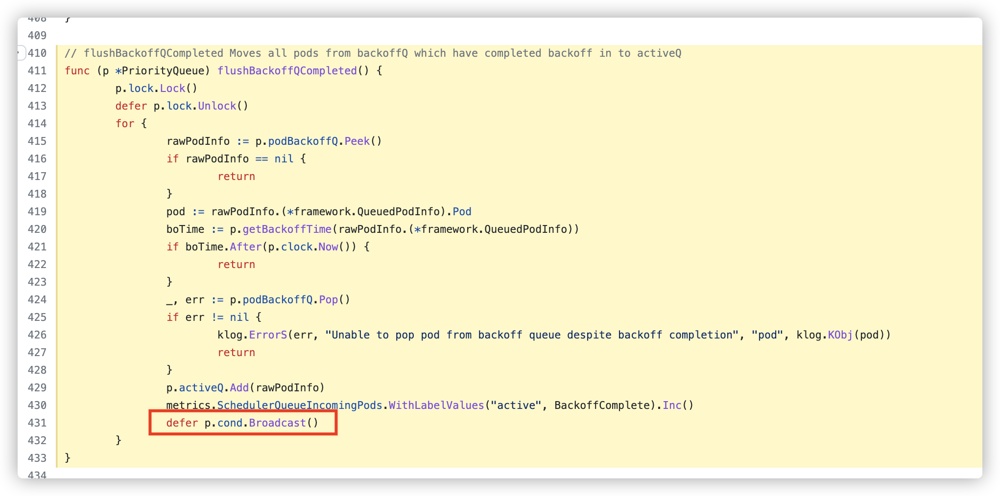

# 给 kubernetes 提了 pr，吹一辈子！！

https://github.com/kubernetes/kubernetes/pull/107816

起因，再看调度器源码文章的时候，不太理解想去看看源码，结果看到这样一段

明显是bug啊，循环里面加 `defer`

把 defer 去掉后，大佬提了意见，说 加个 flag 把 broadcast 拿到外面，改了，然后合并了！🥸

还在慢慢的啃源码，希望可以正正的提交有建设性的pr~
